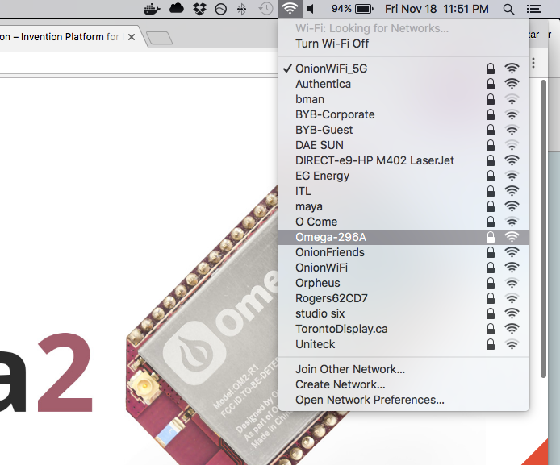

## The Omega & Wireless Connectivity {#the-omega-and-wireless-connectivity}


Your Omega has a wireless interfaces that controls two virtual interfaces. These virtual interfaces are used for different purposes. The first interface broadcasts the Omega's Access Point, a wireless network that your other devices can connect to in order to communicate with the Omega. The second interface can connect to an existing network in order to supply the Omega with internet. These two virtual interfaces work together to turn your Omega into a powerful wireless device.

### Hosting a WiFi Access point

<!-- // highlight that this is the 'Out of the Box' state for the Omega -->

When you power on your Omega, other devices like your computer and smartphone will be able to connect to a new network called `Omega-ABCD`.

> Your Omega's AP name will be different, check our brief [guide to finding your Omega's Name](#omega-name)

<!-- // include an illustration -->



In the documentation, this network is what we refer to as the Omega's Access Point (AP), or the Omega's WiFi.

The Omega's AP is a network to which your devices can connect in order to communicate with the Omega. By connecting to this network, you can access the Omega's filesystem through a terminal, or even the Onion Console through the browser; all of this without having an active internet connection.


>For example, if you're on a bus with a laptop and your Omega, you could connect to the Omega's AP with your laptop, and SSH into the terminal or use the Console through your browser.


### Connected to a WiFi network

<!-- // highlight that this is how we get internet on the omega; connecting to your own existing wifi network -->

Connecting the Omega to the internet greatly expands its capabilities. It allows you to send and receive data over the internet and gives you the ability to download and install packages with `opkg`, the package manger used by the Omega.

> For more on `opkg`, you can read this [article on using opkg](#using-opkg).

All of this is can be done by connecting your Omega to an existing WiFi network that is supplying internet, in the same way you would connect a laptop or a smartphone to internet.


<!-- // include an illustration -->

<!-- // explanation of what connecting to a Wifi network means and how there is a router somewhere out there, etc -->


### Connected to a WiFi network AND hosting a WiFi Access Point

<!-- // highlight that this is the state the omega is in after completing the setup Wizard -->

<!-- // TODO: mention that the Omega is different from other device (laptop, smartphone) in that it can SIMULTANEOUSLY host an AP and connect to a wifi network - this is cool because you can share internet access and other stuff between the two networks -->

Your Omega can **simultaneously** connect to an existing WiFi network, and host its own Access Point, yielding some interesting results. This is the typical use case because you can avoid having to switch networks in order to connect to your Omega.

// TODO: expand on how it's nice to have your omega on the same wifi network as your other devices - namely your laptop
You can connect your other devices to the Omega's AP and access the internet, essentially turning your Omega into a network switch.
> For more on making your Omega into a network switch, check out our tutorial on [Turning your Omega into a Router](#omega-router), or our tutorial on [using the Omega as a WiFi range extender](#wifi-range-extender)]

Or if you're really passionate, you can connect several Omegas on the same network, and communicate with them **ALL** wirelessly from a master device.

<!-- We need to have a project with an absurd amount of Omegas just for fun -->


### Sharing Your Omega's Access Point with Other Devices


You can configure the firewall settings on your Omega to manage sharing your internet access with devices that connect to the Omega's AP. This file is located at `/etc/config/firewall` and its contents be changed in order to modify your AP's firewall.

*Note: Your Omega is already configured to handle the most practical applications. You need not edit this file unless you know what you're doing.*


To apply any firewall changes you'll need to restart your firewall with the following command:

```
/etc/init.d/firewall restart
```


<!-- // include an illustration -->

<!-- // explain that the Omega is super powerful and that it can connect to a Wifi network while simultaneously hosting it's own access point -->
<!-- // this is powerful because it can share/forward connectivity between the two networks, brief intro on the firewall (where the config can be found, how to restart it) -->
