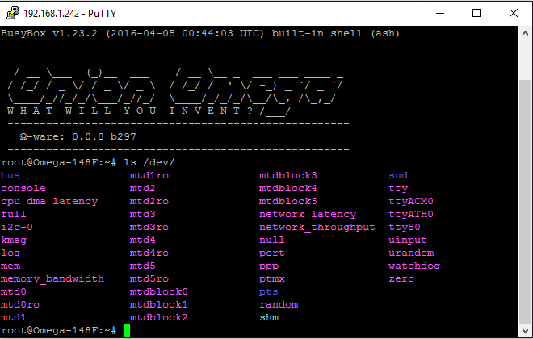
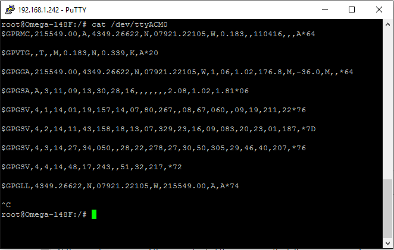
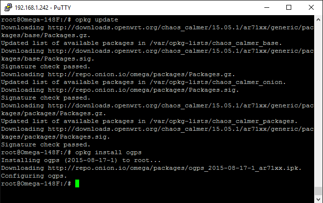
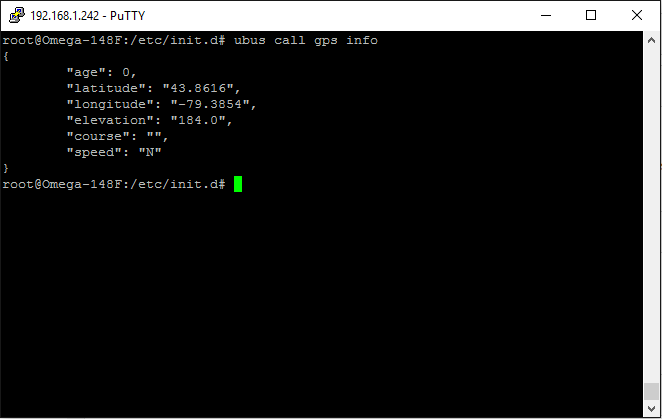

## Using the GPS Expansion {#using-gps-expansion}


The GPS expansion from Onion features a ublox neo GPS module, which allows seamless integration into your omega projects. The expansion outputs GPS data in the form of NMEA messages, which include all relevant information(latitude, longtitude...etc). We have prepared a package, ogps, to handle the NMEA messages and offer up the relevant information to the user via `ubus` calls in the command-line.

### Reading the Raw Output of the GPS Expansion

The device driver will already be installed and Linux should recognize the device automatically. To double check, run the following command.

```
ls /dev/
```



You should see a device called "ttyACM0", this is our GPS expansion.

At this point you can read the raw output of the gps using the following command.

```
cat /dev/ttyACM0
```
This will print out the raw NMEA output.




### Using `ogps` for Cleaner Output

You can also use `ogps` to access relevant data offered up by the GPS via `ubus` calls. To install `ogps` enter the following commands.

```
opkg update
```
```
opkg install opgs
```



Now that it is installed you can access the information through ubus. To make sure the gps service has initialized, run the command.

```
ubus list
```
You should see gps listed.


### Usage
Make sure your GPS is connected! To access the data simply run the command.

```
ubus call gps info
```
If the GPS is not locked, the command will return `signal=false`. In this case you may need to give the GPS more time to lock onto a satellite or you will need to move to a more open area where the gps can see more satellites.

Otherwise you should have an output that looks like this.




>Note: If you've used the GPS Expansion with the Omega1 you may remember some hardware stability issues regarding the GPS Expansion. This is no longer the case with the Omega2 and Omega2+.
