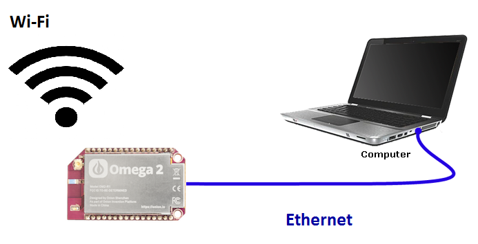

## Ethernet Bridge {#ethernet-bridge}


In this tutorial, we are going to create an Ethernet Bridge using the Omega. An Ethernet Bridge is a device that shares its WiFi internet access through an Ethernet connection, similar to a WiFi dongle.

Our Omega's WiFi and the Ethernet Expansion will allow this to be accomplished.

<!--  -->

As an example, this type of setup can be used to bring internet access to a desktop computer that does not have a network adapter.

### Overview

| <span style="font-weight:normal">Tutorial Difficulty</span> | Intermediate |
| :--- | :--- |
| Time Required| **10 mins** |
| Required Materials | Omega2 or Omega2+<br>Expansion Dock<br>Ethernet Expansion |

>The Expansion dock can be substituted with a Power Dock, Mini Dock, or Arduino Dock 2.

What we are going to do is to first enable the Omega's Ethernet connection, and then to bridge the wireless internet connection with an Ethernet connection.


<!-- The Steps -->

### Step 1: Connect Omega WiFi to the Internet

To begin, you'll need to establish a wireless connection to the Internet on your Omega. Follow this [guide](#first-time-setup) to learn more on how to set up your Omega.


<!-- Step 2 -->

### Step 2: Enable the Omega's Ethernet Connection

<!-- // Connect the Ethernet Expansion to the Omega -->

Connect your Ethernet Expansion to your Expansion Dock, and then plug in an Ethernet cord to set up the hardware.

What we need to do next is change the following code block located in `/etc/config/network`:

```
config interface 'wlan'
        option type 'bridge'
        option ifname 'eth0.1'
        option proto 'static'
        option ipaddr '192.168.3.1'
        option netmask '255.255.255.0'
        option ip6assign '60'

```

Change `option ifname 'eth0.1'` to `option ifname 'eth0'`


Restart the network service by running the follow command:
```
/etc/init.d/network restart
```


<!-- Step 3 -->
### Step 3: Configure your Device to use Ethernet

Now that the Omega is configured, we should be able to connect with other devices via Ethernet.

Make sure that your connection is set to `Obtain IP address and DNS address Automatically`. It should be set so by default.


#### Windows
To do this on Windows, follow this [guide](http://www.computerhope.com/issues/ch001048.htm)


#### Mac OSX
To do this on Mac OSX, follow this [guide](https://www.cs.cmu.edu/~help/networking/dhcp_info/dhcp_mac.html)

<!-- ### Linux -->

<!-- Not sure how to do or how to test that this actually does the thing? -->
