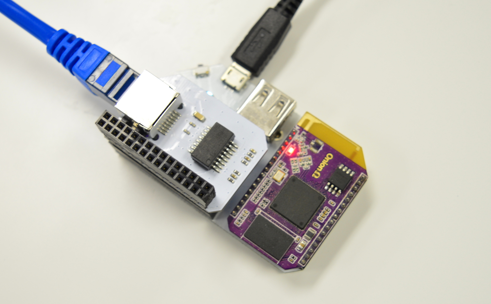

# The Omega as a Router

[//]: # (make this make sense)
The Ethernet Expansion gives your Omega access to an Ethernet port, and giving it the option of a stable and fast connection. By using the Ethernet Expansion, we can turn our Omega into a low-cost yet effective router. This tutorial will show you how you can set up the Omega as a Wi-Fi router.

[//]: # (illustration showing the whole system)

# Overview

| Overview |
| :---: | :---: |
| Tutorial Difficulty | **Intermediate** |
| Time Required | **10 mins** |
| Required Materials: | <ul><li>Omega2 or Omega2+</li><li>Expansion Dock</li><li>Ethernet Expansion</li></ul> |

## Step 1: Setup the Hardware

First, connect the Omega to the Expansion Dock, and plug the Ethernet Expansion into the Expansion Dock. Then, connect the Ethernet cable coming from your modem to the Ethernet Expansion, and connect the power to the Omega, as shown below:



After you have connected everything, power on the Omega.


## Step 2: Setup the Omega

[//]: # (explanation of which wifi you're disabling)

The next step is to disable the Wi-Fi connection on the Omega. We want our Omega to connect to the internet via the ethernet connection and so we're going to turn off the Wi-Fi on our Omega

To do this, you will be editing `/etc/config/wireless` file and changing the access point settings of your Omega:

Enter `vi /etc/config/wireless` and find the following block

```
config wifi-iface
        option device 'ra0'
        option network 'wlan'
        option mode 'ap'
        option encryption 'psk2'
        option key '12345678'
        option ssid 'Omega-ABCD'
        option ApCliEnable '1'
        option ApCliAuthMode 'WPA2PSK'
        option ApCliEncrypType 'AES'
        option ApCliSsid 'yourwifissid'
        option ApCliPassWord 'yourwifipassword'

```

and replace
```
option ApCliEnable '1'
```
with
```
option ApCliEnable '0'
```

[//]: # (mention why we do this)
This will disable the ApCli device which is used to wirelessly connect to the internet. Press `ESC` and type `:wq` to save and exit.


Restart the Wi-Fi network to apply your saved changes:

```
wifi
```

[//]: # (create a new step regarding the ssid name)
## Step 3: Changing your Omega Router's Settings

It is recommended that you change your Omega Router's settings from the default, especially the password. To do so, enter the following command:

```
vi /etc/config/wireless
```

And look for:

```
option ssid 'OmegaRouter'
option key 'RouterPassword'
option encryption 'YourEncryptionType'
```

Here, you can change the SSID of your Omega, the router password, as well as the type of encryption you want to use for the router and the password.

Once you have finished customizing the WiFi network, simply save and close the file by pressing `ESC` and then typing `:wq`

Run the following command to restart the Wi-Fi network and apply your settings:

```
wifi
```

## Step 4: Enable `eth0`

The Omega is primarily designed as a development board to prototype WiFi-enabled devices, so by default, we have turned off the ethernet interface `eth0` in the firmware. In order to use the Omega as a router, you will need to re-enable this. To do this, you will need to open up the `/etc/config/network` file, find the the block that looks something like the following:

```
config interface 'wan'
   option ifname 'eth0'
   option proto 'dhcp'   
```
and add the following line:

```
option hostname 'OnionOmega'
```

```
config interface 'wan'
   option ifname 'eth0'
   option proto 'dhcp'
   option hostname 'OnionOmega'
```

This will tell the Omega to turn on the `eth0` interface and we will also be referring to this network as `wan`.

Once you have saved and closed the file, run the following command to restart the network service to reload the new configuration:

```
/etc/init.d/network restart
```

## Step 5: Enabling Packet Routing

Next, you will need to configure the Omega to route packets from the ethernet interface (`eth0`) to your WiFi interface (`wlan0`). To do this, you will be editing the `/etc/config/firewall` file:

Find the block that looks something like the following:

```
config zone
    option name         wan
    list   network      'wwan'
    option input        ACCEPT
    option output       ACCEPT
    option forward      ACCEPT
    option masq     1
    option mtu_fix      1
```

and add the following line:

```
list   network      'wan'
```

What you will end up with is something like the following:

```
config zone
    option name         wan
    list   network      'wwan'
    list   network      'wan'
    option input        ACCEPT
    option output       ACCEPT
    option forward      ACCEPT
    option masq     1
    option mtu_fix      1
```

What this tells the Omega to do is to add the `wan` network (which we defined in `/etc/config/network` file) to a firewall zone called `wan`. This zone has already been setup to route packets to another firewall zone called `lan`, which contains the `wlan0` interface.

Once you have saved and closed the file, run the following command to restart the firewall with the updated configuration:

```
/etc/init.d/firewall restart
```

## Step 6: Using the Omega Router

And we are done! To use the Omega Router, you simply need to connect your computer or your smartphone/tablet to the WiFi network that you configured in Step 4, and your devices should be able to access the Internet via the Omega :)

Happy hacking!
