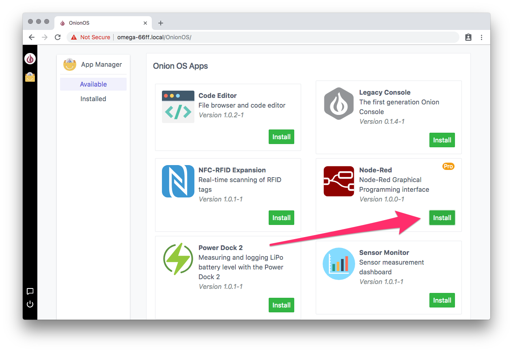
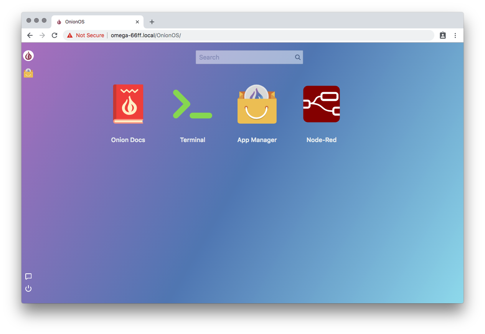

## Node-Red on the Omega2 Pro

A quick guide on using Node-RED with the Omega2 Pro.

### Installing Node-RED

Before playing with Node-Red, we’ll need to update OnionOS and then install the Node-Red App.

First, make sure you’re Omega’s set up and connected to the internet. 

*You can follow the steps we have outlined here: http://docs.onion.io/omega2-docs/first-time-setup.html
and here: http://docs.onion.io/omega2-docs/first-time-setup-command-line.html*

Then, connect to the Omega’s command line (http://docs.onion.io/omega2-docs/connecting-to-the-omega-terminal.html) and let’s update OnionOS:
```
onion os update
```

Once that’s done, you’ll want to navigate to OnionOS in your browser. Here’s a helpful guide on the subject: https://onion.io/getting-started-with-onionos/#getting-to-onionos

Use the App Manager to install Node-Red:



After installation, it will take **about a minute** for Node-Red to load and start running. 

> After every Omega2 Pro reboot, it will take about **an additional minute after boot** before Node-Red starts running and can be accessed in the browser.

You can then launch the app from the OnionOS home screen:



And there it is, NodeRed running in OnionOS on the Omega2 Pro:


Use the visual drag-and-drop programming style to create and deploy your own flows:


### Installing Additional Node Packages
If you’re interested in using additional Node packages with Node-Red, you’ll need to install NPM:
```
opkg update
opkg install node-npm
```

To install packages with NPM, there’s a **specific syntax that needs to be used**.
Instead of:
```
npm install <PACKAGE>
```
use
```
node --max_old_space_size=512 $(which npm) install <PACKAGE>
```

### Installing Node Packages that require Compilation
If the Node package that you’re trying to install needs to be compiled, there is an additional step.

First, you'll need to **install and configure node-gyp**:
```
opkg update ; opkg install python
node --max_old_space_size=512 $(which npm) install -g node-gyp
```

Next, we'll **install gcc and make**, so npm can be used to install packages that require compilation:

Follow these instructions to enable the LEDE package repos: https://docs.onion.io/omega2-docs/using-opkg.html#using-opkg-switch-to-lede-repos

(Just don’t comment out the Onion repos)

Your `/etc/opkg/distfeeds.conf` file should look something like this:
```
#src/gz reboot_core http://downloads.lede-project.org/releases/17.01-SNAPSHOT/targets/ramips/mt7688/packages
src/gz reboot_base http://downloads.lede-project.org/releases/17.01-SNAPSHOT/packages/mipsel_24kc/base
#src/gz reboot_onion http://downloads.lede-project.org/releases/17.01-SNAPSHOT/packages/mipsel_24kc/onion
## src/gz reboot_luci http://downloads.lede-project.org/releases/17.01-SNAPSHOT/packages/mipsel_24kc/luci
src/gz reboot_packages http://downloads.lede-project.org/releases/17.01-SNAPSHOT/packages/mipsel_24kc/packages
## src/gz reboot_routing http://downloads.lede-project.org/releases/17.01-SNAPSHOT/packages/mipsel_24kc/routing
## src/gz reboot_telephony http://downloads.lede-project.org/releases/17.01-SNAPSHOT/packages/mipsel_24kc/telephony
src/gz omega2_core http://repo.onion.io/omega2/packages/core
src/gz omega2_base http://repo.onion.io/omega2/packages/base
src/gz omega2_packages http://repo.onion.io/omega2/packages/packages
src/gz omega2_routing http://repo.onion.io/omega2/packages/routing
src/gz omega2_onion http://repo.onion.io/omega2/packages/onion
```

Then run these commands:
```
opkg update
opkg install make gcc
ar -rc /usr/lib/libpthread.a
```

And you’re all set, you’ll be able to install any Node package with the following command:
```
node --max_old_space_size=512 $(which npm) install <PACKAGE>
```
