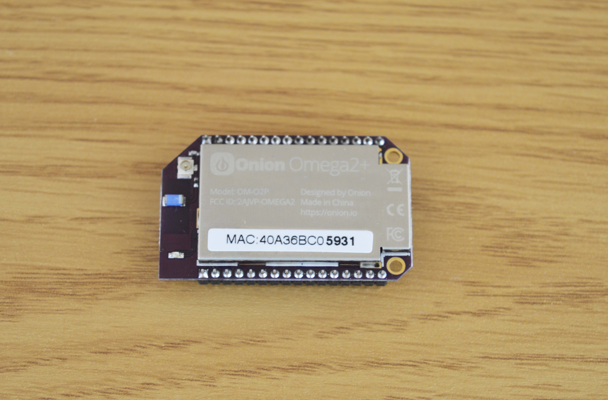

## Your Omega's Name {#omega-name}

Each Omega has a name that is used to identify it and also is the default name of the Omega's AP. The name is based on the [MAC address](https://en.wikipedia.org/wiki/MAC_address) of the Omega's wireless radio; each device has a completely unique MAC address.

There's a sticker on the Omega's shielding:

The text printed here is the Omega's unique MAC address, we're interested in the last four digits that are in bold.

Your Omega's name will be in the form of `Omega-ABCD` where `ABCD` are the last four digits from the sticker.

> MAC addresses are expressed in hex digits, so it's conceivable that your Omega's MAC address will have the `a`, `b`, `c`, `d`, `e`, or `f` characters in it's name.

So the Omega from the picture above is named `Omega-5931`, by default it's AP WiFI network network will be named `Omega-5931` and it's hostname on the local network will be `omega-5931.local`.

> Note that WiFi network names are case-sensitive while the local network hostnames are not!
