## Connecting to the Omega's Terminal {#connecting-to-the-omega-terminal}

// TODO: let's change the STEP X boldings to a few words of what the step is accomplishing (like the first  time setup article)

Now that your Omega is setup, connected to a WiFi network, and updated, you'll want to connect to it to start building and inventing.

There are two ways to connect to the Omega's command prompt:

* Using the local network to connect through SSH
* Using a USB connection to connect to the serial terminal

Both methods will work fine and each has their advantages. We recommend using SSH since it allows you to wirelessly control any Omega that's connected to your WiFi network.


 <!-- //TODO: add background on the command prompt -->


### Connecting with SSH

SSH actually stands for Secure Shell, it's a network protocol that creates a secure channel for communication between two devices on the same network. It can be used to secure many different types of communication, but we will be using it to login to the Omega's command prompt for now.

<!-- //TODO: add stylized picture of the Omega2 and a laptop connected to a wifi network -->

#### The Good & Bad of SSH

When using SSH, the Omega and your computer communicate over the WiFi network to which they are both connected. This means that as long as the Omega is powered on and within range of your WiFi network, you can connect to it! No need to connect it directly to your computer. The disadvantage of SSH is that if the network connection gets interrupted, the connection will also be severed.

For most use-cases with the Omega, SSH will work really well. This should be your go-to method for accessing the Omega's command-line.


### Connecting on a MAC device

<!-- {{#if OSX}} -->
**Step 1:**<br>
Open the Terminal app

**Step 2:**<br>
Run the following command:
```
ssh root@omega-ABCD.local
```
Where `ABCD` is the unique id of your Omega.

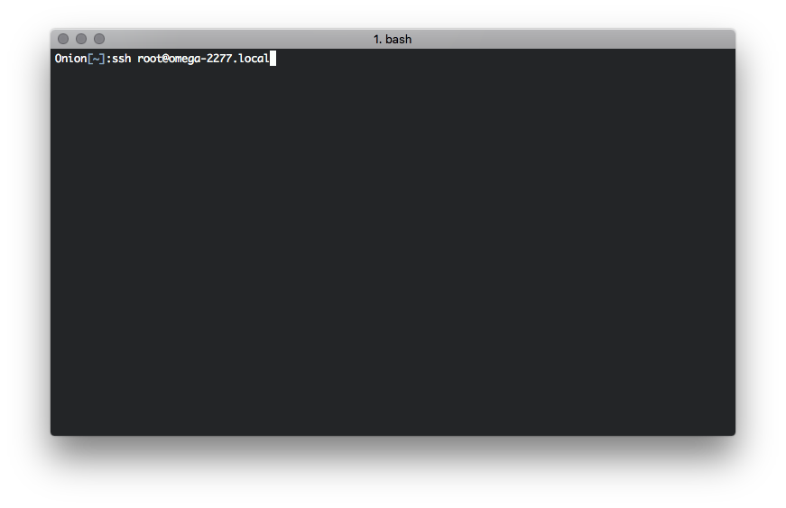

**Step 3:**<br>
When prompted, enter the password <br>
By default, the password is: `onioneer`

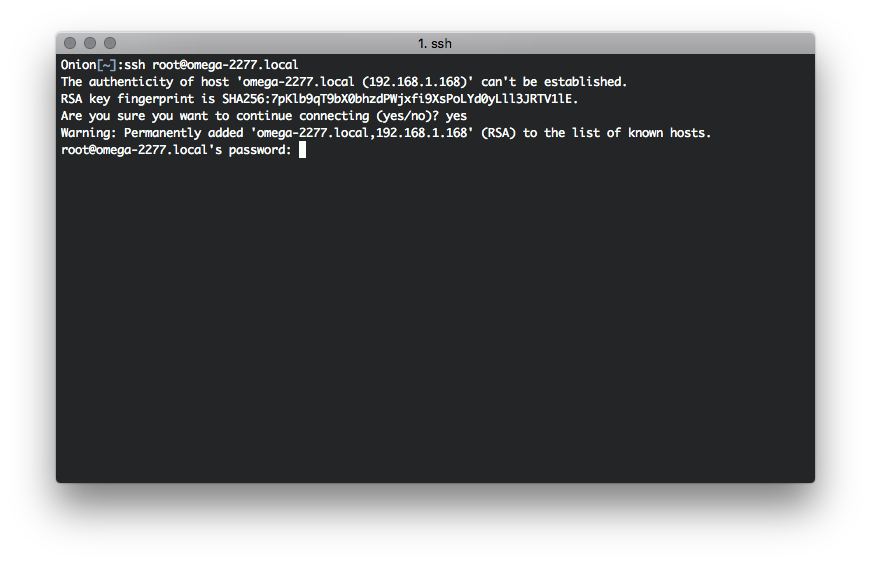

*If you're prompted about adding the address to the list of known hosts, type yes. This is just your computer getting to know the Omega for the first time*

**And you're in!**

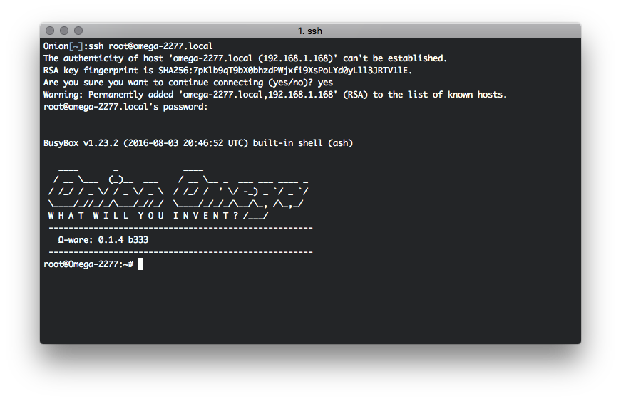

<!-- {{/if}} -->

### Connecting on a Linux device

<!-- {{#if Linux}} -->
**Step 1:**<br>
Open the Terminal app

**Step 2:**<br>
Run the following command:
```
ssh root@omega-ABCD.local
```
Where `ABCD` is the unique id of your Omega.

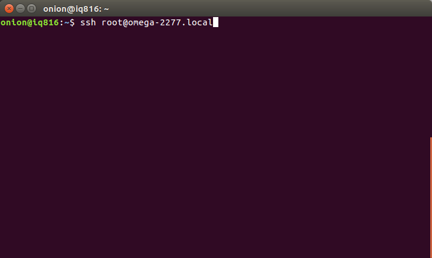

**Step 3:**<br>
When prompted, enter the password <br>
By default, the password is: `onioneer`


*If you're prompted about adding the address to the list of known hosts, type yes. This is just your computer getting to know the Omega for the first time*

**And you're in!**

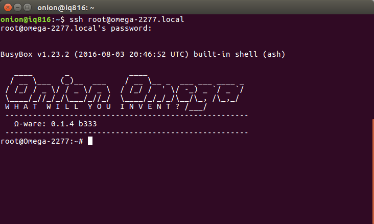

<!-- {{/if}} -->


### Connecting on a Windows Device

**Step 1:**<br>
Download and install [PuTTy](http://www.putty.org/)

**Step 2:**<br>
Configure an SSH connection to `omega-ABCD.local` on port `22`:

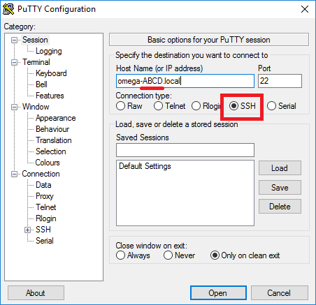

Where `ABCD` is the unique id of your Omega.

**Step 3:**<br>
Click Open and enter the credentials when prompted.

By default, the credentials are:<br>
Username: `root` <br>
Password: `onioneer`

**And you're connected!**

<!-- {{/if}} -->


### Using SSH Key Pairs

Over the course of a few months, the number of times you type in the password to connect will add up to a whole bunch of time that could have been spent having fun. Don't worry, there's another way to authenticate your SSH connection: by using SSH Key Pairs, **the Omega and your computer will do a secure handshake so you won't need to type in that pesky password all the time**. Not only that, but using a key pair will make your Omega even more since passwords can be discovered but secure key pair authentication cannot be broken.

##### What exactly are Key Pairs

Good question! Authentication using a Key Pairs is based on having two randomly generated binary keys, where one is public and one is private. The private key is like a handwritten signature, used to prove your identity, so make sure to keep it secret and keep it safe. The public key is meant to be shared with other devices since it's only purpose is to verify your identity.

An SSH connection to your Omega that's secured by with a key pair will look something like this:

- Your computer will ask to login to the Omega, and the Omega will respond with 'Ok, but first prove your identity'
- Your computer will then generate a hash using your private key and send it to the Omega
- The Omega will use the stored public key to try to decode the identity hash, if the Public Key matches the Private Key, the decode will be successful, and the Omega will allow the connection to proceed.

##### How to Add your Public Key to the Omega on a MAC

<!-- {{#if OSX}} -->


**Step 1:**

Let's first check to see if your computer already has a key pair. Open the Terminal App on your Mac and run:

```

ls ~/.ssh/id_rsa.pub

```

If this file exists, skip ahead to Step 3.

// TO DO: add screenshot of terminal showing file exists

**Step 2:**

No worries if you don't have a key yet, follow this [quick guide](https://help.github.com/articles/generating-an-ssh-key/#platform-mac) to generate a key pair.

**Step 3:**

Copy the contents of the public key file to the clipboard:

```

cat ~/.ssh/id_rsa.pub

```

**Step 4:**

Connect to your Omega's command prompt and create a new file:

```

vi /etc/dropbear/authorized_keys

```

And copy your public key into it.

**And you're done!**

From now on, you'll be able to securely connect to your Omega without having to type out a password every time.

<!-- {{/if}} -->

##### How to Add your Public Key to the Omega on a Linux machine

**Step 1:**

Let's first check to see if your computer already has a key pair. Open the Terminal App on your Mac and run:

```

ls ~/.ssh/id_rsa.pub

```

If this file exists, skip ahead to Step 3.

// TO DO: add screenshot of terminal showing file exists

**Step 2:**

No worries if you don't have a key yet, follow this [quick guide](https://help.github.com/articles/generating-an-ssh-key/#platform-linux) to generate a key pair.

**Step 3:**

Copy the contents of the public key file to the clipboard:

```

cat ~/.ssh/id_rsa.pub

```

**Step 4:**

Connect to your Omega's command prompt and create a new file:

```

vi /etc/dropbear/authorized_keys

```

And copy your public key into it.

**And you're done!**

From now on, you'll be able to securely connect to your Omega without having to type out a password every time.

##### How to Add your Public Key to the Omega on a Windows machine

**Step 1:**

Let's first check to see if your computer already has a key pair. Open the Windows Explorer and enter the following as the address:

```

%HOMEDRIVE%%HOMEPATH%\.ssh\id_rsa.pub

```

If this file exists, skip ahead to Step 3.

**Step 2:**

No worries if you don't have a key yet, follow this [quick guide](https://help.github.com/articles/generating-an-ssh-key/#platform-windows) to generate a key pair.

**Step 3:**

Open the public key file with a text editor (Notepad works fine) and copy the contents to the clipboard:


**Step 4:**

Connect to your Omega's command prompt and create a new file:

```

vi /etc/dropbear/authorized_keys

```

And copy your public key into it.

**And you're done!**

From now on, you'll be able to securely connect to your Omega without having to type out a password every time.

## Connecting via Serial

The Omega's command prompt can also be accessed with a USB cable, as long as your Omega is docked in either an Expansion Dock or a Mini Dock. What's happening behind the scenes is that the Omega is using it's UART pins to run a terminal, the USB-to-Serial chip found on the Dock is translating the Serial Terminal signals into USB signals that your computer can understand and vice versa.

// TO DO: stylized picture of an Omega2 on an Expansion Dock connected to a laptop with a cable

Generally, we recommend using SSH to access the Omega's command line, but the serial terminal does have its advantages. For instance, the serial terminal will always be available as long as the Omega is powered on and does not depend on network connectivity. Additionally, when using the serial terminal, you will see messages such as this one:


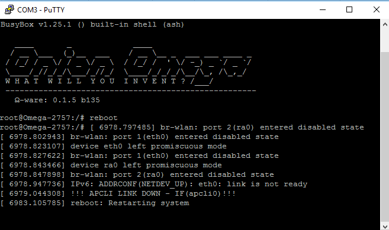

This is an example of a message coming from the kernel. These messages can be listed out at any time using the `dmesg` command, so they can be seen when using SSH as well.

Note that the Expansion Dock and Mini Dock are the only docks that have USB-to-Serial chips, so the serial terminal will only work when using those docks. The serial terminal is meant for debugging during early development, for stable projects, SSH is the best method for accessing the command line.

## How to Connect

We'll first identify the specific USB connection that we need to use to talk to the Omega, and then setting up the communication.

### Setting up using Command Line – OSX

**Step 1**: Download and install the [Silicon Labs CP2102 driver for OS X](https://www.silabs.com/Support%20Documents/Software/Mac_OSX_VCP_Driver.zip).

**Step 2**: Run `ls /dev/tty.*` to see if the USB-to-Serial device can be detected. If the driver is successfully installed, you should be able to see a device with a name similar to `/dev/tty.SLAB_USBtoUART`.

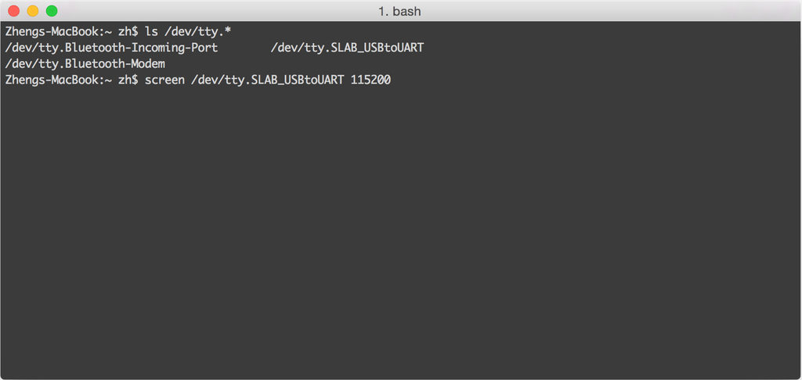

**Step 3**: Run `screen /dev/tty.SLAB_USBtoUART 115200` to connect to the Omega’s serial terminal using the `screen` utility.

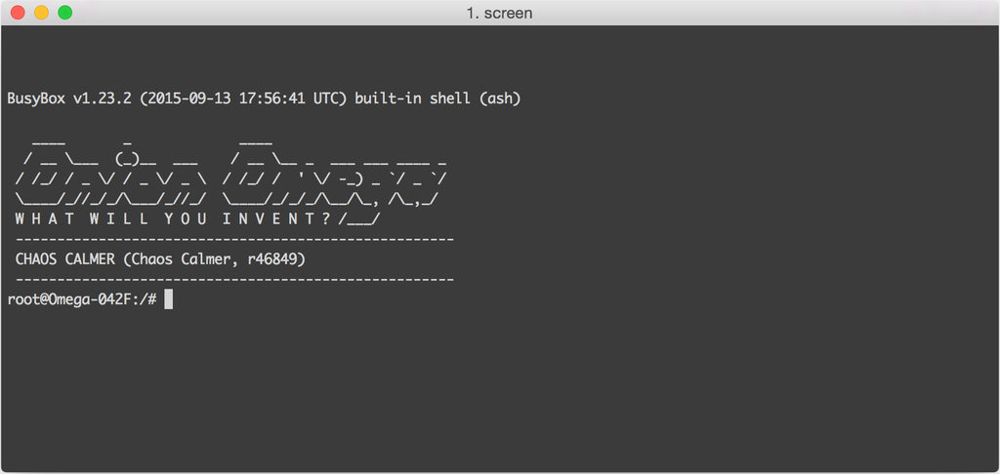

> We recommend taking a peek at [this tutorial](https://www.linode.com/docs/networking/ssh/using-gnu-screen-to-manage-persistent-terminal-sessions) to get an idea of how the `screen` utility works

**Step 4**: Enjoy! You're now connected to your Omega!


## Setting up using Command Line – Windows

**Step 1**: Download and install the [Silicon Labs CP2102 driver for Windows](https://www.silabs.com/Support%20Documents/Software/CP210x_VCP_Windows.zip).

**Step 2**: Run Device Manager (Start > Enter "Device Manager" and press `ENTER`), look for Silicon Labs CP210x USB to UART Bridge under Ports (COM & LPT), and take note of the COM number in bracket.

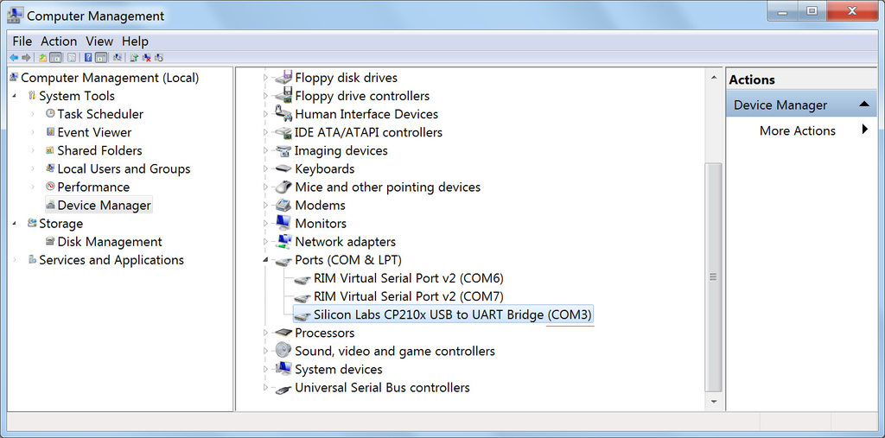

**Step 3**: Download and install [Putty](http://www.chiark.greenend.org.uk/~sgtatham/putty/download.html).

**Step 4**: Open up PuTTY, select Serial for Connection type, enter the COM number noted down in Step 2 as Serial line, and enter `115200` for the speed.

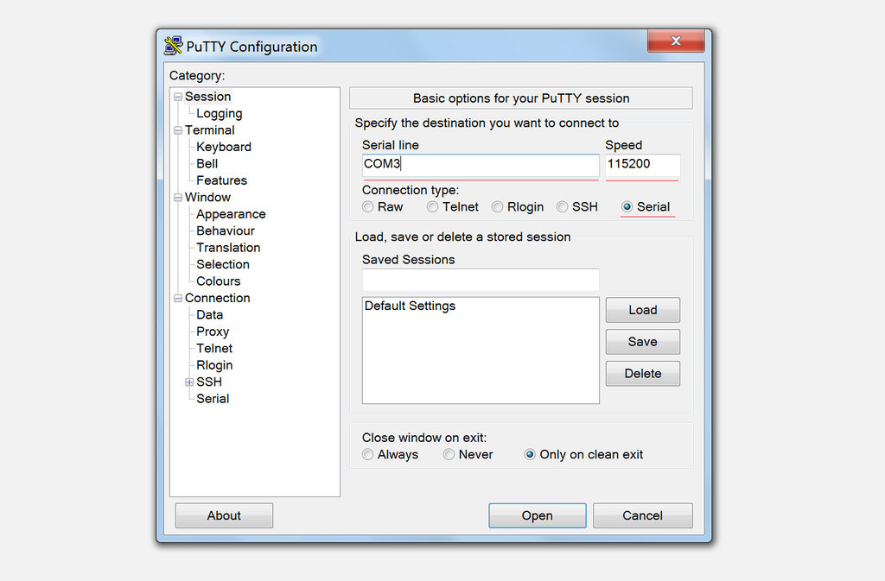

**Step 5**: Click on the Open button to connect to the Omega via the serial terminal.

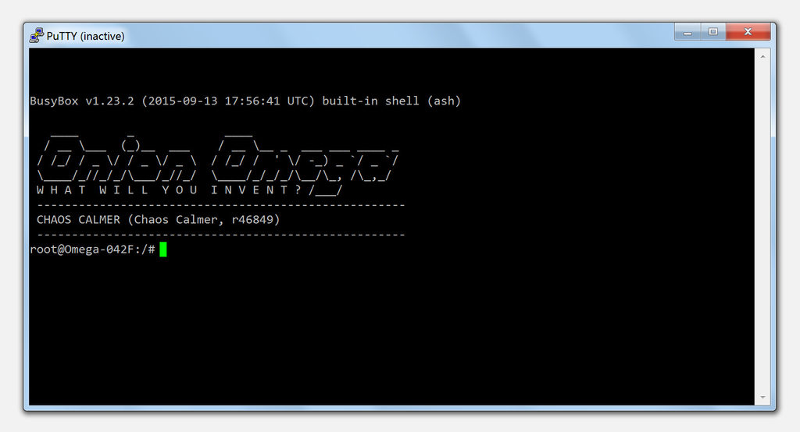

**Step 6**: Enjoy! You're now connected to your Omega!


## Setting up using Command Line – Linux

**Step 1**: Check if the serial drivers are already installed.

Some modern Linux Distros already have the required serial drivers installed. Run `modinfo cp210x` on the command line, if it outputs several lines of information, the driver is already installed and you can skip ahead to **Step 4**.

If the output is something along the lines of

```
modinfo: ERROR: Module cp210x not found.
```

the driver will need to be installed. Continue to **Step 2**.


**Step 2**: Download and install the Silicon Labs CP2102 driver source files.

For Linux kernel **3.x.x and higher**: [[https://www.silabs.com/Support%20Documents/Software/Linux_3.x.x_VCP_Driver_Source.zip]].

For Linux kernel **2.6.x**:
[[https://www.silabs.com/Support%20Documents/Software/Linux_3.x.x_VCP_Driver_Source.zip]].

**Step 3**: Build and install the driver.

*For Ubuntu/Debian*:

Unzip the archive.

`cd` into the unzipped directory.

Compile the driver with `make`.

```bash
sudo cp cp210x.ko /lib/modules/<kernel-version>/kernel/drivers/usb/serial/
sudo insmod /lib/modules/<kernel-version>/kernel/drivers/usb/serial/usbserial.ko
sudo insmod cp210x.ko
sudo chmod 666 /dev/ttyUSB0
sudo usermod -a -G dialout $USER
```

*For RedHat/CentOS*:

```
sudo yum update kernel* //need to update the kernel first otherwise your header n't match
sudo yum install kernel-devel kernel-headers //get the devel and header packages
sudo reboot //your build link should be fixed after your system come back
```

Unzip the archive.

`cd` into the unzipped directory.

Compile the driver with `make`.

```
sudo cp cp210x.ko /lib/modules/<kernel-version>/kernel/drivers/usb/serial
sudo insmod /lib/modules/<kernel-version>/kernel/drivers/usb/serial/usbserial.ko
sudo insmod cp210x.ko
sudo chmod 666 /dev/ttyUSB0
sudo usermod -a -G dialout $USER
```


**Step 4**: Let's install `screen`, a command line utility that will allow connecting to the Omega's serial terminal.

*For Ubuntu/Debian*:

```
sudo apt-get update
sudo apt-get upgrade
sudo apt-get install screen
```

*For RedHat/CentOS*:

```
sudo yum update
sudo yum install screen
```

> We recommend taking a peek at [this tutorial](https://www.linode.com/docs/networking/ssh/using-gnu-screen-to-manage-persistent-terminal-sessions) to get an idea of how the `screen` utility works

**Step 5**: Run `ls /dev/ttyUSB*` to see if the USB-to-Serial device can be detected. If the driver is successfully installed, you should be able to see a device with a name similar to `/dev/ttyUSB0`.

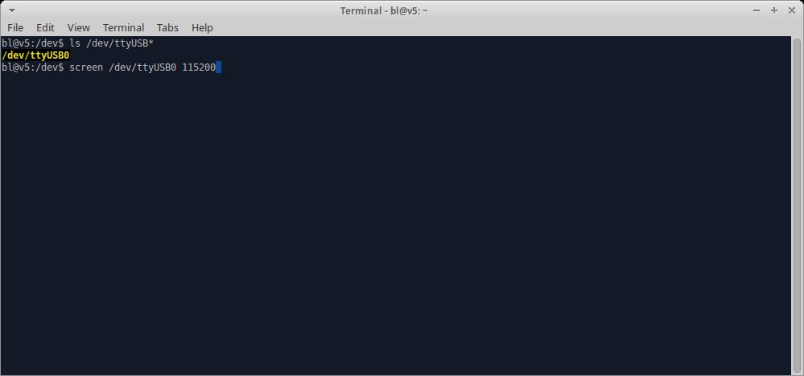

**Step 6**: Run `sudo screen /dev/ttyUSB0 115200` to connect to the Omega’s serial terminal using screen.

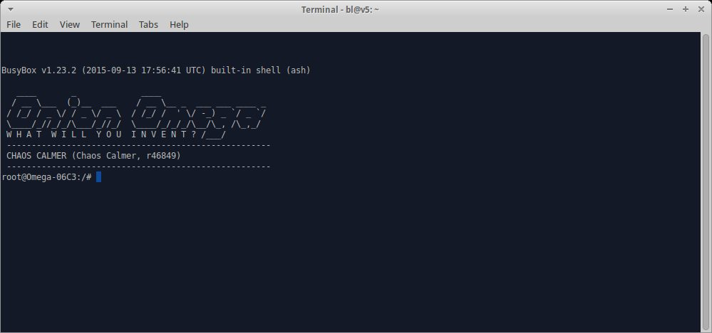

If the screen remains blank, hit enter again to get to the command prompt.

**Step 7**: Enjoy! You are now connected to your Omega!
