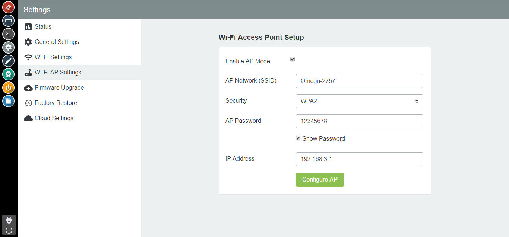

## Adjusting the Omega's WiFi AP Network {#adjusting-omega-ap-network-using-console}

The `Wi-Fi AP Settings` tab in the Settings app is used to configure your Omega's access point.

On this page you can change your Omega's SSID, password, encryption type, and even the IP Address. You can also enable or disable the access point with the checkbox located at the top.

For more information on the Omega's WiFi and AP settings, check out this [guide to the Omega and Wireless](../../Doing-Stuff/Connectivity/The-Omega-and-Wireless)

// LAZAR: think about this!

// using the Settings App - Wi-Fi AP Settings tab to configure the Omega's WiFi AP
// - show how the ssid and password can be changed
// - show how to fully disable it - link to connectivity overview
// - show how to change the Omega's base IP address, explain that this will affect all devices that connect to the Omega - they will get Ip addresses from the new range

// include images
