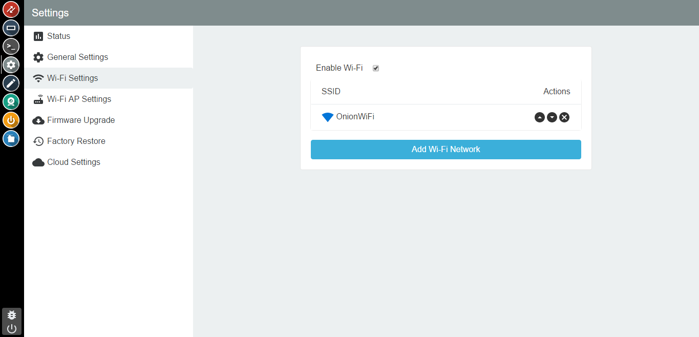
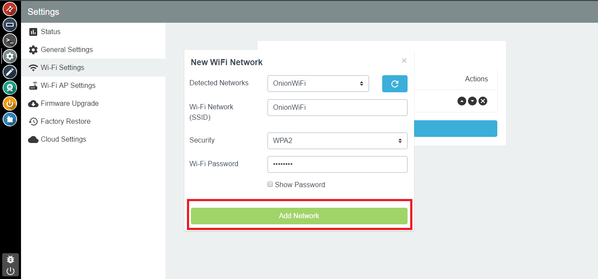
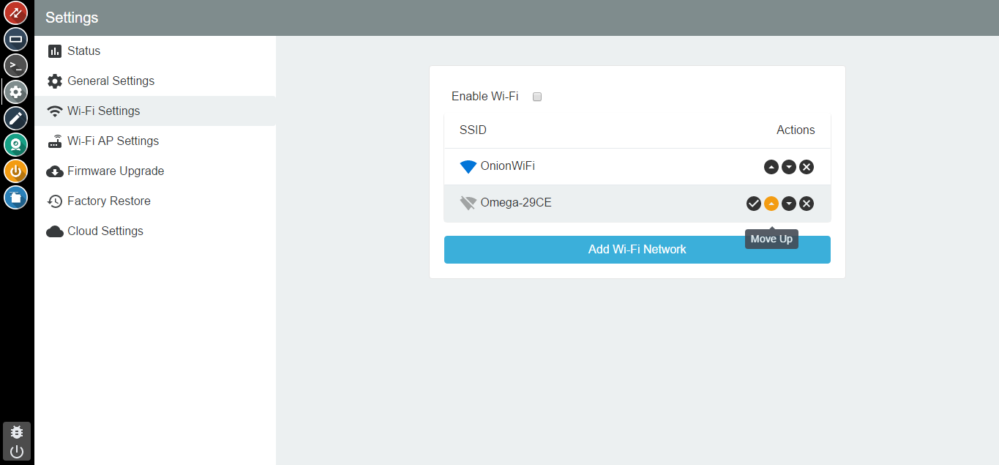

## Connecting to WiFi

Upon logging into the Console, the first app you'll see is the Settings App. Through this app you can monitor your Omega's status, change the Omega's hostname and password, and even WiFi settings. This guide will show you how you can manage your WiFi networks through the console.

### Managing your Wifi Networks

<!-- // explanation of how wifimanager works (can have many configured networks, and it will connect to the available ) -->

The Omega's network manager, `wifimanager`, works by checking all configured networks, and connecting to the available network with the highest priority. The WiFi tab in the Settings App gives you a nice visual representation of what that looks like.

Click on the WiFi settings tab to edit your network connections.

Here, you can enable a network, remove a network, and even add new networks.

#### Adding a New Network

To add a new wireless network configuration, click on the button labelled `Add Wi-Fi Network`. A new window will open that will scan for Wi-Fi networks in your area.

Select a network, or enter the information on your own. Click on `Add Network` to confirm your settings and add the network configuration.

#### Enabling a Network Configuration

To enable a network, click the checkmark button on a network that is not enabled.

#### Removing a Network

To remove a network, click the x button. If you delete your enabled network, you will still need to enable another network to connect to it.

#### Reordering Network Priorities

To shift the priority of a network up or down, click the arrow buttons. It is important to order your networks by preference so that `wifimanager` will connect to your preferred network quickly.

The move-up priority button will increase the priority of a network, making it a more preferred network.

The move-down priority button will decrease the priority of a network, making it a less preferred network.

Click on the arrow up or arrow down buttons to reorder the priority of your networks. to suit your needs.
