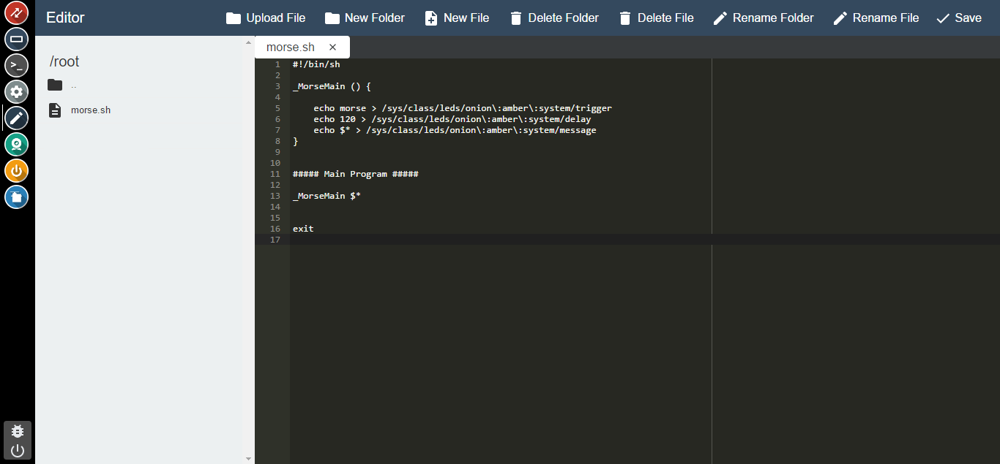

## Developing using the Console {#developing-using-the-console}

The Console is a powerful tool that is easily accessible through your browser. The Console gives you access to a terminal connected to your Omega, and an editor that allows you to directly access the Omega's filesystem!

In this tutorial we're going to write a script that will blink the Omega's LED in morse code based on the user's input using the Editor App, and the Terminal App.


### Overview

| <span style="font-weight:normal">Tutorial Difficulty</span> | Intermediate |
| :--- | :--- |
| Time Required | **15 mins** |
| Required Materials: | Omega2 or Omega2+<br>Expansion Dock, Mini Dock, Arduino Dock or Power Dock |

### Prerequisites

In order to develop programs on the console you'll need the Terminal and Editor apps installed.

>To learn more on how to install apps you can read our brief [guide to installing apps](#installing-apps)


At this point you are now ready to develop code for your Omega from your browser!


### Controlling the LED from the Terminal App

Open the Terminal App and log in using your username and password. The defaults are:

```
username: root
password: onioneer
```


The Omega comes ready with a kernel module that can translate text to Morse code and blink the LEDs, but you'll need to tell the kernel which LED you want to blink.  The kernel exposes a lot of hardware status and configuration options through a virtual filesystem under `/sys`.  
> The files under `/sys` aren't *actually* files, but they look and act like files to make it very easy to access them from the command line and in scripts or programs.

To tell the kernel that we are going to use the Morse code module, set the LED trigger condition for the Onion system LED to `morse` by using the `echo` command to write the setting into the virtual file:

```
echo morse > /sys/class/leds/onion\:amber\:system/trigger
```

> To paste into the Terminal app, use `ctrl+shift+v` or `cmd+shift+v` on a MAC


You can verify that it worked by using `cat` to look at the virtual file:

```
root@Omega-2757:~# cat /sys/class/leds/onion\:amber\:system/trigger                                                              
none mmc0 timer default-on netdev transient gpio heartbeat [morse] oneshot
```

The square brackets indicate that the `morse` trigger is currently selected. The text in that file shows the other available options that this particular bit of the kernel can be set to.

Anyway, now we have everything set up!  We just need to tell the kernel what message to blink on the LED.  Conveniently, once the morse option is selected, the kernel creates a new virtual file for that called (unsurprisingly enough) `message`.  We can use `echo` again to put text there:

```
echo Hello, Onion > /sys/class/leds/onion\:amber\:system/message
```

Now watch your LED!  If it's too fast or too slow, you can change the speed with the `delay` file that also gets created:

```
root@Omega-12D9:~# cat /sys/class/leds/onion\:amber\:system/delay
50
```

That's pretty fast!  Let's slow it down a bit so that people like me who aren't experts can read it:

```
root@Omega-12D9:~# echo 100 > /sys/class/leds/onion\:amber\:system/delay
```

The message will keep looping forever or until you change it.  To stop it, you can either clear the message entirely:

```
echo > /sys/class/leds/onion\:amber\:system/message
```

or change the LED trigger to something else:

```
echo default-on > /sys/class/leds/onion\:amber\:system/trigger
```

### Writing a Shell Script in the Editor App

A Unix Shell is an interpreter that reads commands from the command-line and executes them. A Shell Script is a way of coding using those basic commands to create a more complex program. Essentially, we are going to use the same basic commands from the last section to create a program that will read a message and then blink that message in morse code.

<!-- // DONE: change script to be called morse.sh -->
Create a file called `morse.sh` in the root directory using the Editor App.

Copy the code below, and save the file:

```bash
#!/bin/sh

_MorseMain () {

	echo morse > /sys/class/leds/onion\:amber\:system/trigger
	echo 120 > /sys/class/leds/onion\:amber\:system/delay
	echo $* > /sys/class/leds/onion\:amber\:system/message
}


##### Main Program #####

_MorseMain $*


exit

```

This block diagram shows the steps the `_MorseMain` function will perform:


The main part of the program will just call the function and pass in all of the command line arguments.

Your Console should look something like this now:



<!-- // DONE: update this photo ^ with the new text -->

You are now ready to convert text to morse code!

### Running your Script in the Terminal App

To run your Script, open the Terminal App once again, and log in if your session was disconnected.

Then, enter the following command to run your script:

```
sh /root/morse.sh <YOUR MESSAGE HERE>
```

Enter a message that you would like to blink in morse code:

```
root@Omega-2757:~# sh /root/morse.sh Hello Onion
```

<!-- TODO add a gif here -->

Once you're done, you can set the blinking back to `default-on` with the following command:

```
echo default-on > /sys/class/leds/onion\:amber\:system/trigger
```


<!-- // this article will show how you can use the console to develop code for the Omega using the Omega (pls reword so this makes sense)
// as an example project, we're going to write a script that will blink the Omega's LED in morse code based on user input

// section on using the editor to create a bash script
//  - installing the editor app
//  - small background on bash scripting
//  - walkthrough on navigating the file system and creating a new script
//    - make sure to mention that the best place for project files is in /root (since it won't be overwritten during firmware updates)
// - explanation of a script that controls the Omega's LED
//    - setting the led trigger to morse code (`echo morse > /sys/class/leds/onion:amber:system/trigger`)
//    - getting input from command line argument for the text to be converted to morse code
// note that there's an article about this already, can borrow heavily

// section on using the terminal app
//  - installing the terminal app
//  - logging in to the terminal
//  - navigating through the filesystem
//    - cd and ls commands, introduce ls -l
//    - have links to getting started with linux - check existing linux basics articles for these links
//  - using the echo command to read the available triggers in `/sys/class/leds/onion:amber:system/trigger`
//  - running the script we wrote using the editor app
// make sure to point out that the terminal app now supports copy and paste (but with weird shortcuts) -->
