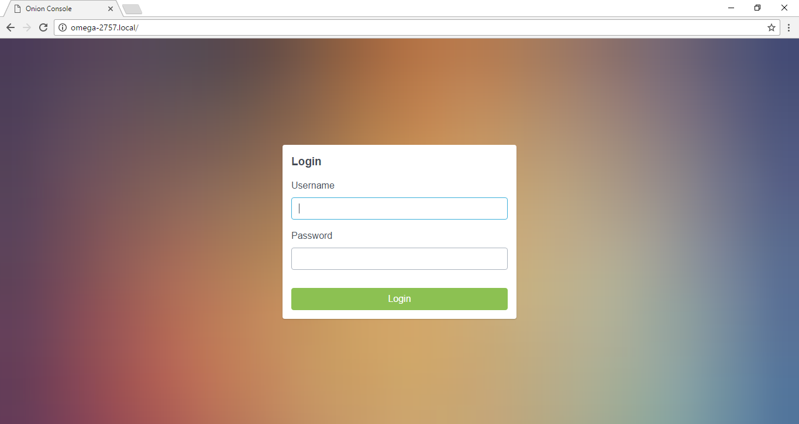

# The Onion Console

// Brief overview on what the console is and what it's used for. Highlight apps that can be made and that we are making etc.
The Onion Console is a web interface that gives you access to a number of apps that enhance your Omega's capabilities. These apps can be used to control your Omega and various expansions through your browser.

# Installing the Console

// Show how to install the console through the setup-wizard, or through the command line
The Console can be installed through the Setup Wizard, or through the command line.
Follow this [guide](../First-Time) if you haven't yet set up your Omega.

## Installing through the Setup Wizard

If you have set up the Omega and didn't install the console, skip to the Software page and make sure the checkbox is checked.


Click the Install Console button and your console will install. This process can take up to 5 minutes.
Refresh the page and you should see the console login page.


The default username and passwords are:

```
username: root
password: onioneer
```

## Installing through the command line

The console can also be installed using the command line using the `console install tool`.
For information on how to access the Omega's command line, follow this [guide](../Using-the-Command-Line/connecting.md)

You'll need to be connected to the internet in order to install the Console.
With your terminal open, run the following commands:

```
opkg update
opkg install onion-console-base
```

After installation is completed, you'll need to restart the rpcd service to load the console configurations with the following command:

```
/etc/init.d/rpcd restart
```

Now, you can access the console by going to `http://omega-ABCD.local/` where `ABCD` are your Omega's special characters.

Upon loading, you should see the console login page.


The default username and passwords are:

```
username: root
password: onioneer
```

# Installing additional apps

// Mention the pre-installed apps. Show how to install additional apps through the console or through the command line

The base Console comes with pre-installed apps that can be used alongside various expansions, like the OLED Expansion Control app.
These apps are available immediately and don't require an installation.

The Editor, Terminal, and Webcam apps all require installation and the process is quite easy. Open the desired app and you'll be greeted with an install page,


Click the install button and wait for the installation to complete.


Once the app is installed, you'll be notified.


Refresh the page and your app will be available for you to use.


