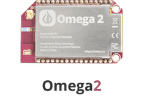

## Onion Omega2 {#onion-omega2}

<!-- intro of the Omega2 IoT computer -->
The Omega2 is the latest in development boards from Onion. It comes packed with built-in Wi-Fi

### The Omega2 at a Glance

<!-- TODO: have an illustration with labels -->

| Omega2 Specs  | |
| :-------------: | :-------------:  |
| Processor | 580MHz MIPS CPU  |
| Memory | 64MB Memory  |
| Storage | 16MB Storage  |
| USB | USB 2.0  |
| MicroSD Slot | No  |
| WiFi adapter | b/g/n Wi-Fi  |
| GPIOs | 15  |
| PWM | 2  |
| UART | 2  |
| I2C | 1  |
| SPI |  1   |
| I2S | 1  |

### The Pins

<!-- image of omega2 pinout -->

<!-- LATER: include section on the 50pin connector -->

### The Operating system

The Omega2 runs the Linux Embedded Development Environment (LEDE) operating system, a distribution based on OpenWRT. This distribution gives the Omega2 access to the OPKG functionality, allowing you to download packages to enhance your experience.

### The Omega LED

The Omega LED is a great tool for communicating information with a user. It notifies you when your Omega is on, when it's off, and when it's booting.

The Omega LED uses GPIO44, and can be programmed to do a number of cool things. You can learn more about the LED in [the article on how to use the Omega's LED](../../Doing-Stuff/The-Omega-LED)

### Reset GPIO

The Omega's can be reset using GPIO38. When plugged into a Dock (e.g. Expansion Dock), this GPIO gives various functionality to the reset button found on docks. For example, a quick button press triggers the reboot command, whereas holding the button for longer than 7 seconds will trigger a factory reset command.

<!-- batch2: ## Antenna and U.FL Connector -->

<!-- Description of SMT antenna used on the Omega, mention that it's directional, have a diagram of the directionality -->
<!-- Describe that U.FL connector can be used to connect other, bigger antennas -->

<!-- TO DO: ## Mechanical Drawing -->

<!-- insert mechanical drawing image, link to repo -->
