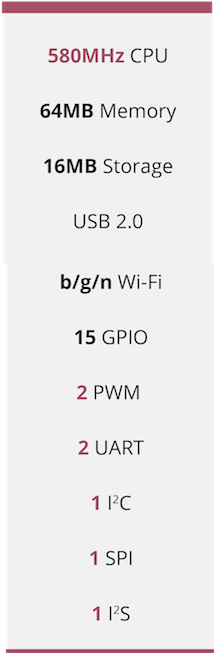

# Onion Omega2

// intro of the Omega2 IoT computer
The Omega2 is the latest in development boards from Onion. It comes packed with built-in wifi

## The Omega2 at a Glance

// labelled Image

// table of Specs

## The Pins

// image of omega2 pinout

[//]: # (LATER: include section on the 50pin connector)

## The Omega LED

// Info on the Omega LED, state that it uses GPIO44, link to Omega LED article

## Reset GPIO

// mention the reset gpio (GPIO38) and the reboot and factory restore functionality when connected to a dock,
GPIO38 is the reset gpio. When plugged into a dock (e.g. expansion dock), this gpio gives various functionality to the reset button found on docks. For example, a quick button press triggers the reboot command, whereas holding the button for longer than 7 seconds will trigger a factory reset command.

## Antenna and U.FL connector

// Description of SMT antenna used on the Omega, mention that it's directional, have a diagram of the directionality
// Describe that U.FL connector can be used to connect other, bigger antennas

## Mechanical Drawing

// insert mechanical drawing image, link to repo
