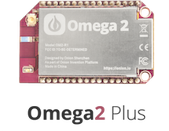

# Onion Omega2+

The Omega2+ is the upgraded version of the Omega2. It comes packed with built-in Wi-Fi, a MicroSD slot, and a powerful processor among other things.

## The Omega2 at a Glance

| Omega2+ Specs  | |
| :-------------: | :-------------:  |
| Processor | 580MHz MIPS CPU  |
| 128MB Memory | 128MB Memory  |
|  32MB Storage | 32MB Storage  |
| USB 2.0 | USB 2.0  |
| MicroSD Slot | MicroSD Slot  |
| WiFi adapter | b/g/n Wi-Fi  |
| 15 GPIO | 15 GPIO  |
| 2 PWM | 2 PWM  |
| 2 UART | 2 UART  |
| 1 I2C | 1 I2C  |
| 1 SPI |  1 SPI   |
| 1 I2S | 1 I2S  |

## The Pins

[//]: # (LATER: include section on the 50pin connector)

## The Operating system

[//]: # (Linux operating system: LEDE blah blah)
The Omega2+ runs the Linux Embedded Development Environment (LEDE) operating system, a distribution based on OpenWRT. This distribution gives the Omega2+ access to the OPKG functionality, allowing you to download packages to enhance your experience.

## The Omega LED

[//]: # ( Info on the Omega LED, state that it uses GPIO44, link to Omega LED article)

## Reset GPIO

[//]: # ( mention the reset gpio (GPIO38) and the reboot and factory restore functionality when connected to a dock,)
GPIO38 is the reset gpio. When plugged into a dock (e.g. expansion dock), this gpio gives various functionality to the reset button found on docks. For example, a quick button press triggers the reboot command, whereas holding the button for longer than 7 seconds will trigger a factory reset command.

[//]: # ( leave this out for now)
[//]: # ( ## MicroSD Card Slot)

[//]: # ( little explanation of the MicroSD Slot)
[//]: # ( images & explanation of proper sd card insertion and removal)

## Antenna and U.FL Connector

[//]: # ( Description of SMT antenna used on the Omega, mention that it's directional, have a diagram of the directionality)
[//]: # ( Describe that U.FL connector can be used to connect other, bigger antennas)

[//]: # ( leave this out for now)
[//]: # (## Mechanical Drawing)

[//]: # ( insert mechanical drawing image, link to repo)
