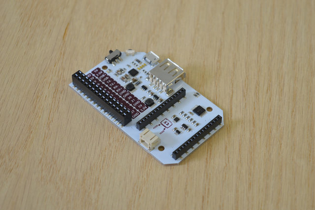
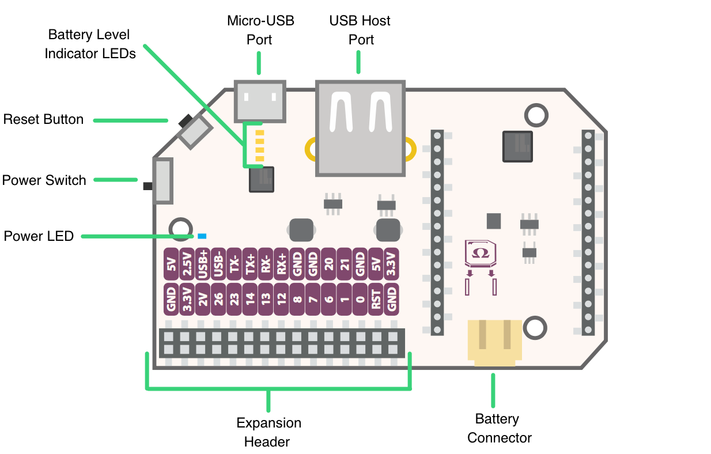
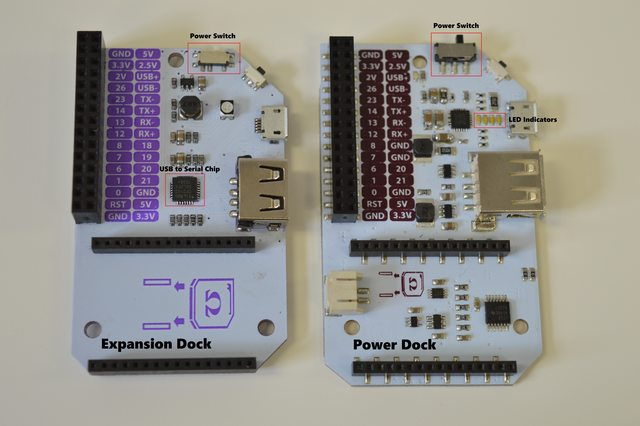

## The Power Dock {power-dock}

<!-- [//]: # (Brief overview on the Power Dock. Highlight the features such as battery management, battery recharge, mobility (completely wireless).) -->
<!-- [//]: # (Briefly mention that the power dock is similar to but not the same as the expansion dock.) -->

Bring your next project on the go with the Power Dock! Equipped with on-board battery management, the Power Dock allows you to recharge and monitor battery levels, while providing a header to connect Onion Expansions.



### The Hardware

Your Power Dock has a 30 pin Expansion Header, allowing you to use all of your Onion Expansions. It provides the Omega with the 3.3V it needs to run, while also providing 5V for the Expansions and USB Host port.

Your Expansion Dock has a 30 pin Expansion Header, allowing you to use all of your Onion Expansions. The Expansion Dock is powered by the Micro-USB port that supplies 5V to the Dock. This voltage is stepped down to the required 3.3V required to power the Omega, and also provides 5V to the Expansions and USB Host port.


The Power Dock is flexible: it can run off just a battery or just by drawing power from the Micro USB port.

The Micro-USB port supplies 5V to the Dock. This voltage is stepped down to the required 3.3V required to power the Omega, and also provides 5V to the Expansions and USB Host port.

Charging the battery requires having both the battery and the Micro USB plugged in. Don't worry, the Omega will still work with no interruptions while charging.

#### Connecting an Omega

<!-- [//]: # (picture guide on how to properly plug in an Omega) -->

#### The Power Dock at a Glance



#### The Expansion Header

<!-- [//]: # (breakout of the Omega's GPIOs, can be connected to other circuits directly, or can use Omega expansions) -->

The Expansion Header is a convenient tool that gives you easy access to the Omega's GPIOs, and allows you to connect Onion Expansions directly. The Expansion Header is labelled to show you what GPIO is connected to each section.


#### Detailed Pinout

<!-- [//]: # (A detailed pinout diagram of the Expansion Header, showing which pins are multiplexed - see Lazar for an example) -->


### Micro-USB Port

<!-- The Micro-USB Port is used to supply the Power Dock with ... power! Connect it to a computer or a USB wall adapter. -->
The Micro-USB Port is used to supply power to the Power Dock. Connect the Dock to a power source such as a computer or a USB wall adapter to recharge your battery, or to use your board without a battery.

<!-- [//]: # (fix up this text...) -->


#### No USB to Serial Chip

There is no USB-to-Serial Chip on the Power Dock. This means that you will **not** be able to connect to the Omega serially over the Micro-USB port.

<!-- [//]: # (add a link to connecting to your Omega with ssh aricle) -->

<!-- You can still connect to your Omega's terminal with SSH. You can learn how to do that in this [guide to connecting to the Omega](#connecting-to-the-omega) -->

#### The Power Switch

The power switch controls power to the Omega, regardless of whether it is powered from the battery or Micro-USB cable. The power switch has no effect on the battery charging, so **the battery will charge regardless of the switch position**.

The blue Power LED indicates if there is power flowing to the Omega.

<!-- [//]: # (add illustrations indicating the ON and OFF positions of the switch) -->


#### Battery Level Indicator LEDs

The power dock contains 4 LEDs that indicate the current battery level and charging status. The LED closest to the Micro-USB port indicates the lowest battery level and the LED furthest away from the Micro-USB port indicates the highest battery level.

Lowest Battery Level:


Highest Battery Level:


#### The Battery Connector

The Power Dock is designed for use with a **3.7V LiPo Battery** with a standard 2-pin JST-PH connector (2mm spacing between pins).

Expect a 1500mAh battery to last about 10 hours, in some cases, up to 12 hours.

<!-- It should take Y hours to fully charge it up again.  -->

**Warning:** Do not attempt to charge your battery with anything other that the Power Dock or a charger designed specifically for LiPo Batteries!


#### Reset Button

The Reset Button can be used to reboot the Omega or perform a factor restore of the firmware.
A Reset Button can be found on the Expansion Dock and Mini Dock:

For reference, the Reset Button is connected to Omega's GPIO11. GPIO11 is the Omega's Active-High Soft Reset input.

##### Reboot

Momentarily pressing the reset button and letting go will initiate a reboot of the Omega OS.

##### Factory Restore

Pressing and holding the reset button for 10 seconds and releasing will trigger a factory restore.

**Warning:** This will reset your Omega to the default filesystem of the last firmware update, this **will delete ALL of your data!**


#### Omega USB Port

<!-- [//]: # (USB port connected to the Omega - interface USB devices with the Omega, mention that it's a type A connector) -->

The USB Host Port is connected to the Omega and can be used to interface USB peripherals with the Omega. A large variety of devices are supported out of the box, including webcams, keyboards, flash drives, hard drives, etc.


#### Differences from the Expansion Dock
<!-- [//]: # (thinking about removing this e) -->

Note some of the differences between the Expansion Dock and the Power Dock:



The main differences are:
  * Addition of battery management circuits and battery level indicator LEDs
  * Addition of 2-pin JST-PH connector for batteries
  * All circuit components are surface-mount
  * No USB-to-Serial Chip
  * No RGB LED


## Using the Power Dock

<!-- [//]: # (overview of what this section covers) -->


### Three Different Operating Modes

The Power Dock operates in three different modes.


<!-- Usage Modes: Battery Mode -->

#### Battery Mode

This is the most important mode; when the Omega and Power Dock are running completely off the battery. The LED Indicators will be turned off by default to conserve battery life, however they can be turned on for five seconds via a command from the Omega.


When the battery is approaching depletion the Indicator LEDs will begin flashing the low battery warning:


<!-- Usage Modes: Charging Mode -->

#### Charging Mode

When both the battery and Micro-USB cable are connected to the Power Dock, the battery will be charging. The Omega can still be powered on while the battery is charging, but it doesn't have to be; the battery will charge in this mode regardless of what the Omega is doing. You can even disconnect your Omega and the battery will still charge!

The Indicator LEDs will show the current charge level of the battery:
  * A solid LED means the battery has charged up to that level
  * A flashing LED means the battery is currently charging this level

**For best results, use a short Micro-USB cable when charging.**

Take a look at the animations below for more details on the battery level indicators:

Battery is **25%** charged, charging up to **50%**:


Battery is **50%** charged, charging up to **75%**:


Battery is **75%** charged, charging up to **100%**:


<!-- Usage Modes: Stationary Mode -->

#### Stationary Mode

The Power Dock will still work when the battery is disconnected and the Power Dock is receiving power just from the Micro USB cable. The Battery Level Indicator LEDs will be flashing erratically, this is expected:


The Power Dock essentially acts like the Expansion Dock in this mode.


<!-- SECTION -->
<!-- power-dock application -->

### Checking the Battery Level

[//]: # (explanation that you can visually see the battery level on the indicator LEDs AND in the operating system)

The `power-dock` application allows you to turn on the indicator LEDs on the Power Dock. It will only take effect when the Omega and Power Dock are being powered just by the battery.

### Install

To install the power-dock application, run the following commands:

```
opkg update
opkg install power-dock
```

### Usage

The application will turn on the Battery Level Indicator LEDs, allowing you to visually check the battery charge level. To do this simply enter the following command:

```
power-dock
```


[//]: # (Add section describing the text output of the battery level)


### Controlling the GPIOs

[//]: # (mention how the GPIOs can be controlled and provide link to the gpio article)
