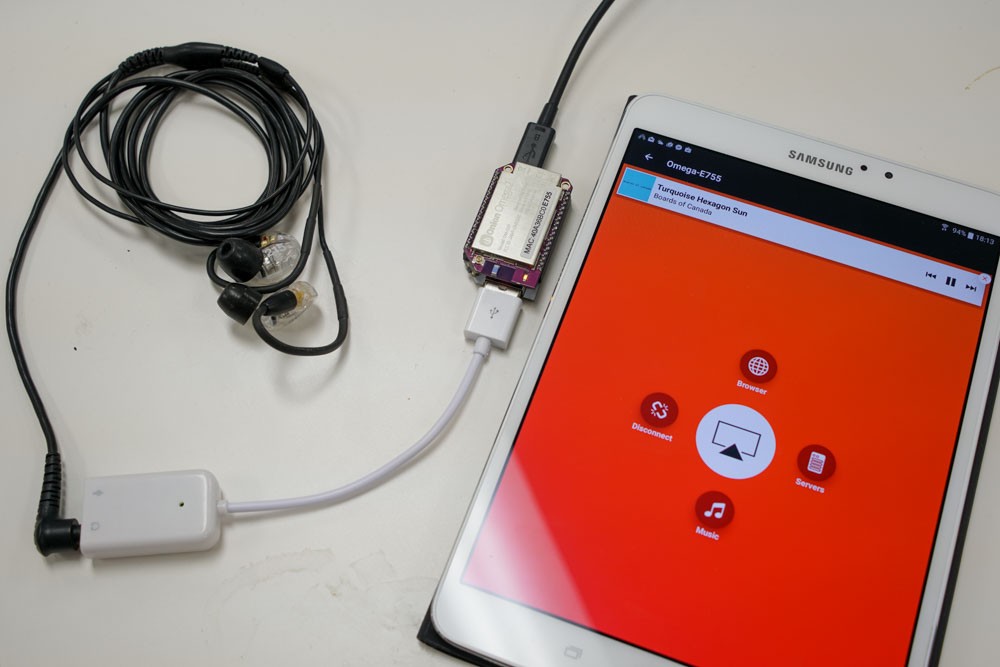
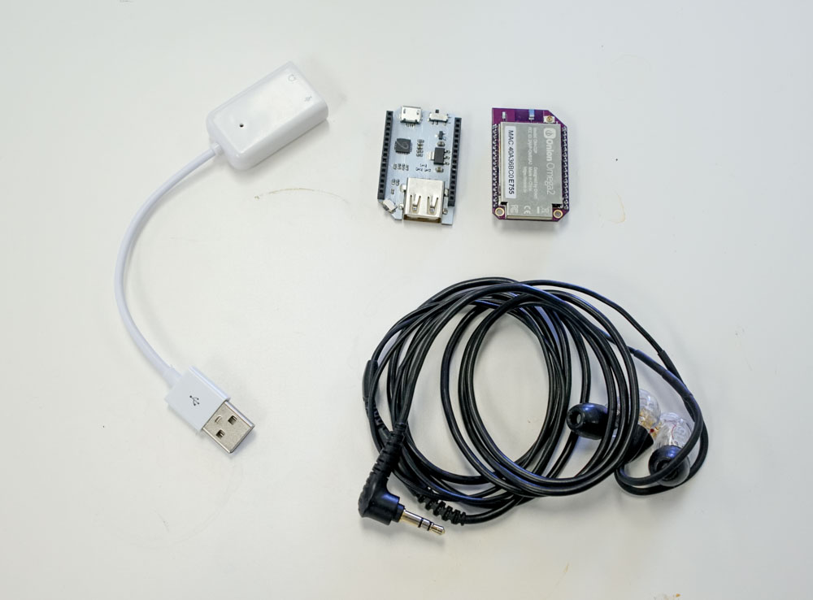
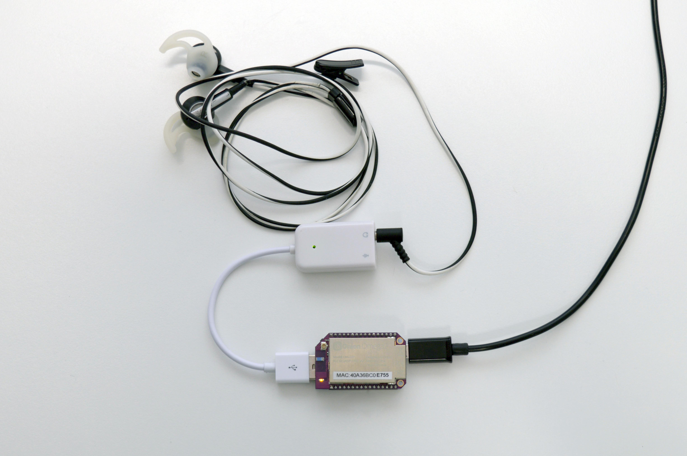
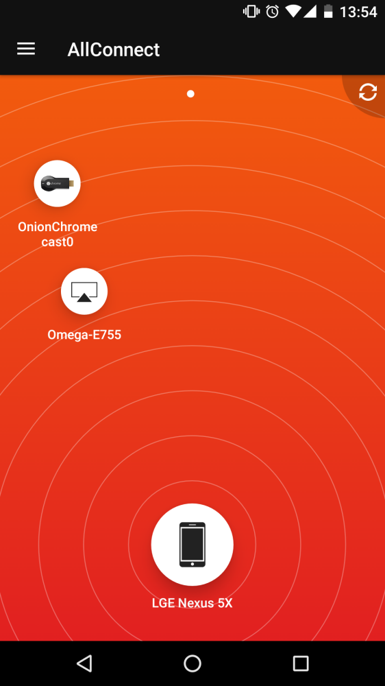

## AirPlay with the Omega

<!-- // brief intro to the project  -->
<!-- // include a photo of the final result -->

Thanks to the work of Mike Brady, the Omega can be set up to receive AirPlay streams. With a USB audio device, we can turn our Omega into a wireless speaker that can be controlled with a laptop or phone!



### Overview

**Skill Level:** Intermediate

**Time Required:** 15 Minutes

<!-- // go into some detail here about how we're going to be implementing the project -->
<!-- //	eg. which programming language we'll be using, APIs -->
<!-- //	include links to any api or module references -->

There's three main pieces of the puzzle here:

To get AirPlay working, we will set up `shairport-sync` on the Omega. The audio stack on the Omega will work out of the box with USB devices, so we simply need to plug in any USB audio device. Finally, to actually stream music, a device with AirPlay controller capabilities must be set up to stream to the Omega.

We'll go over setting all of it up, but first, our ingredients.

### Ingredients

<!-- // a numbered list of all physical items used to make this project -->
<!-- //	all items should be linked to a place online where they can be bought -->
<!-- //	the Onion items should be linked to their corresponding Onion store page -->

1. Onion Omega2 or Omega2+
1. Onion Dock with USB connectivity
1. A USB audio device
    * Either USB speakers
    * or a USB Digital-Analog Converter



### Step-by-Step

Follow these steps and we'll have audio streaming to the Omega in no time!

#### 1. Prepare the Ingredients

<!-- // brief description of the step activity -->
<!-- //	include photos -->
For this project, we'll need an Omega2 ready to go. If needed, complete the [First Time Setup Guide](https://docs.onion.io/omega2-docs/first-time-setup.html) to connect your Omega to WiFi and update to the latest firmware.


#### 2. Replace Avahi

The version of Avahi that comes installed on the Omega does not have 'dbus-daemon' support which we'll be 

To fix this, we'll have to connect to the Omega's [command line](https://docs.onion.io/omega2-docs/connecting-to-the-omega-terminal.html#connecting-to-the-omega-terminal) to uninstall the pre-existing avahi package. Then we can get the `avahi-dbus-daemon` package to replace it.

First to uninstall avahi:
```
opkg remove avahi-nodbus-daemon --force-depends
```

Once that's finished,

```
opkg update
opkg install avahi-dbus-daemon --force-overwrite
```

#### 3. Install Shairport Sync

`shairport-sync` runs an Airplay Receiver server to listen and process AirPlay streams. 

Fortunately, it is available in the Onion Repositories, so we can install with `opkg`:

```
opkg install shairport-sync
```

#### 4. Configure Shairport Sync

Shairport Sync requires some set up to work properly. To configure it, we'll be editing `/etc/config/shairport-sync`. Open it up and you should see something like this:

```
# Use your own config file
config shairport-sync 'shairport_sync_file'
        option disabled '1'
        option respawn '1'
        option conf_custom '1'
        option conf_file '/etc/shairport-sync.conf'

# Use OpenWrt UCI config
config shairport-sync 'shairport_sync'
        option disabled '1'
        option respawn '1'
        ...
        ...
```

The first block isn't useful to us. We want to edit options under the `# Use OpenWrt UCI config` line.

Specifically, these following lines:

```
        option disabled '1'
        ...
        option name 'Shairport-Sync-%v-%h'
        option password ''
        ...
        option mdns_backend '' # avahi/external-avahi/dns-sd/external-dns-sd/tinysvcmdns
```

First let's set `disabled` to `'0'` to enable the UCI configuration. 

Optionally, pick out a new name to display in your AirPlay devices menus.

Next, consider using a password - not mandatory, but much be handy.

Finally, make sure the `mdns_backend` is set to `'tinysvcmdns'`

The rest of the options can be kept as their default values.

If you need a reference for the default configurations, we've put them into the [airplay-receiver GitHub repo]()

Restart the Omega for the changes to take effect, and we'll plug in some speakers!

#### 5. Set up your audio

In our setup, we used a USB Digital-Analog Converter (DAC). But any USB speaker setup should work out of the box thanks to Linux's audio stack. Plug it into the dock, and we'll be good to go!

<!-- // DONE: image of dock plug -->


#### 6. Prepare your controller

AirPlay works out of the box for iOS devices, so if you own one there's no set up needed.

If you wish to use an Android device, we found AllStream and DoubleTwist to have stable AirPlay integration.


#### 6. Fire up Shairport Sync

Now that everything's ready to go, enter `shairport-sync -d` to start up the shairport-sync server in the background.

Now take a look at your AirPlay device, and you should see the Omega pop up as a receiver!

<!-- // DONE: screenshot of shairport working on android -->



<!-- ### Code Highlight -->

<!-- // one or two paragraphs (max) about something cool we did in the code -->
<!-- //	just give a brief description/overview and provide links to where they can learn more (Onion Docs, online resources, etc) -->
 
