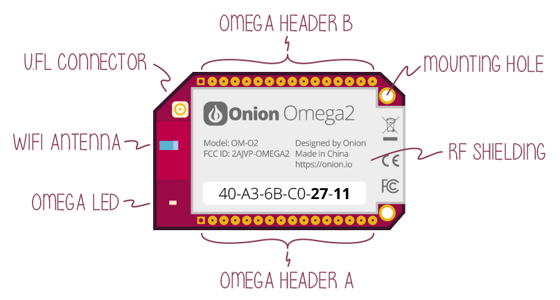
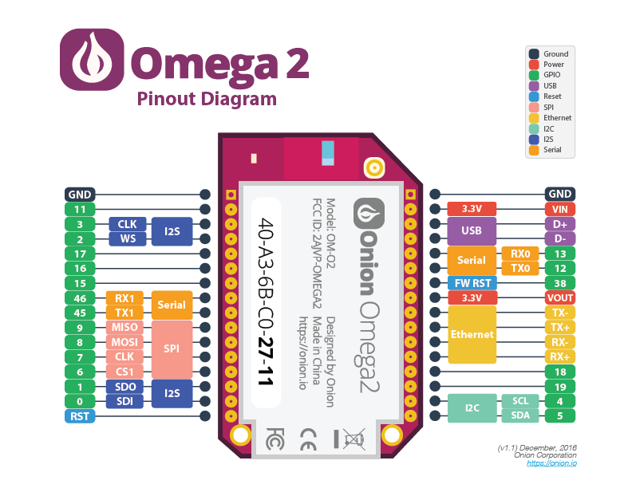
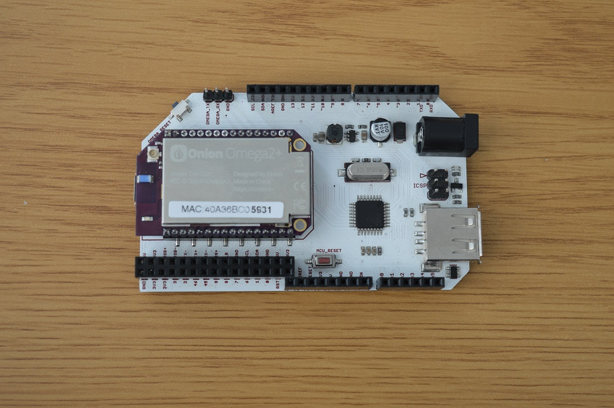
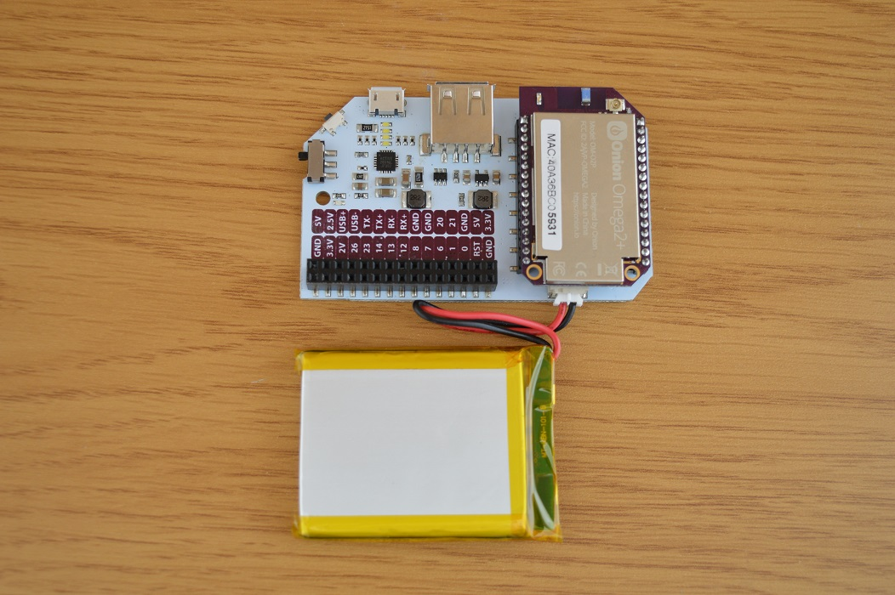
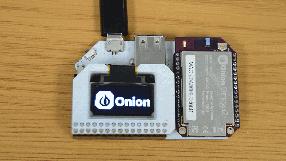
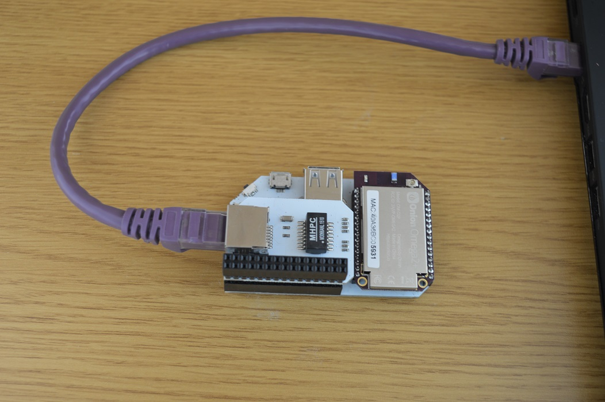

## Introduction to the Omega2 {#omega2-intro}

Wondering what exactly the Omega2 is all about? You've come to the right place!


#### What is an IoT Computer?


An IoT computer is a Linux computer designed specifically for use in building connected hardware applications meant for IoT. As a refresher, IoT (which stands for the Internet of Things) is the next big technological wave. It involves providing intelligence and internet connectivity to physical devices of all sorts, this includes home appliances, cars, buildings, really anything. The newly smart devices will be able to collect and exchange data as well as receive instructions. All with the goal of having all of our devices work together to improve our lives, whether through automating your sprinkler system to keep your lawn or garden green without any intervention, having your coffee machine brew automatically and sounding your alarm early when there's heavy traffic, or improving the efficiency of your manufacturing and shipping business.

So then, what is an IoT computer used for, exactly? The Omega2 IoT computer is meant to be a development platform for all things IoT, whether you want to experiment, build yourself some sweet gadgets for fun, or prototype and create an IoT product.

What makes the Omega an IoT computer:

* Small form factor
* Power efficiency
* Processing, networking, and encryption capabilities
* Flexibility that comes from running a Linux OS
	* Support for many programming languages and many simultaneous processes


##### Comparisons

If you're familiar with existing development boards, the Omega2 can be categorized as **something in between an Arduino and a Raspberry Pi**.

When compared to an **Arduino Uno**, the Omega has several advantages since it is a computer while the Uno is a microcontroller:

* It is powered by a full processor, not a microcontroller
* Runs a full Linux (soft) real-time operating system
	* Supports many programming languages
	* Has a filesystem with storage
* Networking (wireless and wired) support built-in, can be programmed

Some things the Arduino Uno can do that the Omega cannot:

* Support for analog inputs and outputs
* Provide cycle accurate signals for controlling very low level hardware

The Omega is more similar to the **Raspberry Pi**, since they're both computers. Being an IoT computer, the Omega does some things differently from the Raspberry Pi single-board computer:

* Comes with on-board storage and the OS preloaded - getting it up and running for the first time takes about two minutes
* Built-in WiFi radio and capabilities (not all Raspberry Pi models come with this on-board)
* Lower power consumption

Since the Omega is not a general purpose computer, there are a few things the Raspberry Pi family can do that the Omega cannot:

* Output HD video
	* The Omega's IoT-centric purpose means it can drive smaller screens, but not a computer monitor or TV
* Run a graphical Linux desktop
	* The Omega is not a general purpose computer; it is meant for use-cases that prioritize connectivity and lower power consumption
* Generally, the Raspberry Pi's SoCs have more processing power
	* The Omega prioritizes power efficiency over processing performance

So, the Omega is more powerful and flexible than the Arduino Uno, and it provides internet & network connectivity right out of the box. However, it is not as powerful as the Raspberry Pi and cannot output video to TVs or monitors, since it is geared towards power efficiency and out-of-the-box usage with the built-in storage, preloaded OS, and WiFi networking. Best of all, the Omega is a very affordable module, with prices that are lower than or very closely rival its neighbors in the development board space.

Note that we at Onion use and love both the Arduino Uno (as well as other Arduino products) and all Raspberry Pi models. We wanted to provide a development platform specifically geared towards IoT, and that is how the Omega came into being.


#### History

Back in late 2014, we were trying to make a thermal printer automatically print our To Do lists from Evernote. We struggled quite a bit during this endeavour and realized the need for an IoT computer. So we got to work and in the spring of 2015, Onion launched the [original Omega](https://www.kickstarter.com/projects/onion/onion-omega-invention-platform-for-the-internet-of) on Kickstarter. The response was great! About 4,400 makers, coders, and tinkerers backed the campaign. We spent a considerable amount of time in Shenzhen, China and made the Omega and it's assorted Docks and Expansions into a reality, with a variety of speed-bumps along the way. This process provided many great lessons about product design, manufacturing, and delivery.

After listening to feedback from the community and taking a hard look at the state of IoT, Onion decided to launch the Omega2 in 2016. The Omega2 would have two models with different specs, be even lower cost than the original, and be fully FCC certified! The [Omega2 Kickstarter](https://www.kickstarter.com/projects/onion/omega2-5-iot-computer-with-wi-fi-powered-by-linux) was successful beyond belief, with over 16 thousand backers pledging to the campaign!

### Hardware

The Omega2 IoT Computer:



The Specs:

|   | Omega2 | Omega2+ |
| :-------------: | :-------------:  | :-------------:  |
| Processor | 580MHz MIPS CPU  | 580MHz MIPS CPU  |
| Memory | 64MB Memory  | **128MB Memory**  |
| Storage | 16MB Storage  | **32MB Storage**  |
| USB | USB 2.0  | USB 2.0  |
| MicroSD Slot | No  | **Yes**  |
| WiFi adapter | b/g/n Wi-Fi  | b/g/n Wi-Fi  |
| Operating Voltage | **3.3V**  | **3.3V**  |

#### SoC

The Omega2 uses the Mediatek MT7688AN System-on-a-Chip (SoC). The processor is MIPS 24KEc, little-endian, 32-bit RISC core that operates at 580 MHz. For the truly curious, it has a 64 KB I-Cache and 32 KB D-Cache.

While this family of SoCs has traditionally been used in routers, this is very much a real CPU (and not a microcontroller) like you would find in a smartphone or laptop. It's just a different architecture (MIPS as opposed to ARM in smartphones or x86 in laptops & desktops) and operates at a lower frequency: about a quarter of the speed of a modern laptop CPU.

The lower clock speed and the MIPS architecture of the SoC lend to the Omega's low power consumption and low heat generation. This makes it ideal for use in the space and energy constrained use cases common for IoT applications.

| SoC | |
| :-------------: | :-------------:  |
| SoC | MediaTek MT7688AN |
| Architecture | MIPS 24KEc (RISC, 32-bit) |
| Endianness | Little |
| Clock Speed | 580 MHz |
| I-Cache | 64 KB |
| D-Cache | 32 KB |


#### Memory

The Omega2 comes with **128 MB** of memory and the Omega2+ with **256 MB**. Both models use DDR2 DRAM (Dynamic Random Access Memory).


#### Storage

While technically still memory, we refer to the Omega's onboard SPI flash memory as storage since it provides persistent, non-volatile memory that will not be destroyed when the Omega is powered off. The flash storage is where the Operating System (OS), programs, and all other files are stored. This flash storage is to the Omega what a hard-drive is to a laptop computer.

The Omega2 comes with **16 MB** flash storage while the Omega2+ has **32 MB**.


##### Micro-SD Card Slot

The Omega2+ additionally has a Micro-SD card slot on the underside that can be used to extend the storage available to the system. It is also possible to boot the Omega from the SD card.


#### Networking

The Omega2 has support for both wireless and wired networking.

##### WiFi

The Omega supports 2.4 GHz IEEE 802.11 b/g/n WiFi with a 150 Mbps PHY data rate. The antenna is 1T1R, meaning that it is used for both transmitting and receiving by virtue of time-multiplexing. By default, the Omega uses the on-board ceramic chip antenna. However, there is also a u.FL connector onboard for those who wish to use external antennas.

The Omega's WiFi interface supports hosting its own WiFi Access Point, connecting to existing WiFi networks, or both simultaneously.

##### Ethernet

The Omega supports 10M/100M wired ethernet network connectivity as well when used with a Dock and an Ethernet Expansion.


#### GPIOs

The Omega2 has twelve General Purpose Input/Output (GPIO) pins that can be controlled by the user.

##### GPIO Mapping

On the Omega, the GPIOs are laid out in two banks:

<!-- image of omega2 pinout -->


##### Electrical Characteristics

Before interfacing with external electronics, the electrical characteristics of the Omega should be noted. The most important part is that the Omega's GPIOs are **3.3V** and **are not** 5V tolerant. Interfacing with 5V devices directly may damage your Omega's GPIOs!

###### Digital Signal Voltage Level

```{r child = '../../Documentation/Doing-Stuff/GPIO-electrical-characteristics.md'}
```

###### Current Limits

The Omega's GPIOs have current limitations: a GPIO can source or sink up to 8mA. This is not a high current, so try to limit the current demands on the GPIOs to avoid damaging your device. Use external circuits controlled by the Omega's GPIOs if your project has higher current demands.


##### USB

The Omega supports the USB 2.0 protocol as a host. Use USB devices to extend the functionality of your system. Most Docks provide a USB Type-A socket for easier connectivity.

##### Serial Protocols

The Omega supports several useful serial communication protocols.

###### I2C

Support is included for the ubiquitous Inter-Integrated Circuit interface, also known as I2C. I2C is a master-slave bus protocol that allows a master device to interact with and control multiple slave devices. It is fast and reliable and only uses two data lines: SCL for the bus clock and SDA for the serial data.

| Signal | Purpose    | Omega GPIO |
|--------|------------|------------|
| SCL    | Clock Lane | 4          |
| SDA    | Data Lane  | 5          |

The Omega acts as an I2C bus master, issuing commands and reading responses from other devices and chips. For example, the Omega controls the Servo (PWM), Relay, and OLED Expansions using I2C.

See our [Documentatation on I2C](https://docs.onion.io/omega2-docs/communicating-with-i2c-devices.html) for more details.

###### UART

The Universal Asynchronous Receiver Transmitter (UART) protocol is supported as well. A UART is meant for direct communication between two devices, with no concept of a master or a slave. It uses two data lines: one for transmitting and one for receiving. Note that the transmitting (TX) pin of one device, needs to be connected to the receiving (RX) pin of the other device, and vice versa.

The Omega has two separate UARTs, meaning it can be connected via UART to two separate devices. By default, `UART0` is configured to provide a serial interface to the Omega's command line. On the Expansion and Mini Docks, `UART0` is connected to a USB-to-Serial chip that allows access to the command line through the Micro-USB connection. The other one, `UART1` is exposed on the Expansion Header, and is free to be used to communicate with other devices. On the Arduino Dock 2, it is hard-wired to the ATmega microcontroller for direct and reliable communication.

| Signal   | Omega2 GPIO |
|----------|-------------|
| UART0 TX | 12          |
| UART0 RX | 13          |
| UART1 TX | 45          |
| UART1 RX | 46          |

See our [Documentatation on UART](https://docs.onion.io/omega2-docs/uart1.html) for more details.

###### SPI

Finally, the Omega also supports the Serial Peripheral Interface (SPI) protocol. SPI is a four-wire, master-slave, synchronous communication protocol that can run at high speeds and transfer lots of data. It is generally used to connect microprocessors or microcontrollers to sensors, memory, and other peripherals. The SPI Master can have multiple connected SPI slaves, but each requires it's own *Slave Select* (also known as *Chip Select*) signal that indicates that specific devices is the current subject of communication.

The Omega uses SPI to communicate with the on-board flash memory that is used as storage for the Operating System and all of the files.

| Signal     | Description                                                   | Omega GPIO |
|------------|---------------------------------------------------------------|------------|
| SCK        | System Clock                                                  | 7          |
| MOSI       | Master Out, Slave In - Data sent from the Master to the Slave | 8          |
| MISO       | Master In, Slave Out - Data sent from the Slave to the Master | 9          |
| CS0        | Chip Select 0                                                 | Internally connected to flash storage |
| CS1        | Chip Select 1                                                 | 6          |

See our [Documentatation on SPI](https://docs.onion.io/omega2-docs/communicating-with-spi-devices.html) for more details.


### Software

The Omega2 runs an Onion-customized version of the [LEDE (Linux Embedded Development Environment) operating system](https://lede-project.org/), a distribution based on OpenWRT.

The Omega's OS comes equipped as a web server by default, so that other devices on the local network can interact with the Omega through a browser.

#### Supported Programming Languages

* C & C++
* Python
* NodeJS
* Rust
* Ruby
* PHP
* Perl
* GoLang

#### Installing  Software

Since the processor's architecture is MIPS, all applications need to be compiled specifically for the MIPS architecture. So you unfortunately can't just download regular Linux installation packages and run them on the Omega. Luckily, LEDE has it's own package management system in the `opkg` program. The `opkg` utility allows users to access online software package repositories and install the packages. By default, it only looks at Onion's package repository, but the main LEDE package repositories can be enabled easily.


### Docks

To make the Omega incredibly easy to use, it can be plugged directly into any of a number of **Docks** provided by Onion. All Docks can be powered with a regular Micro-USB cable, they contain a regulator circuit to safely provide 3.3V to power the Omega. Each Dock adds unique functionality to the Omega, including exposing the Omega's GPIOs, supporting the plug and play Omega Expansions, provide USB connectivity, among other things.

#### Expansion Dock

The [Expansion Dock](https://onion.io/store/expansion-dock/) can be considered the main Dock for the Omega. As the name implies, it supports Omega Expansions since it has the Expansion Header that exposes the Omega's GPIOs.


It's meant to be the main platform for the development phase of your project or product. It features an on-board USB-to-Serial chip that allows serial connectivity to the Omega's command line terminal through the Micro-USB port. The serial terminal can be used to access the bootloader in case the Omega's OS is corrupted or cannot successfully boot. It also provides a USB Type-A plug for connecting USB devices to the Omega.

See the Expansion Dock [hardware overview](https://docs.onion.io/omega2-docs/expansion-dock.html) and [usage guide](https://docs.onion.io/omega2-docs/expansion-dock.html#using-the-dock) for more details.


#### Arduino Dock

The [Arduino Dock 2](https://onion.io/store/arduino-dock-r2/) features the ATmega328P microcontroller (the very same one used on the Arduino Uno) that can be programmed by the Omega to work in tandem as a co-processor. The Omega and ATmega328P can communicate using I2C and a serial UART connection.



The Arduino Dock 2 exposes the microcontroller pins in the same header design as the Arduino Uno, so it can be used with any existing Arduino Shields. It also features the Expansion Header that exposes the Omega's GPIOs, allowing the use of all Omega Expansions. Also present is a USB Type-A socket for connecting USB devices to the Omega.


See the Arduino Dock 2 [hardware overview](https://docs.onion.io/omega2-docs/arduino-dock-2.html) and [usage guide](https://docs.onion.io/omega2-docs/arduino-dock-2.html#using-the-dock-1) for more details.


#### Power Dock

The Power Dock offers the mobility that comes with powering the Omega with any 3.7V LiPo (Lithium ion Polymer) battery. When plugged into power with a Micro-USB cable, it will charge up the battery. If no battery is present, the Omega can be powered with just the Micro-USB, similar to the Expansion Dock.




Use the Power Dock to deploy your developed projects and/or provide a battery back-up to maintain power to mission-critical Omega systems. Also featured is the Expansion header, exposing the Omega's GPIOs and providing support for all Omega expansions. Like the other Docks, it has a USB Type-A socket for connecting USB devices to the Omega.

See the Power Dock [hardware overview](https://docs.onion.io/omega2-docs/power-dock.html) and [usage guide](https://docs.onion.io/omega2-docs/power-dock.html#using-the-power-dock) for more details.


#### Mini Dock

As the name implies, the [Mini Dock](https://onion.io/store/mini-dock/) is the smallest form-factor Dock for the Omega. It does not provide direct access to the GPIOs, but exposes the USB port, making it ideal for networking or USB-based use-case.


See the Mini Dock [hardware overview](https://docs.onion.io/omega2-docs/mini-dock.html) for more details.


#### Breadboard Dock

The [Breadboard Dock](https://onion.io/store/breadboard-dock/) rather unsurprisingly allows the user to plug their Omega directly into a breadboard. The Omega can be powered with a Micro-USB 5V supply since the breadboard has a voltage regulator, or it can be provided with 3.3V directly from the breadboard.


The Omega’s pins are mapped 1-to-1 to the breadboard headers, so it’s about as close as you can get to plugging the Omega directly into a breadboard.

See the Breadboard Dock [hardware overview](https://docs.onion.io/omega2-docs/breadboard-dock.html) for more details.

### Expansions

The Expansions are the key to the Omega's modularity and flexibility since they add specific functionality to the system. As long as the Dock used with the Omega has an Expansion Header, it can support  plug and play Omega Expansions.

| Docks that Support Expansions |
|-------------------------------|
| Expansion Dock                |
| Arduino Dock 2                |
| Power Dock                    |


#### Servo (PWM) Expansion

Generate up to 16 different, free-running Pulse Width Modulated (PWM) signals with the [Servo (PWM) Expansion](https://onion.io/store/servo-pwm-expansion/). The PWM signals are driven by the Dock's 5V power supply by default, it also supports using an external supply (up to 12V DC) to drive the PWM signals.


Use it to control Servos, LEDs, transistors, anything that supports PWM. The on-board oscillator supports generating PWM signals at frequencies in the range of 24 Hz to 1526 Hz. The default frequency is 50 Hz for compatibility with most servos. Note that when using multiple servos under a load, use of an external power supply is recommended.

For more details see:

* [PWM Expansion hardware overview](https://docs.onion.io/omega2-docs/pwm-expansion.html)
* [Guide to using the PWM Expansion](https://docs.onion.io/omega2-docs/using-pwm-expansion.html)

#### Relay Expansion

Use two electromechanical relays to switch external, independent, and potentially much higher-voltage circuits with the [Relay Expansion](https://onion.io/store/relay-expansion/).


The relays can switch up to 60W, and are rated for a maximum current of 2A and a maximum voltage of 220V DC or 250V AC. It includes an I2C address switch, allowing the use of up to eight (8) Relay Expansions with a single Omega, giving the user control of up to 16 external circuits.

For more details see:

* [Relay Expansion hardware overview](https://docs.onion.io/omega2-docs/relay-expansion.html)
* [Guide to using the Relay Expansion](https://docs.onion.io/omega2-docs/using-relay-expansion.html)

#### OLED Expansion

The [OLED Expansion](https://onion.io/store/oled-expansion/) is a low-power 0.96" monocrome OLED screen with a 128x64 resolution. Use it to display text and images.



The pixel brightness is adjustable, as well as inversion of white and black. A single command enables built-in scrolling animations, where the contents of the entire display can be scrolled to the left, right, or diagonally left, and right.

For more details see:

* [OLED Expansion hardware overview](https://docs.onion.io/omega2-docs/oled-expansion.html)
* [Guide to using the OLED Expansion](https://docs.onion.io/omega2-docs/using-oled-expansion.html)

#### Ethernet Expansion

Add an ethernet port for wired network connectivity with the [Ethernet Expansion](https://onion.io/store/ethernet-expansion/).



The Omega has a 10/100 ethernet port, meaning it supports transmissions at 10 Mbps and 100 Mbps. The Omega has extensive networking capabilities, use the Ethernet Expansion to share network access between wired and wireless networks. Or, just provide a wired network connection to the Omega.

For more details see:

* [Ethernet Expansion hardware overview](https://docs.onion.io/omega2-docs/ethernet-expansion.html)
* [Guide to using the Ethernet Expansion](https://docs.onion.io/omega2-docs/using-ethernet-expansion.html)


#### GPS Expansion

The USB-based [GPS Expansion](https://onion.io/store/gps-expansion/) provides location data from the Global Positioning System (GPS) satelittes.


The on-board antenna is connecting using a u.FL antenna connector, meaning that it can be easily unplugged and replaced with a larger, more powerful antenna.

For more details see:

* [GPS Expansion hardware overview](https://docs.onion.io/omega2-docs/gps-expansion.html)
* [Guide to using the GPS Expansion](https://docs.onion.io/omega2-docs/using-gps-expansion.html)
