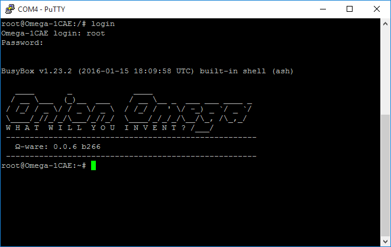

## The Command Line {#the-command-line}

```{r child = '../../Kit-Guides/shared/intro/the-command-line-content-0.md'}
```



```{r child = '../../Kit-Guides/shared/intro/the-command-line-content-1.md'}
```
