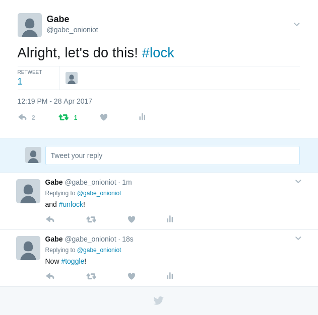
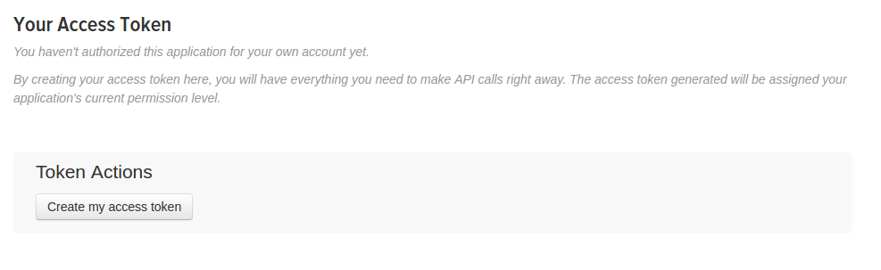

## IoT Lock - Control with a Tweet {#internet-lock-p2}

Let's take what we did in Internet Lock - Part 1, and add a program to control it in real time from Twitter!



**Disclaimer: This security-related project is just that: a *project*. This is not intended to be a fully-featured nor robust home security solution. Use your own judgment when applying this project to securing your belongings, property, etc. By doing this project, you accept all risk and Onion cannot be held responsible for any damages or misuse.**

### Overview

**Skill Level:** Intermediate

**Time Required:** 30 minutes

The code will be written in Python and we'll be making use of [Twitter's Streaming APIs](https://dev.twitter.com/streaming/overview) to grab Tweet data. Specifically, the code uses the [Tweepy library](http://www.tweepy.org/) to manage authentication and keeping a persistent HTTP connection to Twitter.

Same as before, the code used to handle this setup can be found in the [iot-door-lock repository](https://github.com/OnionIoT/iot-door-lock) on GitHub.

### Lock Access Rules

First, this app will be listening for new tweets from the users you specify in the configuration file. Please note that all public tweets will be received over the Internet by your Omega when the main script is running.

By default, the Omega is configured to change the state of the lock when it detects a tweet from an authorized user with a corresponding hashtag. The list of allowed users and hashtags for each command are configured in a separate JSON file, `config.json`.

The default hashtags that correspond to lock actions are:

| Hashtag | Lock Action                                                                   |
|---------|-------------------------------------------------------------------------------|
| #lock   | Program the Relay to set the lock to **locked**                               |
| #unlock | Program the Relay to set the lock to **unlocked**                             |
| #toggle | Unlock, wait 5 seconds, lock again (Does nothing if lock is already unlocked) |

Some examples of authorization are shown below (all of the command hashtags follow the same rules):

| Event      | Lock Response |
|:-----------|:----------:|
| `@authorizedUser1` posts a status containing `#unlock` | Unlock |
| `@authorizedUser2` replies to a status and includes `#toggle` | Toggle (briefly unlock, and then lock again) |
| `@authorizedUser2` retweets a status from `@authorizedUser1` that contains `#lock` | Lock |
| `@unauthorizedUser1` posts or retweets a status containing `#toggle`| None |
| `@unauthorizedUser2` posts retweets a status from `@authorizedUser1` containing `#unlock`| None |

**Note:** The lock will respond to the **first** command hashtag it finds in each status, so posting "`#lock` `#unlock`" will activate the lock.

### Ingredients

Unlike Part 1, the dependencies for the Python Twitter software requires more space than is available on the Omega2 standard model by default. You will either have to [boot from external storage](https://docs.onion.io/omega2-docs/boot-from-external-storage.html) or use an Omega2+ instead.

We will be using the same components and setup as in the first part:

* Onion [Omega2+](https://onion.io/store/omega2p/), or [Omega2](https://onion.io/store/omega2/) with external storage
* Any Onion Dock that supports Expansions: [Expansion Dock](https://onion.io/store/expansion-dock/), [Power Dock](https://onion.io/store/power-dock/), [Arduino Dock 2](https://onion.io/store/arduino-dock-r2/)
* Onion [Relay Expansion](https://onion.io/store/relay-expansion/)
* An electric lock *
* Lock mounting tools - screws, bolts, extra wires, and appropriate tools
* Appropriate power supply for your lock
    * we found a [12V/1A DC power supply](https://www.amazon.com/gp/product/B019X3XVWS/ref=as_li_tl?ie=UTF8&camp=1789&creative=9325&creativeASIN=B019X3XVWS&linkCode=as2&tag=onion0e-20&linkId=7e3fcbbeb2bf474a33f4d68a7413fc21) to be compatible with most locks

\* We recommend a simple power locking, normally unlocked lock so you don't get locked out when there's no power.

Here's what our list looked like - minus the mounting tools and parts.


### Step-by-Step

Follow these instructions to control the smart lock from Twitter on your very own Omega!

#### 1. Prepare

You'll have to have your Omega2 ready to go, complete the [First Time Setup Guide](https://docs.onion.io/omega2-docs/first-time-setup.html) to connect your Omega to WiFi and update to the latest firmware.


#### 2. Complete Part 1 of the Project

This project builds on the first part of the IoT Lock project. If you haven't already completed the [first part](#internet-lock-p1), go back and do it now!

#### 3. Install Dependencies

[Connect to the Omega's command line](https://docs.onion.io/omega2-docs/connecting-to-the-omega-terminal.html#connecting-to-the-omega-terminal) and  run the following commands:

```
opkg update
opkg install python-pip
pip install --upgrade setuptools
pip install tweepy
```

#### 4. Create a Twitter Application

We'll need to create a Twitter Application in order to be able to use Twitter's APIs to grab Tweets. Specifically, our code needs the following information:

* an API Key
* an API Secret
* an Access Token
* an Access Token Secret

in order to authenticate with Twitter before we can use the APIs.

1. If you don't have a Twitter account, [create one now](https://twitter.com/signup).
1. Head over to https://apps.twitter.com and sign in with your Twitter handle

  

1. Fill in the form details for your application. Twitter app names must be unique globally, so try calling it `omega-ABCD-door-lock`, where ABCD are the 4 digits in your Omega's hostname.

  

1. Read and agree to the Twitter Developer Agreement and hit Create your Twitter application.

  

  > Note that your Twitter account must have an associated mobile phone number before Twitter will allow you to create an application!

1. Your Application is now created!

  

1. Head over to the **Keys and Access Tokens** tab to grab the info we need

  

1. Scroll down to the section called "Your Access Token", and click "Create my access token".

  

We will be using the 2 pairs of keys and secrets to authorize our app to connect to Twitter, so copy and paste or write them down somewhere for later.

#### 5. Edit the Configuration File

Open the `config.json` file and edit or paste in the following information:

| config.json | Value |
|:-----|:-------------|
| consumerKey | Consumer Key in the Twitter application menu |
| consumerSecret | Twitter Consumer Secret |
| accessToken | Twitter Access Token |
| accessTokenSecret | Twitter Access Token Secret |
| allowedUsers | A comma-separated list/array of screen names who will have access to your lock. eg.: `["@john_smith", "@jane_doe"]` |
| hashtags | Customize the hashtag you want for each action. The defaults are `#lock`, `#unlock`, and `#toggle`. |

If you trust them, you can add friends or family to the list of allowed users.

#### 6. Running the Project

Navigate to the repo directory and run:

```
python tweetLock.py
```

The script will then run forever, listening for new tweets until you exit by pressing `Ctrl-C`.

Now try tweeting from some of the allowed accounts and include one of the hashtags you configured. You should see your lock reacting very quickly!


Tell your friends to try it out too!

#### 7. Rate Limiting

The Twitter Streaming API that pushes new tweets to the Omega limits the amount of **new** sessions you can initiate within a certain period of time. If you restart the program too often in a short window of time, you will receive a 420 error. You will see a warning on the command line, and the program will automatically disconnect and retry according to Twitter's recommended backoff policy; see the Rate Limiting section on [Twitter's documentation](https://dev.twitter.com/streaming/overview/connecting).

The rate limiting criteria are not made public, so we recommend playing it safe and relaxing for about 5-10 minutes each time you need to restart the script.

**Note:** Too many connection attempts may result in your IP being banned from connecting to Twitter!

#### 8. Running the Program on Boot

We can automate this project to run when the Omega is turned on, and we can also make it run in the background so you can use the Omega for other things while it's running! To do this, we'll place a script in  `/etc/init.d`.

In the repo folder, make the `etc/init.d/tweet-lock` file executable, copy it to `/etc/init.d`, then enable it to run on boot:

```
cd etc/init.d
chmod +x tweet-lock
cp tweet-lock /etc/init.d
/etc/init.d/tweet-lock enable
```

Wait for 5-10 minutes, reboot the Omega, and you will automatically be able to tweet at your lock again!

> The `/etc/init.d/tweet-lock` script registers the IoT Lock Python script as a service with `procd`, the process management daemon of the system. `procd` then ensures that the process gets started at boot and continues to run until the service is disabled.

### Code Highlight

This project uses the Twitter Streaming API, made easily accessible by the Tweepy library. Streaming, as opposed to using the REST API, lets Twitter push data such as new statuses or direct messages immediately after they happen in real-time. This eliminates the overhead of repeatedly polling Twitter for new information; it'll get sent to us as it happens.

When opening a stream, you must specify some way to filter the incoming tweets. This is because thousands of tweets are sent every second on average; that's a **lot**! The two most common ways of doing this are by:

* following particular users
* tracking keywords

Here we use the first method by only receiving tweets from our list of authorized users.

The streaming functions have been further abstracted by the `StreamListener` and `TwitterApp` classes in `twitterHelper.py`. Any class that is used to receive and process tweets must extend the `tweepy.StreamListener` class by redefining its callback methods, such as `on_status()` and `on_error()`. These functions are called when an event such as a new status occurs. They do nothing by default, so you need to tell them what to do!

For full details on the Tweepy library, visit the [documentation page](http://docs.tweepy.org/en/latest/).
