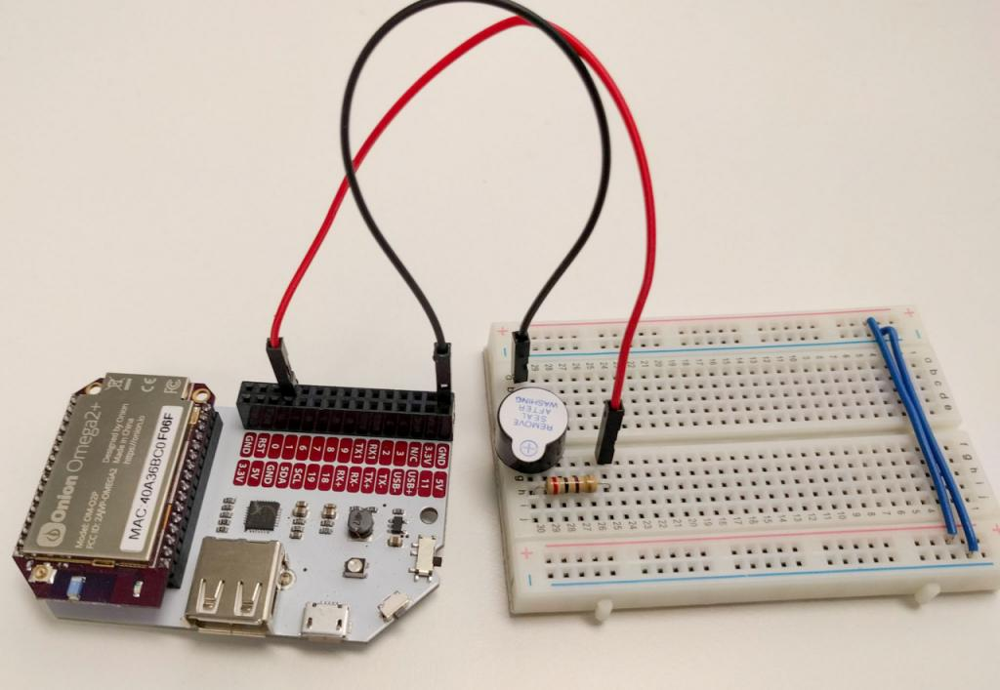
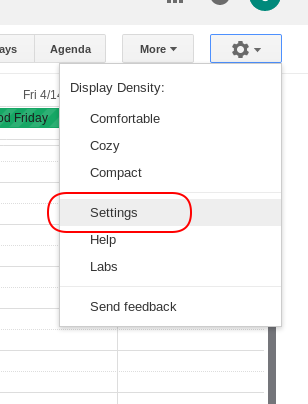
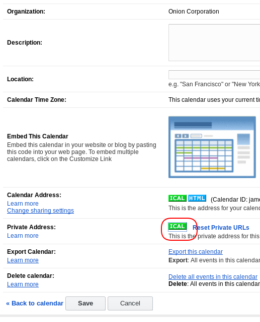
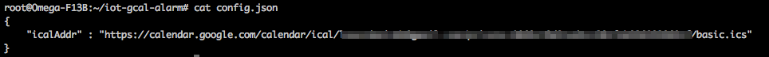

## Alarms based on an Online Calendar {#calendar-alarm}

This project will create a real-world alarm clock that can be setup from an online calendar of your choice. Just create a calendar event with a specific word in it, and your Omega will act as an alarm based on the event's time and date.



### Overview

**Skill Level:** Intermediate

**Time Required:** 30 minutes

This project requires an online calendar source in addition to the ingredients below. We'll be using Google calendar in our Step-By-Step, but you can pick any compatible iCalendar source.

The complete project code can be found in Onion's [`iot-gcal-alarm` repo on GitHub](https://github.com/OnionIoT/iot-gcal-alarm).


### Ingredients

* Onion [Omega2](https://onion.io/store/omega2/) or [Omega2+](https://onion.io/store/omega2p/)

* Any Onion Dock that exposes the Omega's GPIOs: [Expansion Dock](https://onion.io/store/expansion-dock/), [Power Dock](https://onion.io/store/power-dock/), [Arduino Dock 2](https://onion.io/store/arduino-dock-r2/), [Breadboard Dock](https://onion.io/store/breadboard-dock/)
* A [breadboard](https://www.amazon.com/gp/product/B004RXKWDQ/ref=as_li_tl?ie=UTF8&camp=1789&creative=9325&creativeASIN=B004RXKWDQ&linkCode=as2&tag=onion0e-20&linkId=3f7f512f8017eeed52768810a0deca09) (optional, but recommended)
* 1x 100Ω Resistor
* Buzzer
* 2x Jumper wires (M-M)


### Step-by-Step

Follow these instructions to setup your very own alarm!


#### 1. Prepare

You'll have to have an Omega2 ready to go, complete the [First Time Setup Guide](https://docs.onion.io/omega2-docs/first-time-setup.html) to connect your Omega to WiFi and update to the latest firmware.


#### 2. Install Required Software on the Omega

[Connect to the Omega's Command line](https://docs.onion.io/omega2-docs/connecting-to-the-omega-terminal.html#connecting-to-the-omega-terminal-ssh) and install Python as well as some of the packages we need:

```
opkg update
opkg install python python-pip git git-http ca-bundle
```

We'll use `pip` to install some additional Python module:

```
pip install --upgrade setuptools
pip install urllib3 python-crontab icalendar
```

The `urllib3` module will help make HTTP requests to connect to our calendar source. `icalendar` will help parse the calendar data, and `crontab` will allow us to create and remove cron jobs for our alarm.


#### 3. Build the Buzzer Circuit

To keep it straightforward, the buzzer will be powered directly by a GPIO. We'll build it on our breadboard for ease of setup. Feel free to do some soldering or electrical tape if you'd like a more compact alarm.

1. Plug the Buzzer across the channel of your breadboard.
1. Using a jumper, connect the negative end of the buzzer (the pin WITHOUT a plus sign) to a `GND` pin on the expansion headers
1. Plug in a 100Ω current limiting resistor across the (+) row of the buzzer and an empty row.
1. Finally, connect the resistor to GPIO1 on the Dock's Expansion Headers

Once we're done, it should look a little like this:


#### 4. Download the Project Code

The code for the Calendar Alarm can be found in Onion's [iot-gcal-alarm repo](https://github.com/OnionIoT/iot-gcal-alarm) on Github. You can [use `Git` to clone it](https://docs.onion.io/omega2-docs/installing-and-using-git.html) to your Omega:

```
cd /root
git clone https://github.com/OnionIoT/iot-gcal-alarm.git
```

**Or** use `wget` to download the three files directly to your Omega:

```
mkdir /root/iot-gcal-alarm
cd /root/iot-gcal-alarm
wget https://raw.githubusercontent.com/OnionIoT/iot-gcal-alarm/master/iotGcalAlarm.py https://raw.githubusercontent.com/OnionIoT/iot-gcal-alarm/master/config.json https://raw.githubusercontent.com/OnionIoT/iot-gcal-alarm/master/config.json
```

Now all of the code will be in the new `/root/iot-gcal-alarm/` directory on your Omega.

#### 5. Setting Up Your Calendar

The calendar can be any calendar you wish, but for the events to be recognized, they have to include `SET_BUZZER` string in the event's title. More specifically, the 'SUMMARY' field of the iCalendar event.

We'll use a Google calendar as an example.

First, go to the settings page of your calendar:



Then navigate to the 'Calendars' tab in the settings page. Here, click which calendar your event will be in:


The green 'ICAL' button next to 'Private Address' will be a direct link to your up-to-date calendar in the `.ics` format - this is it! To get the link, right click, and hit the 'Copy Link Location' button.


Open up `config.json` from the repo, and paste the link as the value to the "icalAddr" key - replacing `your-calendar-address`:

)


#### 6. Run the Code

Let's run the code!

```
python /root/iot-gcal-alarm/iotGcalAlarm.py
```

The script will read the calendar data from your source, and add a cron job for every event in the future with the keyword `SET_BUZZER`. It will also clear any cron jobs that have already been run - only for up to a year, since cron does not keep track of year data.


#### 7. Schedule the Code to Run Once a Day

Now we'll use the trusty `cron` Linux utility to schedule the script to run once a day at midnight to update our other cron jobs.

Run `crontab -e` to add the task, it will open the crontab file in vi, add the following lines:

```
0 0 * * * python /root/iot-gcal-alarm/iotGcalAlarm.py
#
```

restart the `cron` daemon for the changes to take effect:

```
/etc/init.d/cron restart
```

Now the `iotGcalAlarm` script will run every day at midnight, updating your alarms based on calendar events that have the `SET_BUZZER` keyword.

> Check out the Omega documentation for more info on [using `cron`](https://docs.onion.io/omega2-docs/running-a-command-on-a-schedule.html)


#### 8. Alarming!

You're all set, your Omega will now automatically set off alarms based on your calendar events!
