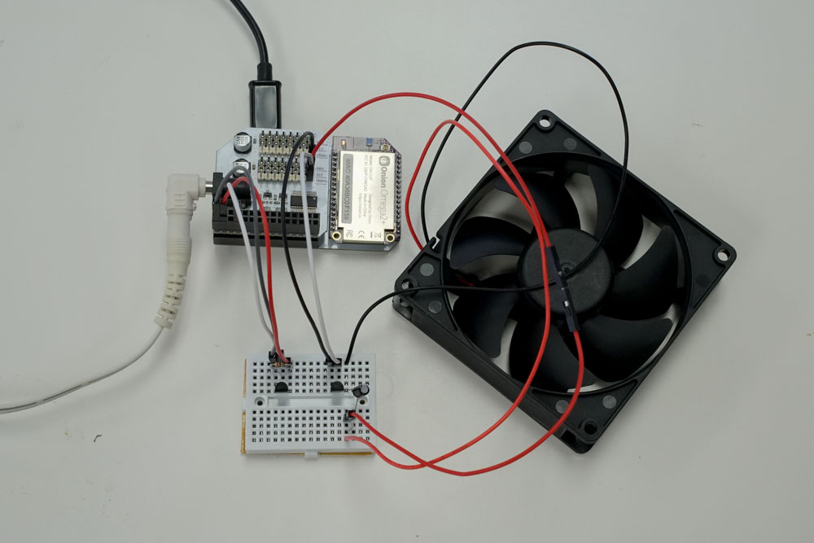
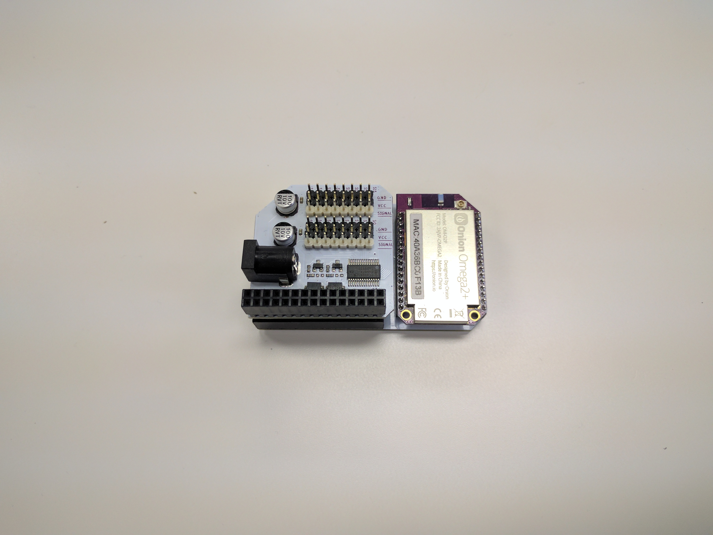
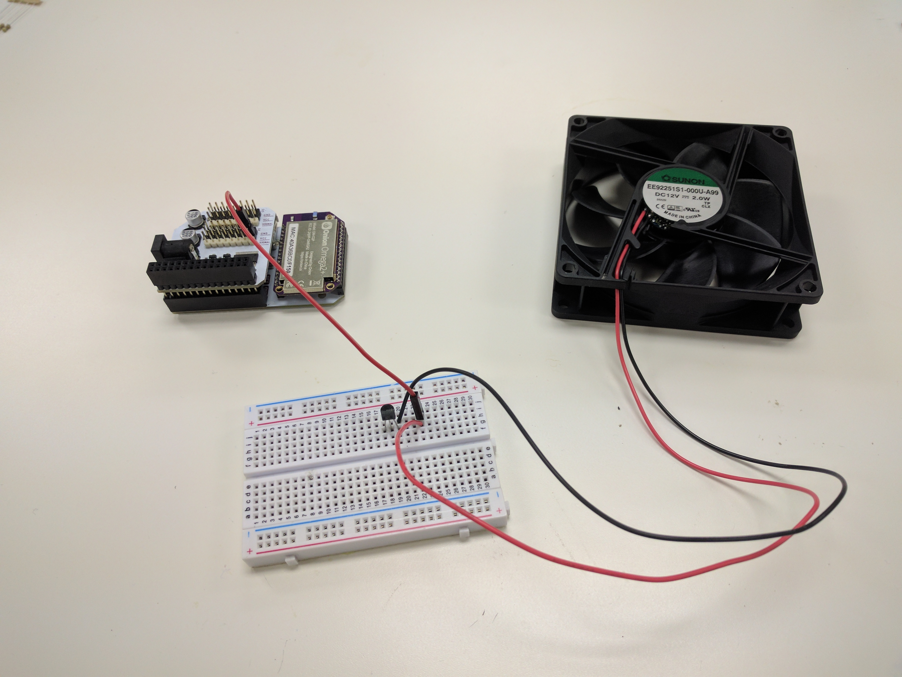
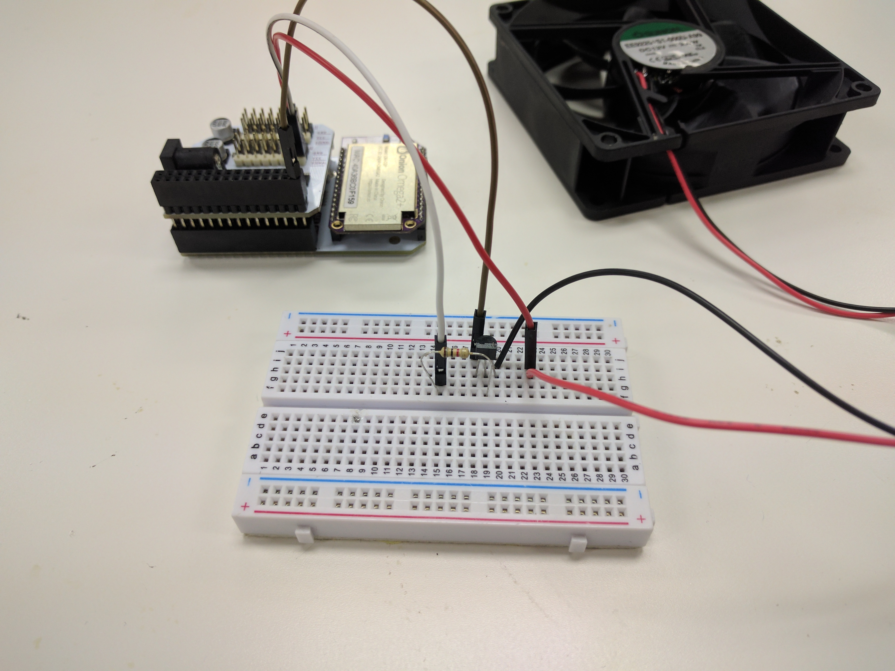
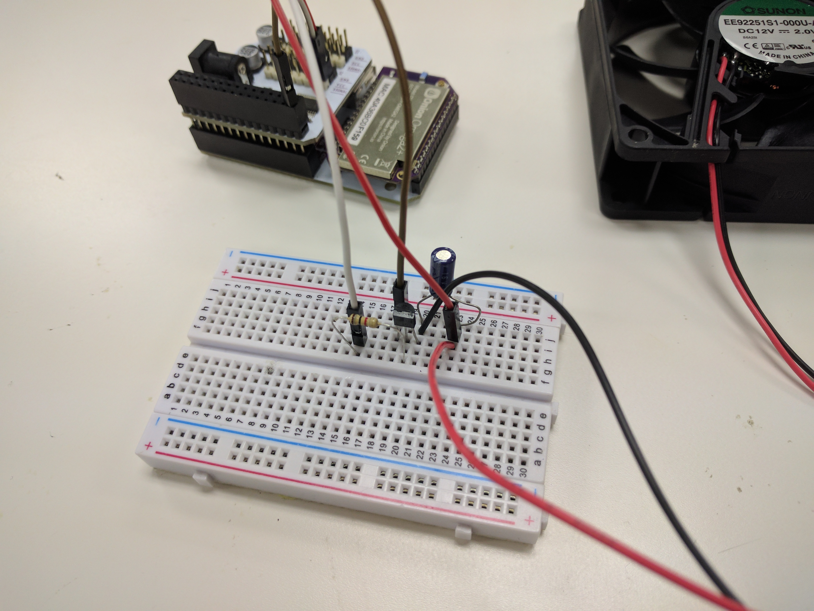
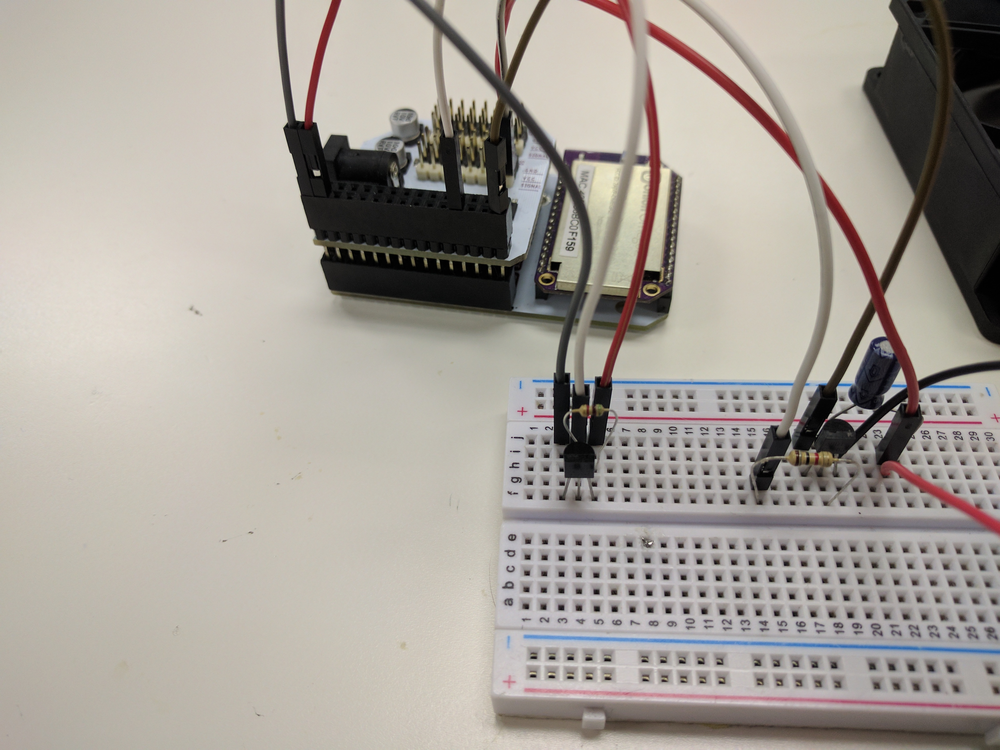
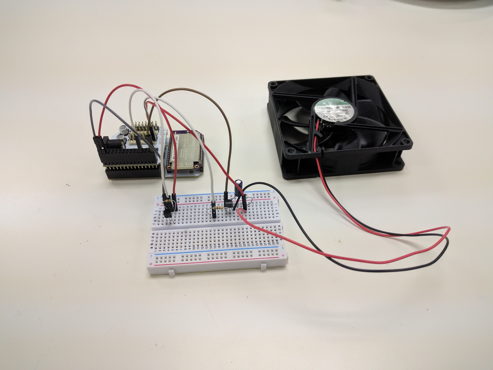

## Temperature-Based Smart Fan {#smart-fan}


Mornings too cold, but gets too hot by noon? By hooking up a temperature sensor to the Omega, we can use the data it provides to modulate the speed of a fan - cooling us down only when we need it!

This kind of setup is used in many places: the cooling fans in your laptop or desktop computer operate in the same way. Other applications include home-brewing beer or wine kegs and anywhere temperature control is required.



### Overview

**Skill Level:** Intermediate ~ Advanced

**Time Required:** 40 Minutes

<!-- // go into some detail here about how we're going to be implementing the project //	eg. which programming language we'll be using, APIs //	include links to any api or module references -->

There's a lot of implementation details in this project that will change depend on the exact hardware you have access to. We used a D18B20 1Wire temperature sensor, for example. For the fan, we recommend a computer case fan, since those are quite easy to come by and works decently well.

We also cooked up a DC motor with a 3D printed rotor setup just like in the [Omega2 Maker Kit](https://docs.onion.io/omega2-maker-kit/maker-kit-servo-h-bridge.html) since we had all of those handy.

To control the fan, we'll be using a python script and the [Onion PWM Expansion Python Module](https://docs.onion.io/omega2-docs/pwm-expansion-python-module.html) to control the fan speed. We also use a library to operate the 1Wire sensor, but your methods may vary depending on your exact sensor.

All the code we used is written for a case fan with a transistor switching it. It can be found in Onion's [`iot-smart-fan` repository](https://github.com/OnionIoT/iot-smart-fan) on GitHub.

### Ingredients

* Onion [Omega2](https://onion.io/store/omega2/) or [Omega2+](https://onion.io/store/omega2p/)
* Any Onion Dock that supports Expansions: [Expansion Dock](https://onion.io/store/expansion-dock/), [Power Dock](https://onion.io/store/power-dock/), [Arduino Dock 2](https://onion.io/store/arduino-dock-r2/)
* Onion [Servo (PWM) Expansion](https://onion.io/store/servo-pwm-expansion/)
* [Breadboard](https://www.amazon.com/gp/product/B004RXKWDQ/ref=as_li_tl?ie=UTF8&camp=1789&creative=9325&creativeASIN=B004RXKWDQ&linkCode=as2&tag=onion0e-20&linkId=3f7f512f8017eeed52768810a0deca09) (optional, but it helps a lot)
* [Computer case fan](https://www.amazon.com/gp/product/B00XDZBGKW/ref=as_li_tl?ie=UTF8&tag=onion0e-20&camp=1789&creative=9325&linkCode=as2&creativeASIN=B00XDZBGKW&linkId=332191a81246fc23201e27ff1a5e74a6)
	* Note that we used a fan that was roughly double the size!
* [D18B20 1-Wire Temperature Sensor](https://www.amazon.com/gp/product/B004G53D54/ref=as_li_tl?ie=UTF8&camp=1789&creative=9325&creativeASIN=B004G53D54&linkCode=as2&tag=onion0e-20&linkId=79fff5f353a360474ce314466504b359)
	* The Omega accepts I2C, 1Wire, and SPI, among other protocols, so other digital sensors will work as well.
* [12V DC power supply](https://www.amazon.com/gp/product/B019X3XVWS/ref=as_li_tl?ie=UTF8&camp=1789&creative=9325&creativeASIN=B019X3XVWS&linkCode=as2&tag=onion0e-20&linkId=7e3fcbbeb2bf474a33f4d68a7413fc21)
	* Must be capable of supplying at least 0.5A
* [Resistors](https://www.amazon.com/gp/product/B016NXK6QK/ref=as_li_tl?ie=UTF8&tag=onion0e-20&camp=1789&creative=9325&linkCode=as2&creativeASIN=B016NXK6QK&linkId=62595ffef640175ce3a3b44fabd712e4)
    * 1x 5.1kΩ
    * 1x 1kΩ
* 1x [47 μF Capacitor](https://www.amazon.com/gp/product/B00M2EJ8Y6/ref=as_li_tl?ie=UTF8&tag=onion0e-20&camp=1789&creative=9325&linkCode=as2&creativeASIN=B00M2EJ8Y6&linkId=fe5eb0fd249c34ff8a43690ffd9f850f)
* [NPN Transistor](https://www.amazon.com/gp/product/B008IFYEP6/ref=as_li_tl?ie=UTF8&tag=onion0e-20&camp=1789&creative=9325&linkCode=as2&creativeASIN=B008IFYEP6&linkId=4f618679e87ed718958f7372f0fbfb6a) rated for 12V at 0.5A
* [Jumpers](https://www.amazon.com/gp/product/B01LZF1ZSZ/ref=as_li_tl?ie=UTF8&tag=onion0e-20&camp=1789&creative=9325&linkCode=as2&creativeASIN=B01LZF1ZSZ&linkId=0fa23489eefb433f7768a252eb43dbde)
    * 2x M-F
    * 4x M-M


### Step-by-Step

Follow these instructions to set this project up on your very own Omega!


#### 1. Prepare

First let's get the Omega ready to go. if you haven't already, complete the [First Time Setup Guide](https://docs.onion.io/omega2-docs/first-time-setup.html) to connect your Omega to WiFi and update to the latest firmware.

Plug in the PWM Expansion to the Dock and grab all the components:

<!-- // DONE: insert photo with PWM Expansion plugged into Expansion dock -->


#### 2. Install the Required Software

We need Python and the [Onion PWM Expansion Python Module](https://docs.onion.io/omega2-docs/pwm-expansion-python-module.html)  to make this work:

```
opkg update
opkg install python-light pyPwmExp
```

Everything else will be included in the GitHub repo.

#### 3. Connect the Fan

Computer case fans are voltage driven, but we can cheat by using PWM with a transistor to switch the supply voltage.

If you have jumpers handy, we recommend using them as a bridge between the header of the fan and the PWM expansion.

First, we'll have to set up the transistor. For our lab setup, we used an S9014 NPN transistor with a 2-wire PC case fan. If you use a different model, make sure to note which pin is the base/collector/emitter.

>If you use a PNP transistor, your fan will automatically turn on unless you set the PWM output to 100%. This is because PNP transistors turn 'on' when the base draws current, when the PWM channel is at 0% duty, it draws a tiny bit of current - enough to turn on the transistor!

Most commonly, case fans have three pins/wires - one of which is a tachometer output. If you're using one of these, make sure there's no power being supplied to the output pin, this will cause damage to the fan.

>The output pin sends the current speed of the fan, it can be used in your code to check if the fan is working as a bonus!

We connected the power supply to the PWM expansion for cleaner wiring.

1. Connect the transistor to the breadboard across 3 empty rows.
1. Connect the `(-)` (usually black) wire of the fan to the transistor's collector pin (right pin when looking at the flat front).
1. Connect the `(+)` (usually red) wire of the fan to an empty row a few spaces away.
1. Connect the `Vcc` pin on the PWM Expansion's `S0` channel to the `(+)` pin of the fan using a M-F jumper wire.

    

1. Connect one end of the 1kΩ resistor to the transistor's base pin (middle).
1. Connect the other end of the resistor to the `SIGNAL` pin on the PWM Expansion's `S0` channel using a M-F jumper.
1. Connect the transistor's emitter pin (left pin when looking at the flat front) to one of the Expansion Dock's `GND` pins using a M-M jumper.

    

1. Connect the capacitor across the fan's `(+)` and `(-)` wires where they are connected to the breadboard.
    * If you have a polarized capacitor with the `(-)` or `(+)` side clearly marked, make sure to match the terminals with the fan's (`(-)` to `(-)`, `(+)` to `(+)`)!



This circuit will now switch the Fan's voltage based on the PWM signal from channel 0!

>The capacitor acts as a simple low-pass filter to supply the fan with a smooth analog voltage.

#### 4. Wire up the Temperature Sensor

This part is written assuming you're working with the D18B20, if your sensor is different, you may have to find a guide elsewhere on wiring it properly.

The D18B20 has a pinout that looks like this:


**NOTE**: the second graphic is a **bottom** view, where the pins are pointing towards you (we may have fried a sensor by misreading this one).

Now we can connect the sensor to the Expansion Headers.

1. First, connect the temperature sensor to the breadboard across another three empty rows.
    * Leave some space from the transistor so you can easily interact with it!
1. Connect the `GND` pin of the sensor to a `GND` pin on the Expansion Header using a M-M jumper wire.
1. Next, connect the middle pin (`DQ`) to GPIO1 on the Expansion Header using a M-M jumper.
1. Connect the `VDD` pin to a `3.3V` pin on the Expansion Header using a M-M jumper.
1. Finally, connect the 5.1kΩ resistor across the sensor's `VDD` and `DQ` pins (right and middle respectively).



Your setup is now complete!




#### 5. Get the Project Code

The code for this project is all done and can be found in Onion's [`iot-smart-fan` repo](https://github.com/OnionIoT/iot-smart-fan) on GitHub. Use [`git` to download the code to your Omega](https://docs.onion.io/omega2-docs/installing-and-using-git.html): navigate to the `/root` directory, and clone the GitHub repo:

```
cd /root
git clone https://github.com/OnionIoT/iot-smart-fan.git
```

#### 5.5. Using a Different Sensor

There's a good bit of setup for the temperature sensor - initialization, communicating, and parsing.

If you have a different sensor than the the one we're using, you'll have to modify the project code. The code that sets up the D18B20 1-wire sensor can be found in the lines between `#~~~ SENSOR SETUP BEGIN` and `#~~~ SENSOR SETUP END`.

Additionally, you'd probably need to change the function used to get the sensor data:

``` python
        temp = sensor.readValue()
```


One important thing to note is that the values assigned to the `temp` variable must be integer or float.

#### 6. Calibrate and Customize

You can edit the `config.json` to change the possible speed range of the fan and restrict the temperature range to which the fan reacts:

```json
{
    "tempMax" : "40",
    "tempMin" : "18",
    "dutyMin" : "60",
    "dutyMax" : "100",
    "frequency" : "1000",
    "fanType" : "case"
}
```

The `dutyMin` and `dutyMax` parameters control the minimum and maximum duty cycle of the signal being sent to the fan, thereby controlling the fan speed. The `tempMin` and `tempMax` parameters specify the temperature range in which to enable the fan. The fan speed has a linear relationship with the temperature when it is between the min and max temperature.

If you find that the fan does not spin when current is applied, you may have to increase the `dutyMin` to overcome the static friction in the fan's shaft bearing. Once it gets up to speed, you can then lower the duty and the fan will still be able to spin.


### Using A Different Fan

If you would rather use the H-Bridge and DC Motor setup, you'll have to make some changes to the code. Namely, you'll have to swap out the `OmegaPwm` class with the `hBridgeMotor` class from `omegaMotors.py`. Check the pin-outs that we've put in by default in `iotSmartFan.py` to make sure you're correctly connecting the H-Bridge to the Servo Expansion.

For a detailed guide on how to set this up, check out the wiring instructions in the [Maker Kit DC Motor experiment](https://docs.onion.io/omega2-maker-kit/maker-kit-servo-dimming-led.html).


To change up the code, open up `iotSmartFan.py` and change this line:

``` python
    fan = OmegaPwm(FAN_PWM_CHANNEL)
```


To this:

``` python
    fan = hBridgeMotor(FAN_PWM_CHANNEL, H_BRIDGE_1A_CHANNEL, H_BRIDGE_2A_CHANNEL)
```

And this line:

``` python
        fan.setDutyCycle(duty)
```

To this:

``` python
        fan.spinForward(duty)
```

### Code Highlight

Two of the key components in this project are the temperature sensor and the motor drivers, found in `temperatureSensor.py` and `omegaMotors.py`.

The output from the 1-Wire temperature sensor contains a lot of unnecessary information such as the device address, connection acknowledgements, and other fields. The `__readOneWire()` internal method of the `TemperatureSensor` class extracts the temperature value and converts it to degrees Celsius:

```python
def __readOneWire(self):
        # device typically prints 2 lines, the 2nd line has the temperature sensor at the end
        # eg. a6 01 4b 46 7f ff 0c 10 5c t=26375
        rawValue = self.driver.readDevice()

        # grab the 2nd line, then read the last entry in the line, then get everything after the "=" sign
        value = rawValue[1].split()[-1].split("=")[1]

        # convert value from string to number
        value = int(value)

        # DS18B20 outputs in 1/1000ths of a degree C, so convert to standard units
        value /= 1000.0
        return value
```

The method to set the duty cycle for a servo fan, `setDutyCycle()` uses the Onion `pwmExp` class to easily control it:

```python
def setDutyCycle(self, duty):
		"""Set duty cycle for pwm channel"""
		ret 	= pwmExp.setupDriver(self.channel, duty, 0)
		if (ret != 0):
			print 'ERROR: pwm-exp setupDriver not successful!'

		return ret
```
