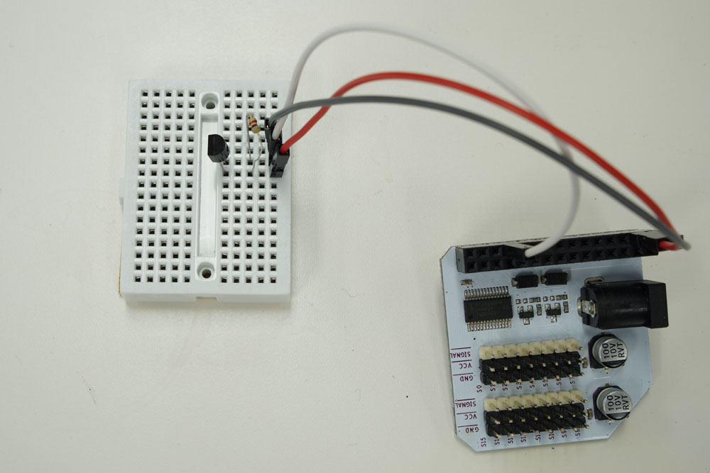

## Temperature-Based Smart Fan {#smart-fan}

<!-- // brief intro to the project -->

<!-- // include a photo of the final result -->

Mornings too cold, but gets too hot by noon? By hooking up a temperature sensor to the Omega, we can use the data it provides to modulate the speed of a fan - cooling us down only when we need it!

// TODO: mention a use-case of using this to cool down electronics or some homebrewing setup, anything where temperature control is required

<!-- // DONE: Add photo -->


### Overview

**Skill Level:** Intermediate ~ Advanced

**Time Required:** 40 Minutes

<!-- // go into some detail here about how we're going to be implementing the project //	eg. which programming language we'll be using, APIs //	include links to any api or module references -->

There's a lot of implementation details in this project that will change depend on the exact hardware you have access to. We used a D18B20 1Wire temperature sensor, for example. For the fan, we recommend a computer case fan, since those are quite easy to come by and works decently well.

We also cooked up a 3D printed fan + DC motor setup just like in the [Maker Kit tutorial](https://docs.onion.io/omega2-maker-kit/maker-kit-servo-h-bridge.html) since we had all of those handy.

To control the fan, we'll be using a python script and the Onion PWM Python Module to pulse the fan. We also use a library to operate the 1Wire sensor, but your mileage may vary depending on your sensor.

All the code we used is written for a case fan with a transistor switching it. It can be found in the [iot-smart-fan repository](https://github.com/OnionIoT/iot-smart-fan) on GitHub.

### Ingredients

<!-- // a numbered list of all physical items used to make this project -->
<!-- //	all items should be linked to a place online where they can be bought -->
<!-- //	the Onion items should be linked to their corresponding Onion store page -->

1. Onion Omega2 or Omega2+
1. Any Onion Dock that supports Expansions: Expansion Dock, Power Dock, Arduino Dock 2
1. Onion PWM Expansion
1. Breadboard (optional, but it helps a lot)
1. Computer case fan
1. Digital temperature sensor *
1. 12V DC supply capable of supplying at least 0.5A
1. 1x 5.1kΩ Resistor
1. 1x 10 μF Capacitor
1. NPN Transistor rated for 12V at 0.5A
1. Jumpers
    * 3x M-F
    * 3x M-M


\* The Omega2 and 2+ accepts I2C, 1Wire, and SPI, among other protocols, unfortunately it cannot read analog voltages.

// TODO: change this so that

### Step-by-Step

Follow these instructions to set this project up on your very own Omega!


#### 1. Prepare the ingredients

First let's get the Omega ready to go. if you haven't already, complete the [First Time Setup Guide](https://docs.onion.io/omega2-docs/first-time-setup.html) to connect your Omega to WiFi and update to the latest firmware. Plug in the PWM expansion to the Dock and grab all the components then move on to...


#### 2. Installing the software needed

We need Python and the Onion PWM Expansion Modules to make this work:

```
opkg update
opkg install python-light pyPwmExp
```

Other modules will be included in the GitHub repo.

#### 3. Connect the fan

Computer case fans are voltage driven, but we can cheat by using PWM with a transistor to switch the supply voltage.

If you have jumpers handy, we recommend using them as a bridge between the header of the fan and the PWM expansion.

First we'll have to set up the transistor. For our lab setup, we used a STS8050 NPN transistor with a 2-wire PC case fan. If you use a different model, make sure to note which pin is the base/collector/emittor.

>If you use a PNP transistor, your fan will automatically turn on unless you set the pwm output to 100%. This is because PNP transistors turn 'on' when the base draws current, when the PWM channel is at 0% duty, it draws a tiny bit of current - enough to turn on the transistor!

Most commonly, case fans have three pins/wires - one of which is a tachometer output. If you're using one of these, make sure there's no power being supplied to the output pin, this will cause damage to the fan.

>The output pin sends the current speed of the fan, it can be used in your code to check if the fan is working as a bonus!

We connected the power supply to the PWM expansion for cleaner wiring.

1. Connect the `GND` from the fan to the collector pin on the transistor (right pin when looking at the flat side of the 8050).
1. Connect the Signal pin from the PWM Expansion channel 0 (`S0`) to the base pin of the transistor.
1. Connect the emittor pin from the transistor to any `GND` pin on the PWM Expansion.
1. Plug one end of the 10 μF capacitor to the emitter row of the transistor.
1. Plug the other end to an empty row.
1. Connect the `VDC` of the fan to the row where the capacitor ends.
1. Finally, connect the `Vcc` pin on the PWM Expansion to the row with the capacitor and the fan `VDC`.

This circuit will now switch the Fan's voltage based on the PWM signal from channel 0!

>The capacitor and fan creates a **second order band-pass filter**. The capacitor will absorb high-frequency signals inside a certain frequency range, leaving DC power to be routed to the fan.

#### 4. Wire up the temperature sensor

This part is written assuming you're working with the D18B20, if your sensor is different, you may have to find a guide elsewhere on wiring it properly.

>Note that the Omega does **not** have analog voltage reading capabilities - you'd have to use an ADC plus write your own converting code to use an analog sensor!

The D18B20 has a pinout that looks like this:


**NOTE**: the second graphic is a **bottom** view, where the pins are pointing towards you (we may have fried a sensor by misreading this one).

You'll need to grab your breadboard and plug the sensor into three different columns. The resistor will bridge the `VDD` and `DQ` lines, so plug that between the two columns like this:

<!-- // DONE: temp-sensor circuit -->


Now we can connect the sensor to the Expansion Headers.

* First, connect the `GND` pin of the sensor to a `GND` pin on the Expansion Header of your Dock
* Next, connect the middle pin (`DQ`) to GPIO1 on the Expansion Header
* Finally, connect the `VDD` pin to a `3.3V` pin on the Expansion Header


#### 5. Get the code

Head over to the [iot-smart-fan repository](https://github.com/OnionIoT/iot-smart-fan) on GitHub, and download the repo.

Copy the all the files to the same directory in your omega. If you're using your own temperature sensor, you'll have to make some changes before it'll run.

#### 5. (and a half) Custom sensor

There's a good bit of setup for the temperature sensor - initialization, communicating, and parsing.

If you have a different sensor than the the one given, you'd have to edit the setup lines to ensure it sends and recieves data correctly. The code that sets up the sensor can be found in the lines between `SENSOR SETUP BEGIN` and `SENSOR SETUP END`.

Additionally, you'd probably need to change the function used to get the sensor data:

``` python
        temp = sensor.readValue()
```


One important thing to note is that the values assigned to temp must be integer or float.

#### 6. Calibrate and customize

By editing the `config.json`, you can change the output range of the fan and the temperature range to restrict the fan to. The fan is set to spin at a rate between the minimum and maximum duty. The output duty has a linear relationship with the temperature when it is between the min and max temperature.


### Bonus Points!

<!-- // one or two paragraphs (max) about something cool we did in the code -->
<!-- //	just give a brief description/overview and provide links to where they can learn more (Onion Docs, online resources, etc) -->

If you want to copy our setup with an H-bridge (switching YOOG fans!), you'll have to swap out the `OmegaPwm` class with the `hBridgeMotor` class from `omegaMotors.py`. Check the pin outs that we've put in by default in `iotSmartFan.py` to make sure you're pluggin the H-bridge in correctly.

For a detailed guide on how to wire this set up, check out the wiring instructions in our [Maker Kit guide experiment](https://docs.onion.io/omega2-maker-kit/maker-kit-servo-dimming-led.html).


To change up the code, open up `iotSmartFan.py` and change this line:

``` python
    fan = OmegaPwm(FAN_PWM_CHANNEL)
```


To this:
``` python
    fan = hBridgeMotor(FAN_PWM_CHANNEL, H_BRIDGE_1A_CHANNEL, H_BRIDGE_2A_CHANNEL)
```

And this line:

``` python
        fan.setDutyCycle(duty)
```

To this:

``` python
        fan.spinForward(duty)
```
