## Smart Plant - Visualizing Plant Data {#smart-plant-p2}

This is the second major part of the smart plant project! [Last time](#smart-plant-p1), we setup an Omega to measure the soil moisture level in one of your plants. This part involves sending that data to a cloud service so we can visualize it and open the door to even more possibilities. The cloud service we will be using is the [Losant IoT Platform](https://www.losant.com/).

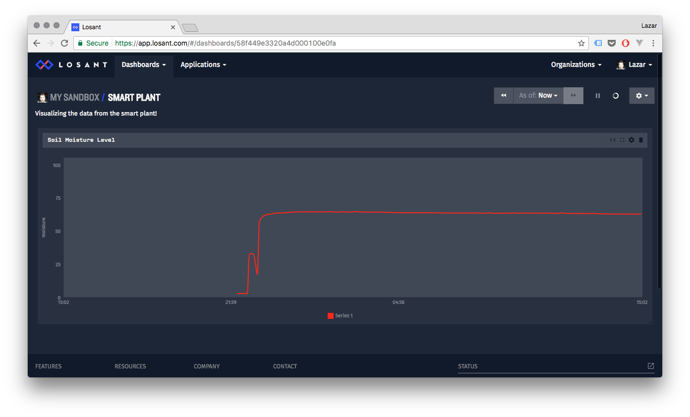

### Overview

**Skill Level:** Intermediate

**Time Required:** 1 hour

We're keeping the Arduino Dock and analog soil moisture sensor from the first part. Using a command line argument, we will be activating a part of the Python program we didn't use last time. This part of the program will use the MQTT protocol to communicate with Losant.

Losant provides a Python library, `losant-mqtt`, to easily interface devices with their cloud platform. Underneath, the popular `paho-mqtt` module is used to implement the MQTT communication. The same thing can be achieved with just `paho-mqtt` since the Losant module is just a wrapper for `paho-mqtt`, but the Losant module makes the implementation a little easier, so we'll use it.

This project will provide a guide on setting up Losant for our purposes:

* Creating an application
* Creating a device on their platform
* Managing security with Access Keys
* Developing a basic workflow
* Setting up a Dashboard to visualize the smart plant data

It also shows how to setup an Omega to send data to Losant.

The complete project code can be found in Onion's [`smart-plant` repo on GitHub](https://github.com/OnionIoT/smart-plant).


### Ingredients

The same as the first part of the project:

* Onion Omega2 or Omega2+
* Onion Arduino Dock 2
* Onion OLED Expansion (optional but recommended)
* Soil Moisture Sensor
* 3x Male-to-Female Jumper Wires


### Step-by-Step

Follow these instructions to set this project up on your very own Omega!

// TODO: enumerate the steps correctly (when you're done all of the other TODOs)

#### 1. Prepare

You'll have to have an Omega2 ready to go, complete the [First Time Setup Guide](https://docs.onion.io/omega2-docs/first-time-setup.html) to connect your Omega to WiFi and update to the latest firmware.


#### 1. Complete Part 1 of the Project

This project builds on the first part of the Smart Plant project. If you haven't already completed the [first part](#smart-plant-p1), go back and do it now!


#### 1. Register for Losant

Navigate to [Losant.com](https://www.losant.com/) and sign up for their free sandbox tier.

#### 1. Create a Losant Application

You'll first need to create a Losant **Application** to be able to use their IoT Platform. For more details see the [Losant Application Documentation](https://docs.losant.com/applications/overview/).

Click the `Applications` Menu, and then `Create Application`:


Give your Application a name, `Smart Plant` was our choice:

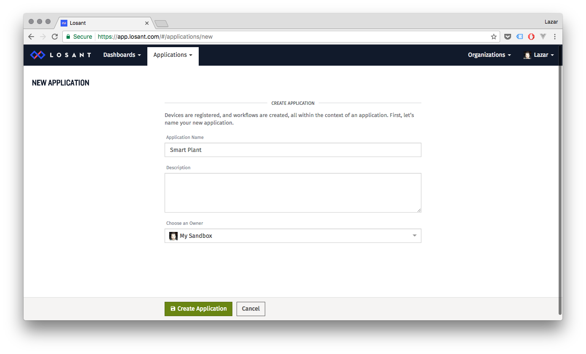

Ok, now your application is created
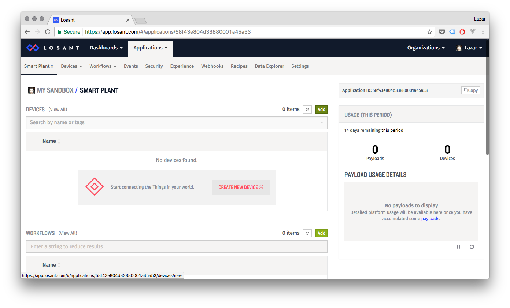

#### 1. Create a Losant Device

Now that you have an Application, you'll need to create a **Device**. A device on Losant can send data to the cloud and receive commands from the cloud. For more details see the [Losant Device Documentation](https://docs.losant.com/devices/overview/).

Click the `Devices` menu, and then `Create a Blank Device`:

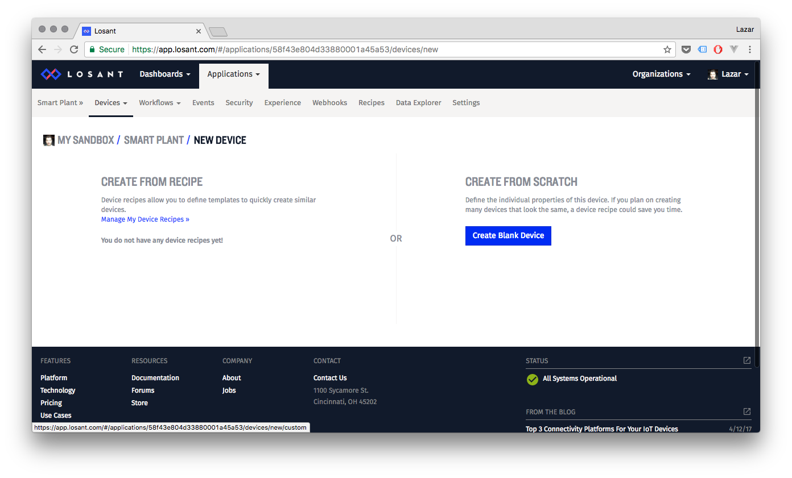

// TODO: in the above image, we should circle the Create a Blank Device button

Give your device a name, we found it easiest to use the name of the Omega we're using to measure the soil moisture levels. Make sure the `Device Type` is set to **`Standalone`**:

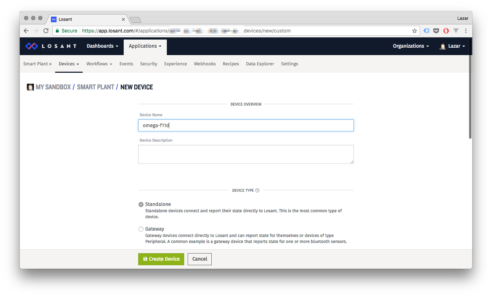

Scroll down and add a `Number` attribute named `moisture` to the device. This attribute will hold the soil moisture level data coming from your Omega:

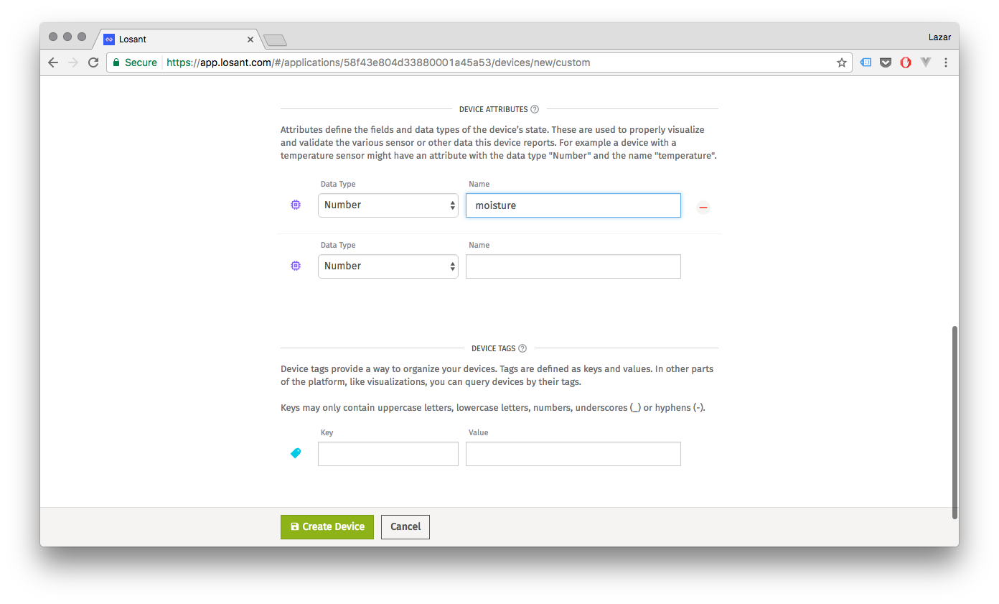

Hit `Create Device` and your device will be ready to go. Note the Device ID on the upper right hand side:

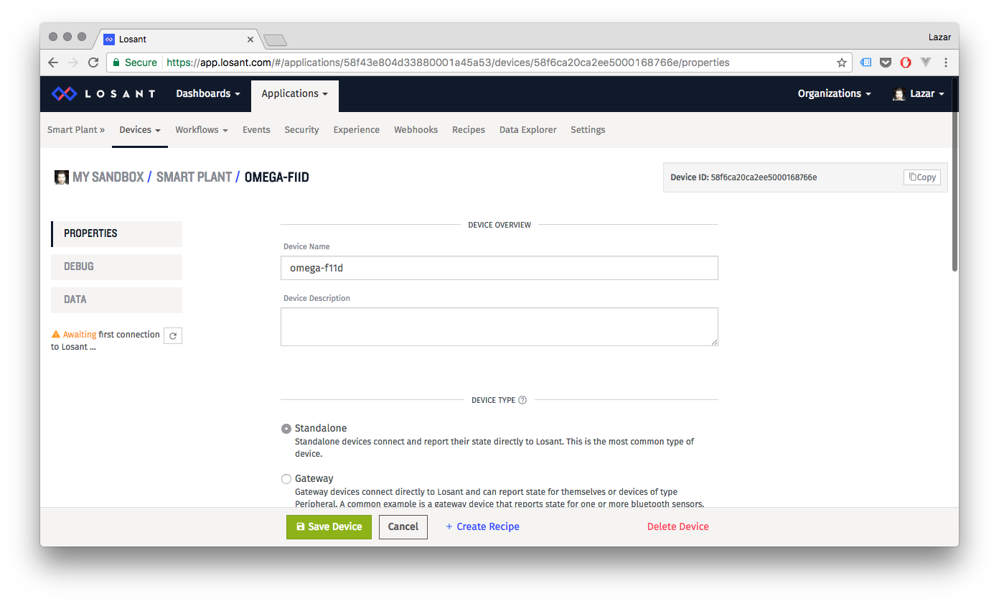


#### 1. Create a Losant Access Key

To actually get your Omega to communicate with Losant, it will need to authenticate. To carry out that authentication, we'll use an Access Key. For more details see the [Losant Access Key Documentation](https://docs.losant.com/applications/access-keys/).

Click the `Security` Menu and then the `Add Access Key` button:

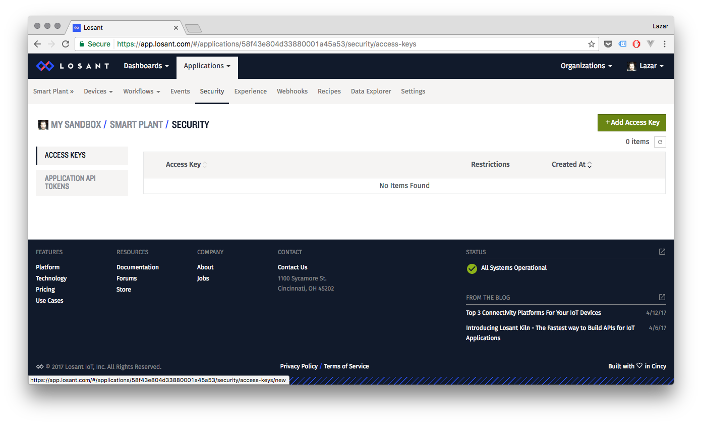

Give the key a description:

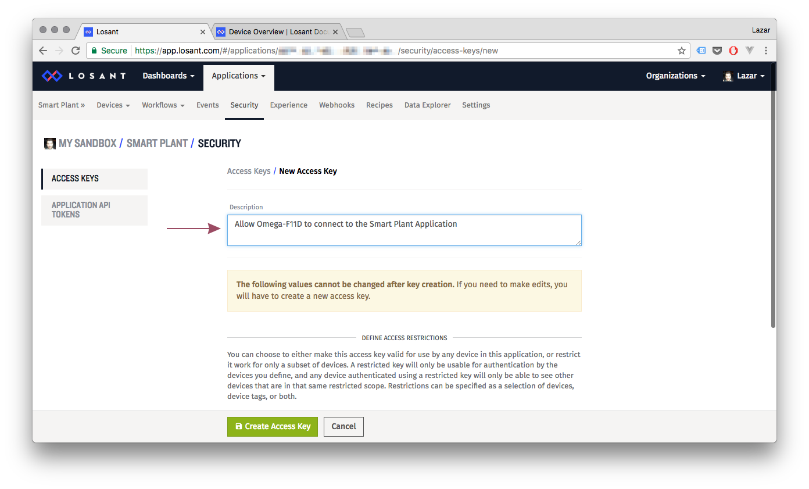

We're setting the Key to authenticate **all** of our devices on Losant. This is slightly risky, if you like, you can change it so that the access key is restricted to just a single device.

In either case, hit the `Create Access Key` button:

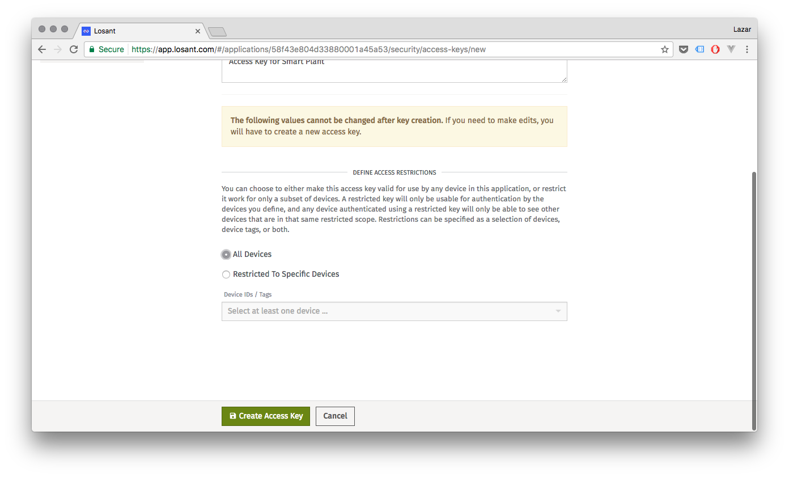

The access key and secret have now been generated! **Make sure to note them both down because this will be the only time you will get to see the Secret! We recommend downloading to a file.**

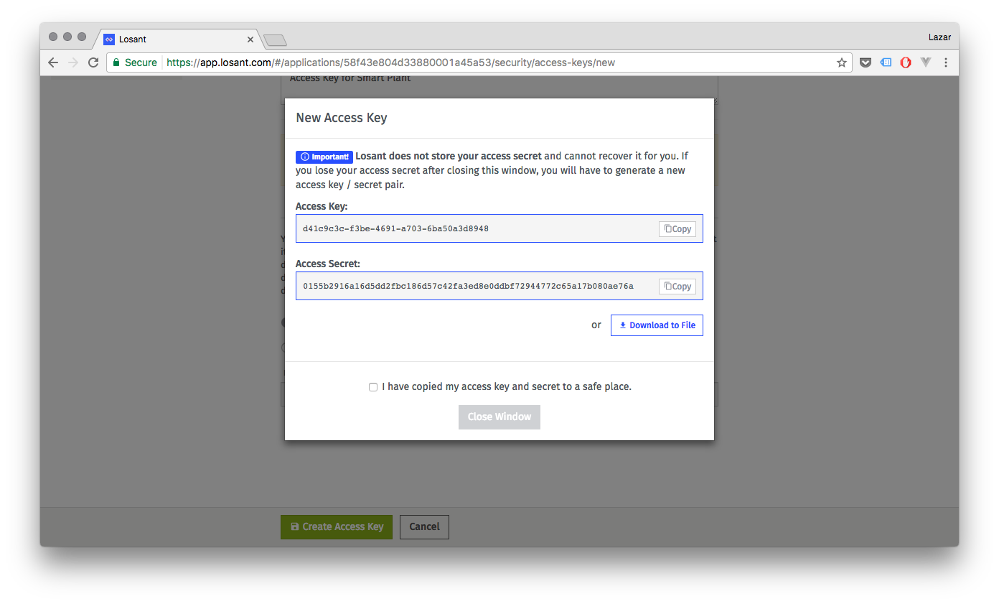

Alright! Your Access Key is ready to go!

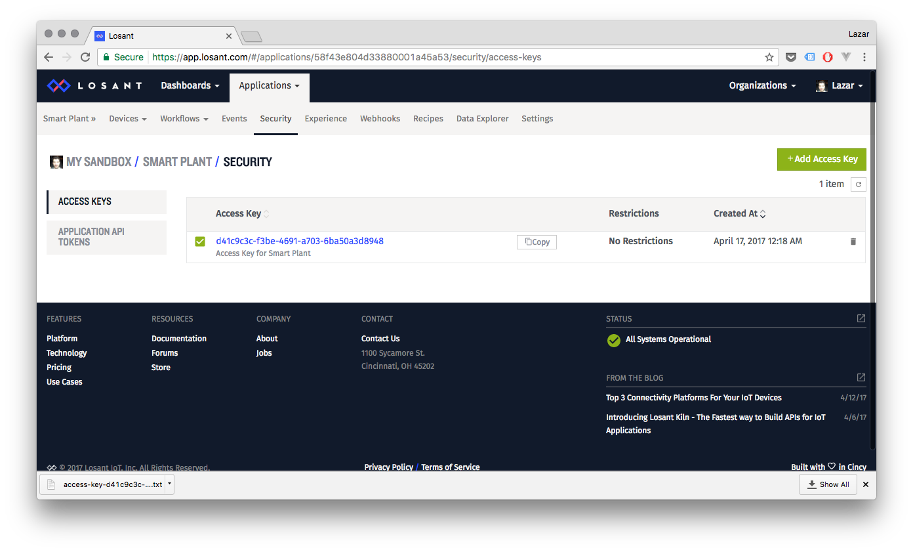


#### 1. Create a Losant Workflow

Now we need to make a [Losant Workflow](https://docs.losant.com/workflows/overview/) so our device can interact with the rest of Losant. For now, our workflow will be a simple tool for debugging. These workflows are easy to use and very powerful, definitely check out [Losant's workflow documentation](https://docs.losant.com/workflows/overview/) to learn more.

Click on the `Workflows` menu and then `Create Workflow`. Give your workflow a name and a description:

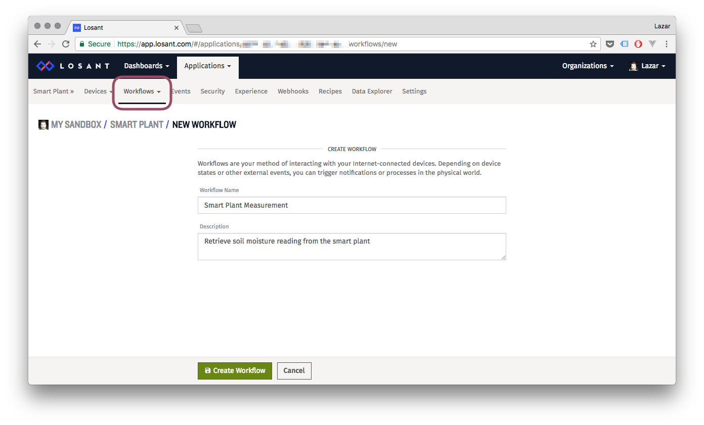

Type `device` into the search bar, then click and drag the `Device` block onto the area in the middle:

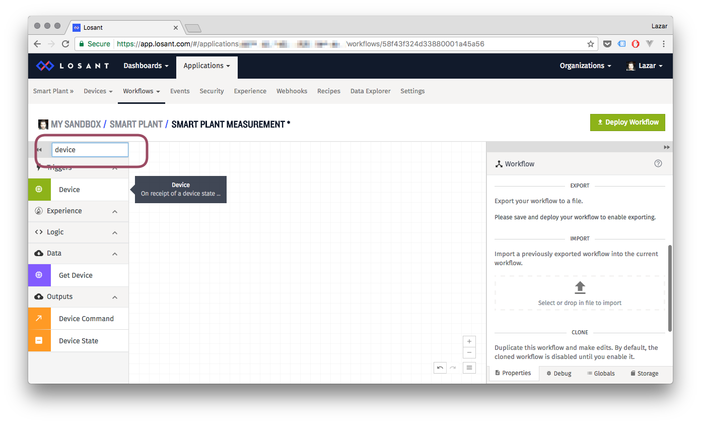

Click on the new `Device` block and scroll down in the right-side toolbar to select which of your devices will be associated with this `Device` block. You'll want to select the device you just created:

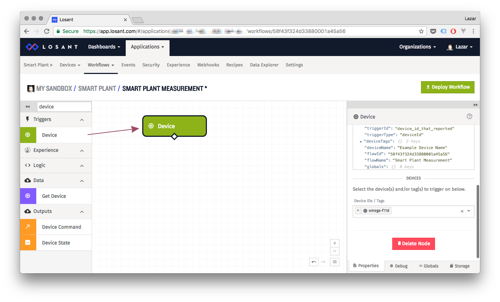

Now, let's add a `Debug` box so we can view the data coming from our device. Type `debug` into the search box:

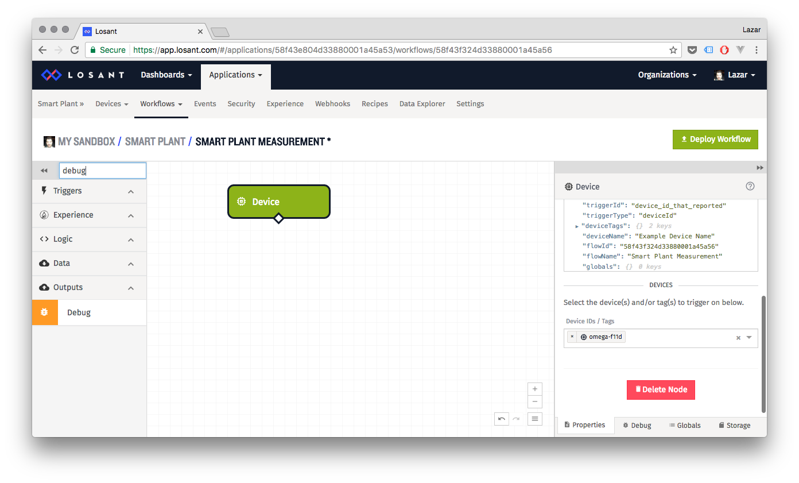

Drag the `Debug` block into the area in the middle:

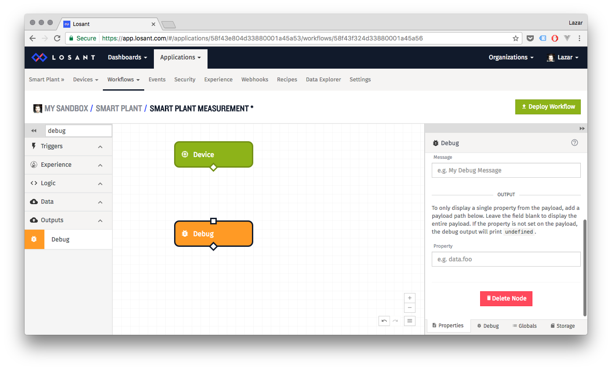

We now need to connect the two blocks. Click on the diamond at the bottom of the `Device` block and drag it down to the square at the top of the `Debug` block, and then hit the `Deploy Workflow` button:


Your workflow is now saved and deployed, meaning that it's running at this very moment on the cloud:

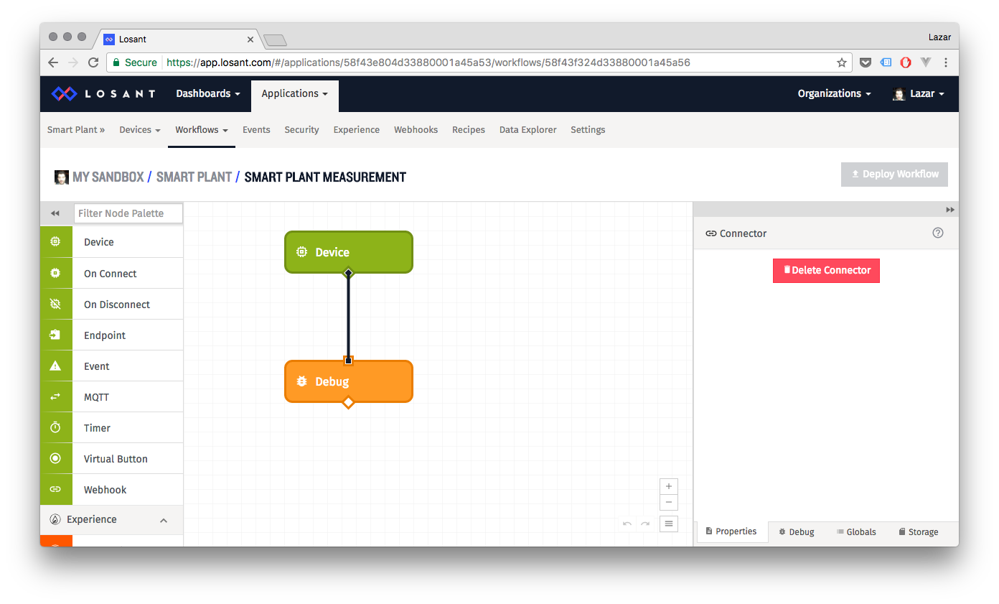


#### 1. How does my Omega talk to Losant?

Glad you asked! There's some additional software and configuration we need to do on the Omega to get it to report the soil moisture level to Losant on a regular basis. Behind the scenes, the Python script will be using MQTT to communicate with Losant.

If you haven't completed the [first part of the Smart Plant project](#smart-plant-p1), you need to go back and do it now before proceeding. The remainder of the steps assume that the `smart-plant` code can be found at `/root/smart-plant` on your Omega.


#### 1. Install Required Software on the Omega

To install additional Python packages, we'll need to install the Python package manager, PIP. [Connect to the Omega's Command line](https://docs.onion.io/omega2-docs/connecting-to-the-omega-terminal.html#connecting-to-the-omega-terminal-ssh) and run the following command:

```
opkg update
opkg install python-pip
```

Now that PIP is installed, we'll first fix an issue with the `setuptools` module, and then install two modules.

```
pip install --upgrade setuptools
pip install paho-mqtt
pip install losant-mqtt
```

The `paho-mqtt` module provides MQTT functionality, and `losant-mqtt` provides an easy to use interface for connecting to Losant.

#### 1. Setup Losant Credentials on Omega

In order to connect and authenticate with Losant, the Smart Plant program will need to know the Device ID of your Losant Device, as well as your Access Key and Secret.

Look at your device on Losant to get the Device ID:


The Access Key and Secret you should have noted down somewhere when you created the Access Key. If you don't have the Access secret noted down somewhere, you'll have to create a new Access Key!

// TODO: the losant.json file is now part of the smart-plant repo, update the below to reflect that

Now on your Omega, in the `/root/smart-plant` directory, create a file to store your Losant credentials. We named the file `losant.json`. The contents of the file are in [JSON format](http://www.json.org/) and should look like this:

```
{
	"deviceId":"<YOUR DEVICE ID>",
	"key":"<YOUR ACCESS KEY>",
	"secret":"<YOUR ACCESS SECRET>"
}
```

Copy the above to your Omega and populate it with your credentials.


// TODO: since we changed the first part to setup an init.d script, we need to update this step
// The new step should entail:
//	* running `/etc/init.d/smart-plant stop`
//		-> before putting this step in, confirm that it actually stops the existing python script instance on the Omega

#### 1. Stop the Existing Program

In the first part of the project, we modified `/etc/rc.local` to automatically run the smart plant program on boot. We'll now need to find the program and stop it before running it again manually.

Find the process of the running smart plant program:

```
root@Omega-F11D:~# ps | grep smart
 1999 root     17568 S    python /root/smart-plant/smartPlant.py --oled --quiet
 2185 root      1184 S    grep smart
```

Kill the process to stop the program:

```
root@Omega-F11D:~# kill 1999
```


#### 1. Report the Smart Plant Data to Losant

Let's try running the Smart Plant program with reporting to Losant enabled. We're also providing the path to the Losant configuration file:

```
python /root/smart-plant/smartPlant.py --oled --quiet --losant /root/smart-plant/losant.json
```

Assuming your Losant credentials are valid, you should see your device come online on Losant:


Going to the workflow, we can take a look at the `Debug` block's Debug output to see the data coming from the Omega:

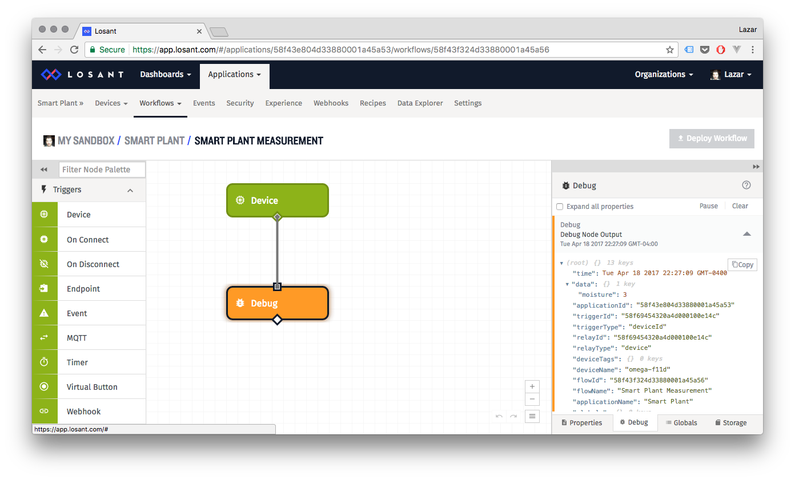

// TODO: update the above image:
// * 'dbug code' should actually read 'debug data'
// * circle the `data` part of the debug data read-out

If you look at the Python code, you'll see that what we send from the Omega is showing up in the debug window on Losant:
```
{
	"data" {
		"moisture": "<MOISTURE LEVEL READING>"
	}
}
```

Hit `ctrl+c` to stop the program.


// TODO: since we changed the first part to setup an init.d script, we need to update this step
// This step should entail:
//	* updating /etc/init.d/smart-plant to have the OPT argument include `--losant /root/smart-plant/losant.json`
//	* restarting the process: `/etc/init.d/smart-plant restart`

#### 1. Update Program Run at Boot

Since we now need to run the Smart Plant program with additional arguments to talk to Losant, we'll need to update the `/etc/rc.local` file.

Open the `/etc/rc.local` file using the Vi editor: `vi /etc/rc.local`. Hit `i` and paste in the additional arguments, your file should look like this:

```
# Put your custom commands here that should be executed once
# the system init finished. By default this file does nothing.

python /root/smart-plant/smartPlant.py --oled --quiet --losant /root/smart-plant/losant.json
exit 0
```
Hit `esc` and type `:wq` to save and close the file.

Try rebooting your Omega (enter `reboot` in the command line), and you'll see that your program will start up again when the Omega boots up.

#### 1. Create a Losant Dashboard

Now that we've successfully sent data to Losant, let's create a Dashboard so we can easily check in on our plant and see how much moisture there is in the soil.

Click the `Dashboards` menu and then `Create Dashboard`, give your dashboard a name and description. Hit `Create Dashboard`:

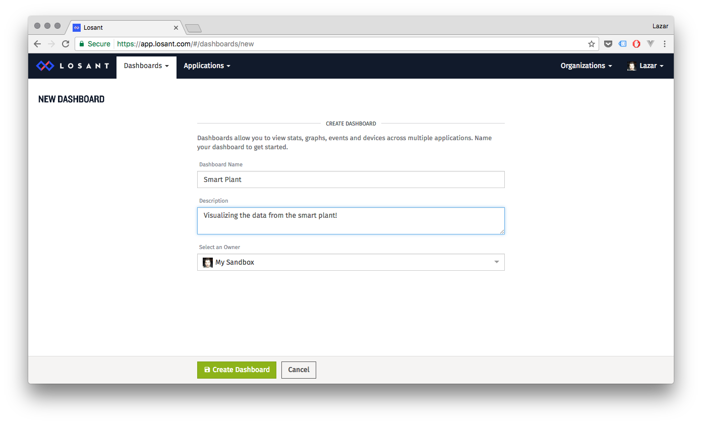

Let's add a `Time Series Graph` to the dashboard:

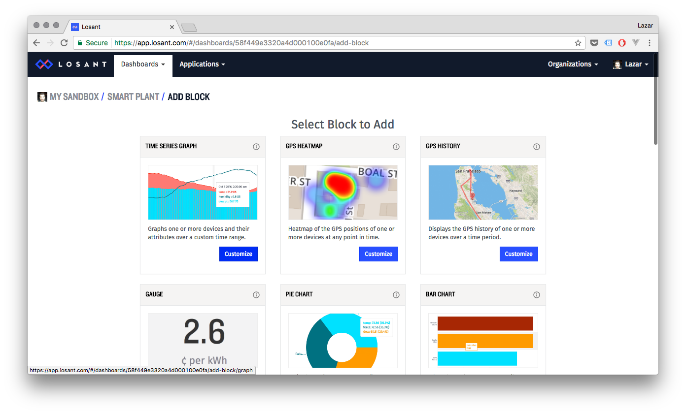

Give the block a Name and set the time range to `60 minutes` and one point every `10 seconds`:

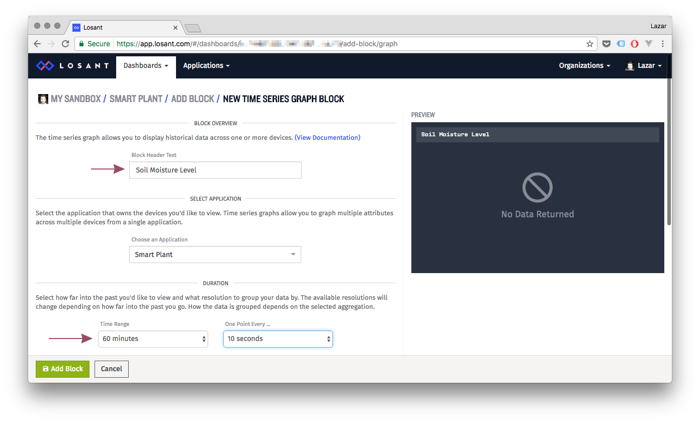

Scroll down to select your device from the Device IDs dropdown. Then select `moisture` from the Attribute dropdown:

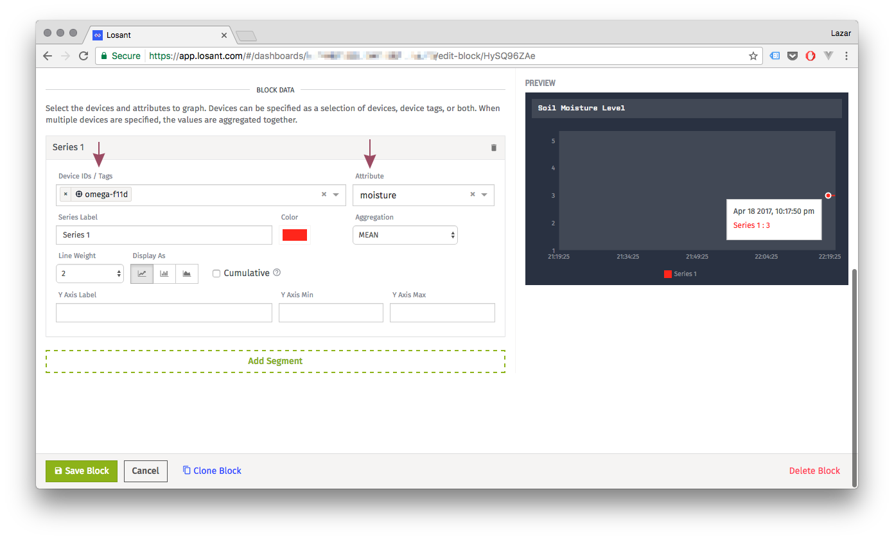

Awesome! Your dashboard is now displaying the soil moisture data being collected by your Omega:

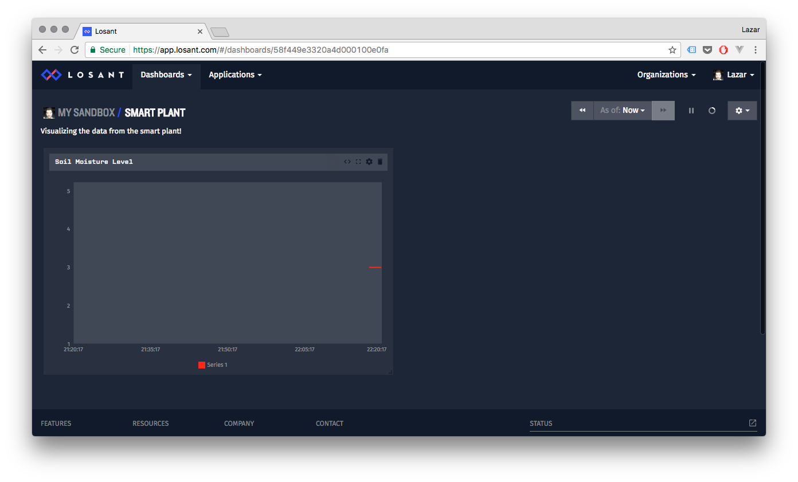

#### 1. Playing with the Dashboard

Try watering your plant a little while after you've setup the dashboard:

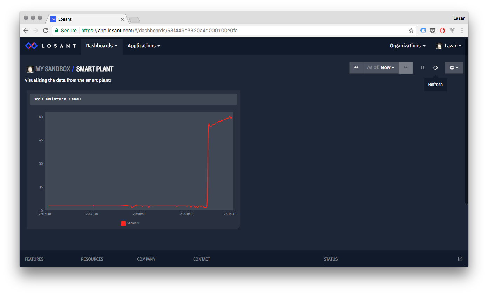

What a jump!

##### Adjusting the Y-Axis

You might have noticed that the Y-axis adjusted automatically to fit the data. Since we know our measured value is limited in the 0 to 100 range, we can adjust the graph.

Hover over the graph and click on the Gear icon. Scroll down and adjust the Y Axis Minimum to 0 and the Maximum to 100:

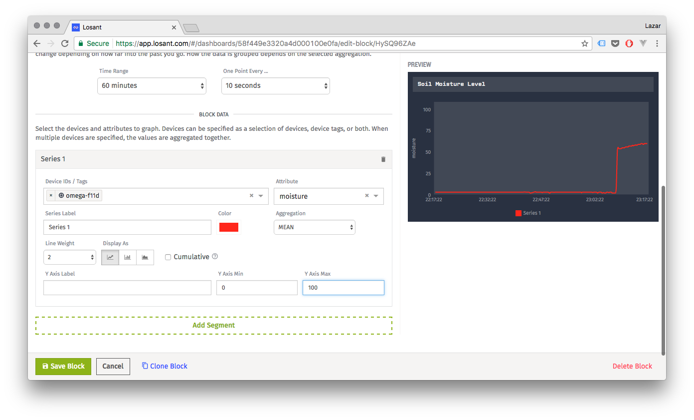

Hit `Save Block` and check out the chart now:

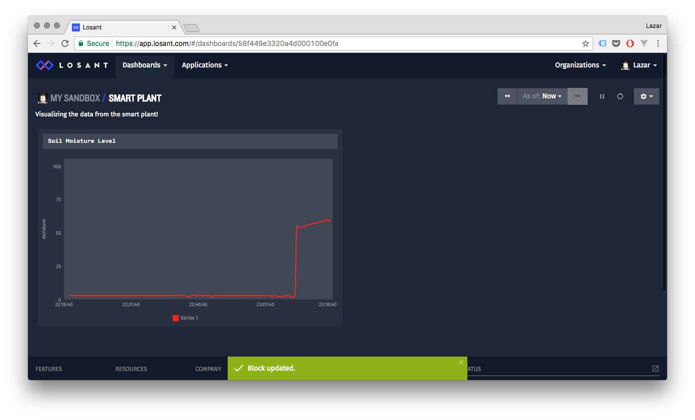


##### Changing the Time Range

Seeing just the last hour of our plant's moisture level isn't too helpful, so let's change it to something more useful!

Hover over the chart and click the Gear icon. Adjust the Graph's Time Range to `24 hours` or more.

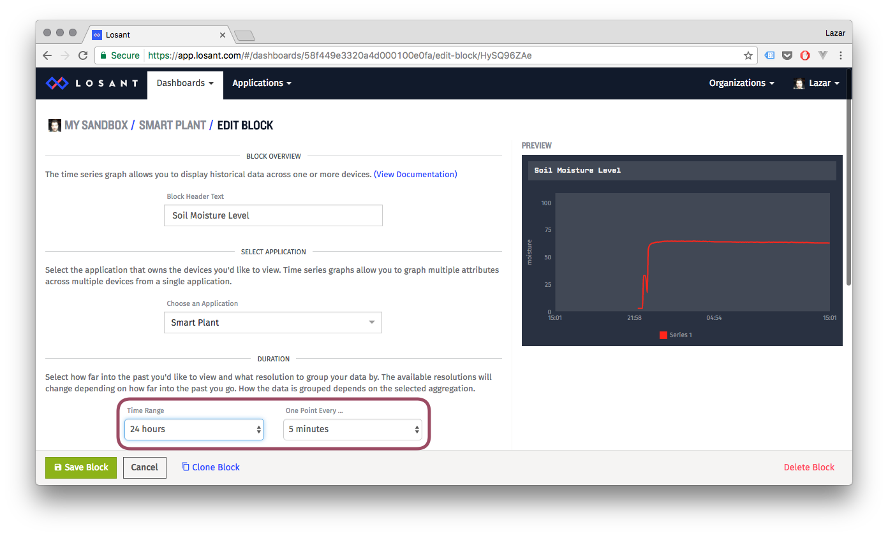

Hit `Save Block` and check out your extended chart. In this case, there was only data for the previous 18 hours, so everything before then is blank. If you have more data, a time range of many days might be more suitable:

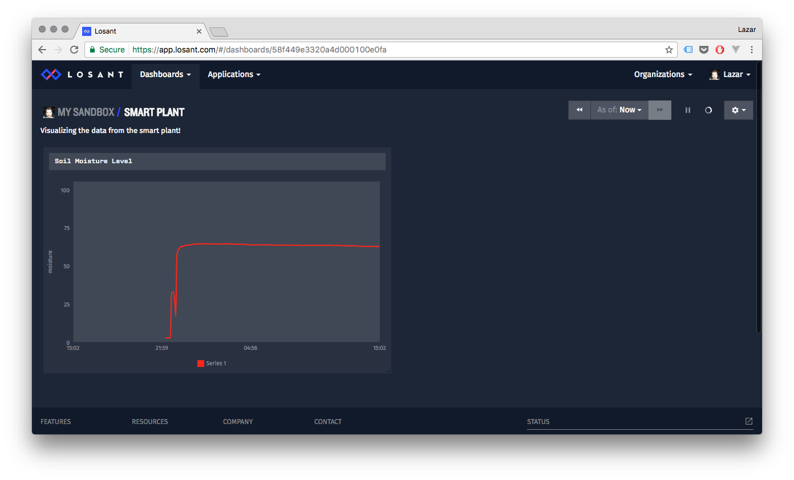

If you do want to display more data, it would be useful to have a larger chart! Hover over the chart and click and drag the icon to change the size:


// TODO: add a teaser for the next part of the project
