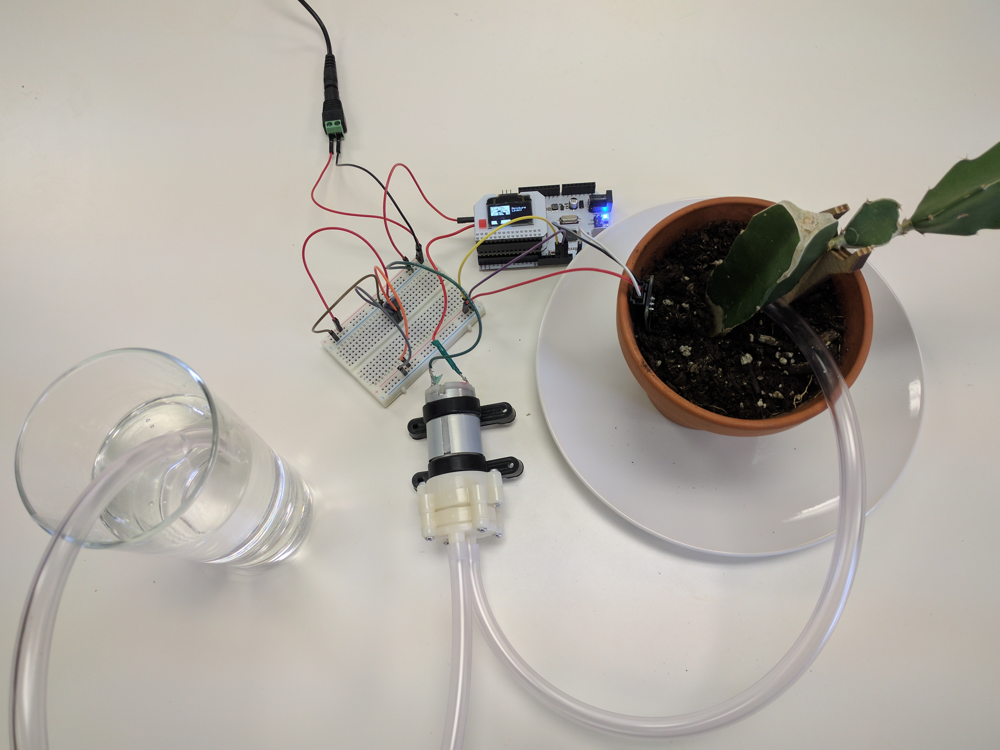
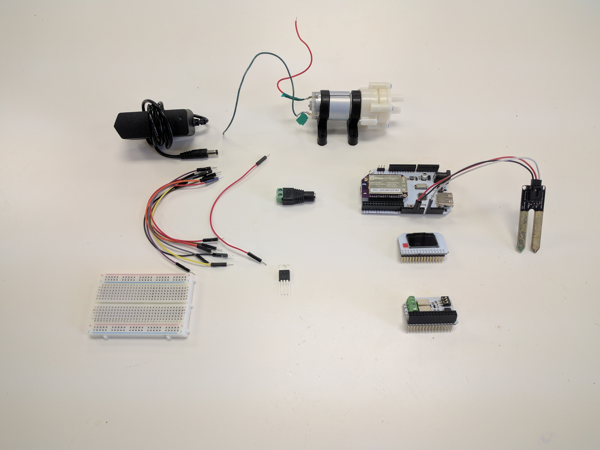
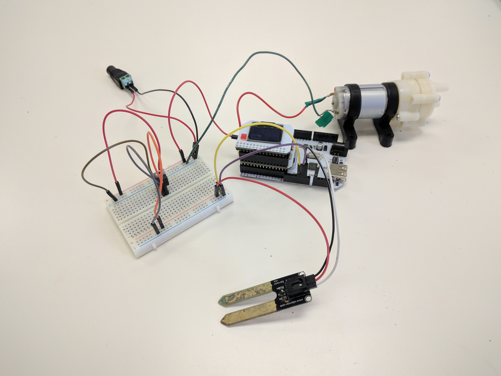
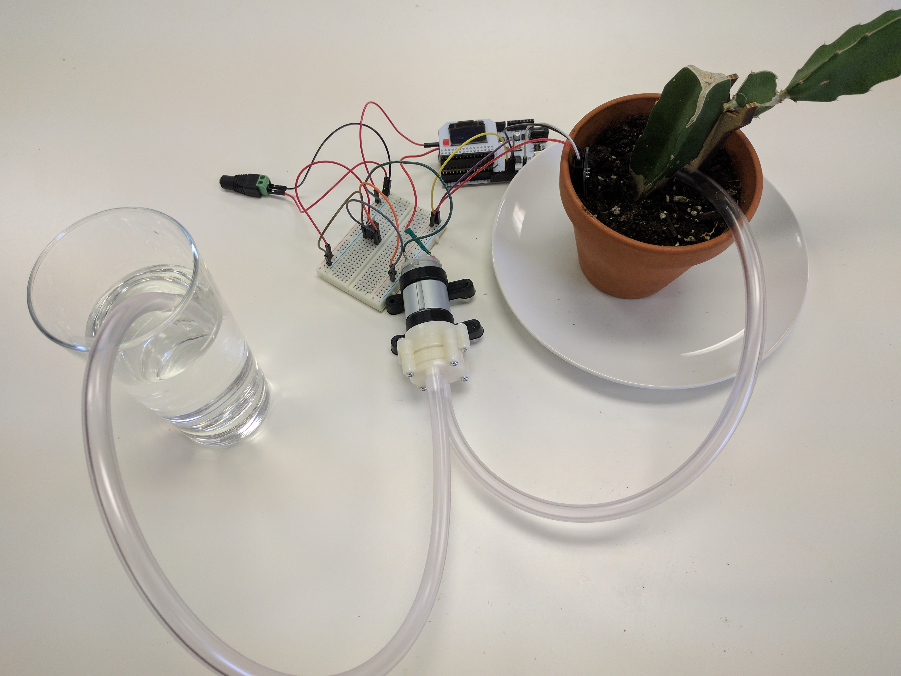

## Smart Plant - A Single Power Supply {#smart-plant-p5}

We've built out some really cool features on our smart plant in the previous parts. Now to top it all off, let's upgrade the power circuitry so we can run the entire project on a single 12V power supply!

<!-- // DONE: include a photo of the final result -->

### Overview

**Skill Level:** Intermediate

**Time Required:** 20 minutes

When you were building the smart plant, you had to power the pump and Arduino separately. Let's change that by replacing the USB power supply with a regulator that can convert the motor's 12V into 5V. This way, when you plug in the 12V supply, the entire project comes to life!

### Ingredients

We'll need all of the same materials as in the previous part:

<!-- // DONE: add ingredients from smart plant p4 once all of those are done -->
* Onion [Omega2](https://onion.io/store/omega2/) or [Omega2+](https://onion.io/store/omega2p/
* Arduino Dock 2
* Onion [OLED Expansion](https://onion.io/store/oled-expansion/)
* Soil Moisture Sensor
* 3x Male-to-Female Jumper Wires
* Onion Relay Expansion
* [DC Barrel Jack Adapter](https://www.amazon.com/gp/product/B00ZGDF7AY/ref=as_li_tl?ie=UTF8&camp=1789&creative=9325&creativeASIN=B00ZGDF7AY&linkCode=as2&tag=onion0e-20&linkId=5d39734cc06c3916099832cb4748a245)
* [Water Pump (12V DC)](http://www.canadarobotix.com/index.php?route=product/search&search=pump)
* 3x Male-to-Male Jumper Wires
* [12V 1A DC Power Supply](https://www.amazon.com/gp/product/B019X3XVWS/ref=as_li_tl?ie=UTF8&camp=1789&creative=9325&creativeASIN=B019X3XVWS&linkCode=as2&tag=onion0e-20&linkId=7e3fcbbeb2bf474a33f4d68a7413fc21)
* Flexible Plastic Tubing
* A plate or bowl to hold your plant and collect excess water
* A glass or bowl of water you can use as a reservoir

We'll need some new ingredients:

1. MC33269T 5V Linear Voltage Regulator
1. A Breadboard
1. 10x Male-to-Male Jumper Wires

Tools:

1. Flat-head screwdriver
1. Philips-head screwdriver

### Step-by-Step

Follow these instructions to set this project up on your very own Omega!

#### 1. Prepare

You'll have to have an Omega2 ready to go, complete the [First Time Setup Guide](https://docs.onion.io/omega2-docs/first-time-setup.html) to connect your Omega to WiFi and update to the latest firmware.

#### 2. Complete the Previous Parts of the Project

This project builds on the previous parts of the Smart Plant project. If you haven't already completed the [first](#smart-plant-p1), [second](#smart-plant-p2), [third](#smart-plant-p3), and [fourth parts](#smart-plant-p4), go back and do them now!

#### 3. Prep

Before you start, take apart the wiring and tubing we did in the [previous part of the project](#smart-plant-p4) and unplug your Arduino Dock. Now you should have:

<!-- // DONE: a photo of ALL of the components on a desk: Arduino Dock w/ omega and moisture sensor plugged in, OLED Exp, Relay Exp, dc barrel jack adapter, voltage regulator, breadboard, water pump, bunch of jumper wires -->

**IMPORTANT:** Make sure your Power Supply is no longer connected to the DC Barrel Jack Adapter!

#### 4. Wiring the Circuit

<!-- // DONE: embellish the text of the steps -->

<!-- // DONE: add photos for logical places in the steps (note: the steps don't have to be in a list, can just be broken up with photos) -->

This is the pinout diagram for the MC33269T. We'll be referring back to this when wiring it up.

<!-- // DONE: find a good spot for the image above -->

We'll assemble the circuit in a few sub-steps:

1. Regulator input
1. Regulator output
1. Water pump
1. Arduino Dock
1. Moisture sensor

##### Regulator Input

1. Connect jumper wires to both DC Barrel Jack Adapter terminals.
1. Connect the DC Barrel Jack to one pair of the `+` and `-` rails on the breadboard.
    * We'll call this the **12V rail**.
1. Plug the MC33269T regulator into the Breadboard across three empty rows.
1. Connect the 12V `-` rail to the GND pin of the regulator with a jumper wire.
    * The left most pin when looking from the front.
1. Connect the 12V `+` rail to the Vin pin of the regulator with a jumper wire.
    * The right most pin when looking form the front.

##### Regulator Output

1. We'll use the other pair of `+` and `-` rails on the breadboard for our **5V rail**
1. Connect the GND pin of the regulator (left most pin when looking from the front) to the 5V `-` rail with a jumper wire
1. Connect the Vout pin of the regulator (middle pin) to the 5V `+` rail with a jumper wire. Now this rail can be used to power the Arduino Dock and Omega

##### Water Pump

1. Run a jumper wire from the 12V `-`rail to the **negative terminal** of the Water Pump
1. Connect a jumper wire from the 12V `+`rail to the **IN** screw terminal on Channel 0 of the Relay Expansion
1. Connect a jumper wire from the **OUT** screw terminal on Channel 0 of the Relay Expansion to the **positive terminal** of the Water Pump

Once you've done that, plug the Relay Expansion back into the Arduino Dock.

##### Arduino Dock

**WARNING: It is very important that you connect the 5V rail to your Arduino Dock. Accidentally using the 12V rail will for sure damage your Arduino Dock and Omega. Proceed at your own risk, but don't worry, if you follow the instructions, you'll be fine.**

1. Connect the **5V `-` rail** to one of the Arduino Dock's `GND` pins
1. Connect the **5V `+` rail** to the Arduino Dock `5V` pin

Then plug in the OLED Expansion.

##### Moisture Sensor

Using the wires from the moisture sensor:

1. Connect the **5V `+` rail** to the sensor's `Vcc` pin.
1. Connect the Arduino Dock's other `GND` pin to the sensor's `GND` pin.
1. Connect the Arduino Dock's `A0` pin to the sensor's `SIG` pin.

<!-- // DONE: photo -->

#### 5. Provide Power

Now reassemble your pump tubing, reservoir, sensor, and plant:

<!-- // DONE: photo -->

Then provide power by connecting the 12V power supply to the DC Barrel Jack Adapter. Your Omega should now be booting.

### Congratulations, You Made It!

Revel in the fact that you've created a regulator circuit that can power your Omega as well as the 12V pump!

<!-- // DONE: photo, finally completed -->

Show off your amazing smart-plant setup and Dashboards on our [Community Forum](https://community.onion.io/category/1/projects), and let us know how you liked these tutorials!
