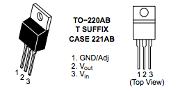
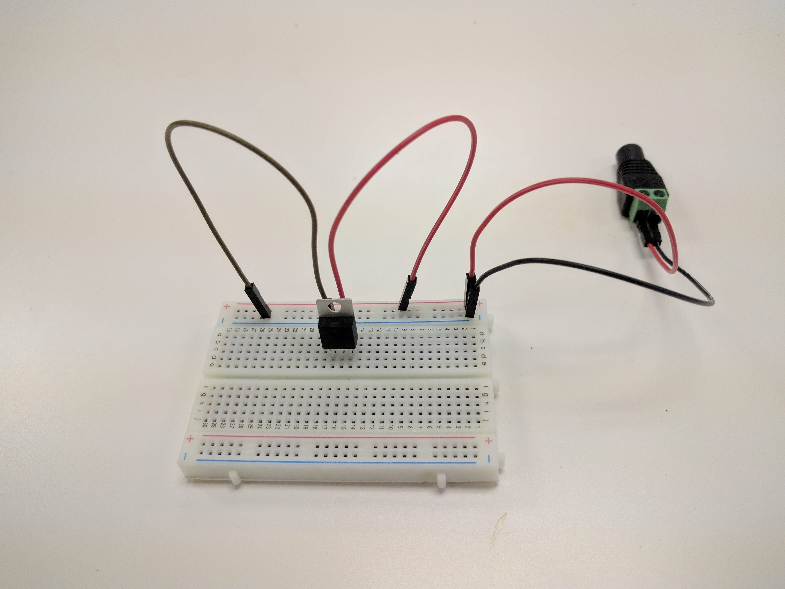
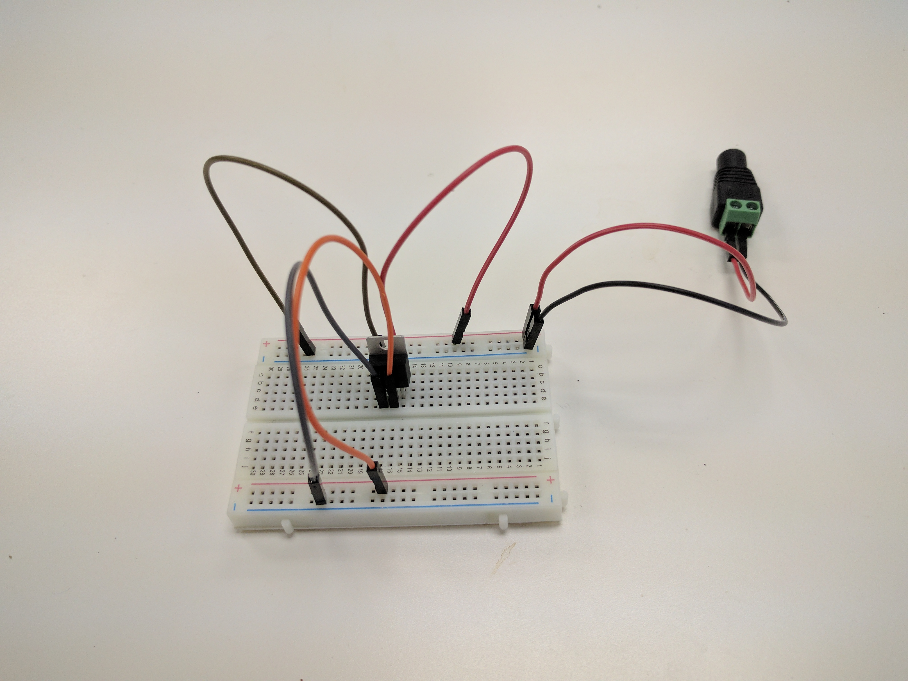
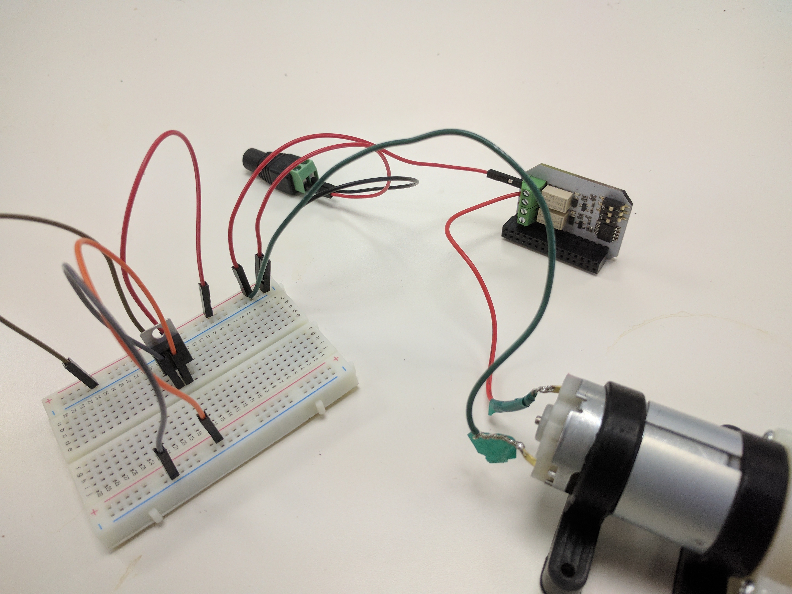
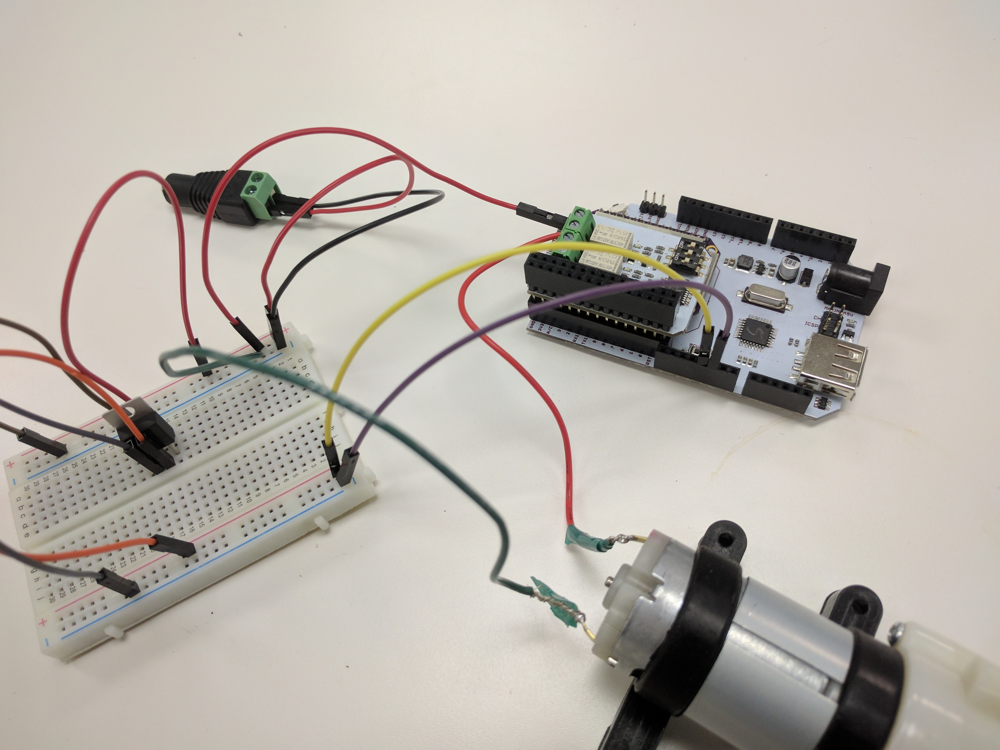
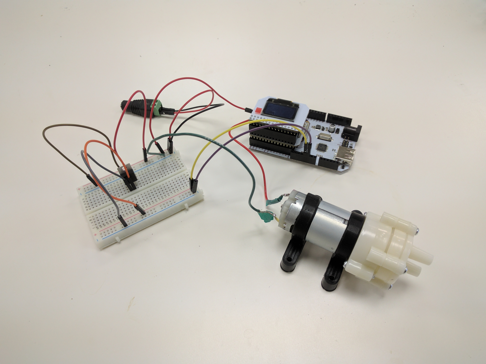

## Smart Plant - A Single Power Supply {#smart-plant-p5}

// brief intro to the project

// include a photo of the final result

### Overview

**Skill Level:** [Beginner|Intermediate|Advanced]

**Time Required:** <a time estimate to complete the project>

// go into some detail here about how we're going to be implementing the project
//	eg. which programming language we'll be using, APIs
//	include links to any api or module references

### Ingredients

We'll need all of the same materials as in the previous part:

// TODO: add ingredients from smart plant p4 once all of those TODOs are done

1. MC33269T 5V Linear Voltage Regulator
1. A Breadboard
1. 10x Male-to-Male Jumper Wires

Tools:

1. Flat-head screwdriver

### Step-by-Step

Follow these instructions to set this project up on your very own Omega!

#### 1. Prepare

You'll have to have an Omega2 ready to go, complete the [First Time Setup Guide](https://docs.onion.io/omega2-docs/first-time-setup.html) to connect your Omega to WiFi and update to the latest firmware.

#### 1. Complete the Previous Parts of the Project

This project builds on the previous parts of the Smart Plant project. If you haven't already completed the [first](#smart-plant-p1), [second](#smart-plant-p2), [third](#smart-plant-p3), and [fourth parts](#smart-plant-p4), go back and do them now!

#### 1. Regulator Circuit

// TODO: schematic of the circuit we're building

#### 1. Prep

Before you start, take apart the wiring we did in the [previous part of the project](#smart-plant-p4) and unplug your Arduino Dock. Now you should have:

// TODO: a photo of ALL of the components on a desk: Arduino Dock w/ omega and moisture sensor plugged in, OLED Exp, Relay Exp, dc barrel jack adapter, voltage regulator, breadboard, water pump, bunch of jumper wires

**IMPORTANT:** Make sure your Power Supply is no longer connected to the DC Barrel Jack Adapter!

#### 1. Wiring the Regulator

// TODO: embellish the text of the steps

// TODO: add photos for logical places in the steps (note: the steps don't have to be in a list, can just be broken up with photos)

// TODO: find a good spot for the image above

Regulator Input:

1. Connect jumper wires to both DC Barrel Jack Adapter terminals
1. Connect the DC Barrel Jack to one pair of the `+` and `-` rails on the breadboard, we'll call this the **12V rail**
1. Plug the MC33269T regulator into the Breadboard
1. Connect the 12V `-`rail to the GND pin of the regulator (left most pin when looking from the front) with a jumper wire
1. Connect the 12V `+` rail to the Vin pin of the regulator (right most pin when looking form the front) with a jumper wire

Regulator Output:

1. We'll use the other pair of `+` and `-` rails on the breadboard for our **5V rail**
1. Connect the GND pin of the regulator (left most pin when looking from the front) to the 5V `-` rail with a jumper wire
1. Connect the Vout pin of the regulator (middle pin) to the 5V `+` rail with a jumper wire. Now this rail can be used to power the Arduino Dock and Omega

Pump Setup:

1. Run a jumper wire from the 12V `-`rail to the **negative terminal** of the Water Pump
1. Connect a jumper wire from the 12V `+`rail to the **IN** screw terminal on Channel 0 of the Relay Expansion
1. Connect a jumper wire from the **OUT** screw terminal on Channel 0 of the Relay Expansion to the **positive terminal** of the Water Pump

Once you've done that, plug the Relay Expansion back into the Arduino Dock.

Power the Arduino Dock:

**WARNING: It is very important that you connect the 5V rail to your Arduino Dock. Accidentally using the 12V rail will for sure damage your Arduino Dock and Omega. Proceed at your own risk, but don't worry, if you follow the instructions, you'll be fine.**

1. Connect the **5V `-` rail** to one of the Arduino Dock's `GND` pins
1. Connect the **5V `+` rail** to the Arduino Dock `5V` pin

Then plug in the OLED Expansion.

#### 1. Provide Power

Now we provide power by connecting the 12V power supply to the DC Barrel Jack Adapter. Your Omega should now be booting.

Revel in the fact that you've created a regulator circuit that can power your Omega as well as the 12V pump!

// TODO: photo

### Code Highlight

// one or two paragraphs (max) about something cool we did in the code
//	just give a brief description/overview and provide links to where they can learn more (Onion Docs, online resources, etc)
