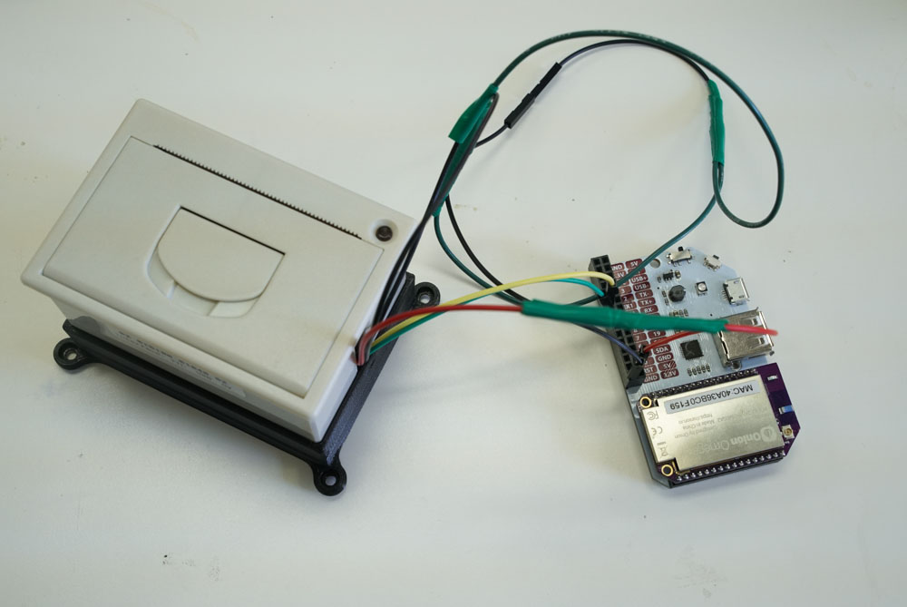
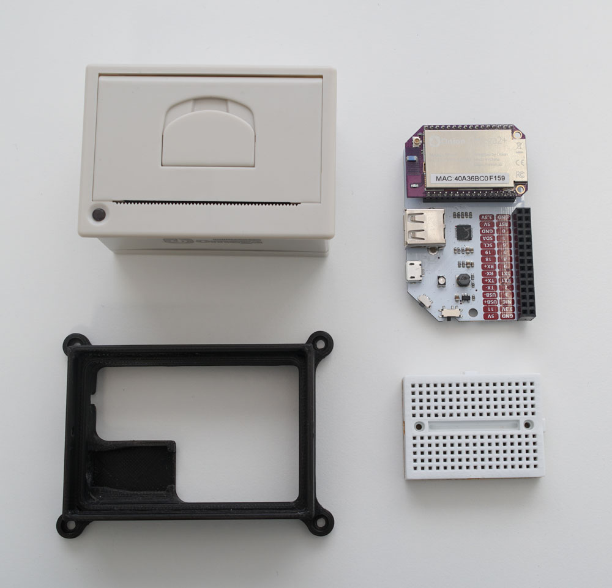
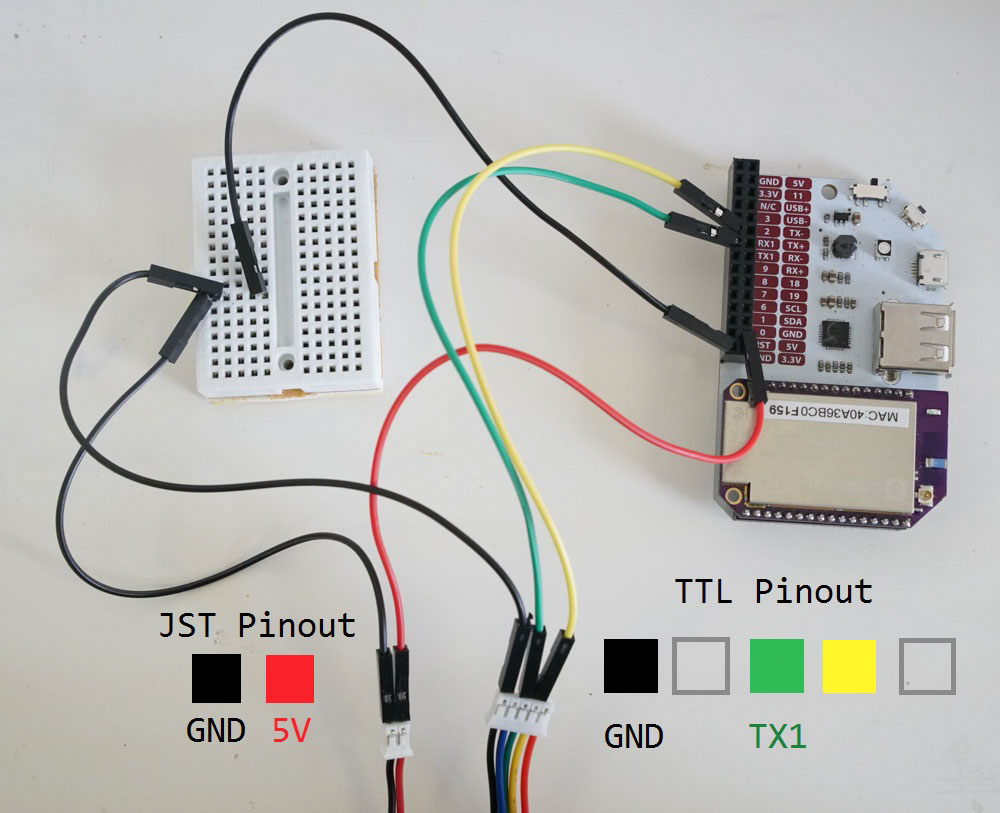

## Thermal Printer {#thermal-printer-p1}

In this project, we'll be using the Omega to control a thermal printer via a web interface. Simply type text in a box, and click Print to print it out in real life!




### Overview

**Skill Level:** Intermediate

**Time Required:** 20 minutes

This tutorial will use the Omega to control a thermal printer - most often seen at cash registers and restaurant checkouts. We'll be using connectors and cables that come with the printer to provide it with power and communicate serially.

Optionally, we'll 3D print a base to clean up the cabling and give the printer some polish.

### Ingredients

* Omega2 / Omega2+
* Any Onion Dock that exposes the Omega's GPIOs: Expansion Dock, Arduino Dock R2, Power Dock, Breadboard Dock
* [Thermal Printer](https://www.adafruit.com/product/2751)
    * comes with a 2-pin JST power cable and a 5-pin TTL cable
* [2.1 mm power jack adapter](https://www.adafruit.com/product/368)
* [5V / 2A Power supply](https://www.adafruit.com/product/276)
* [3D printed base](http://www.thingiverse.com/thing:1272778)
* Male-to-Male Jumper Wires



### Step-by-Step

Follow these steps to turn your Omega into a web-based printer!

#### 1. Prepare

You'll have to have an Omega2 ready to go, complete the [First Time Setup Guide](https://docs.onion.io/omega2-docs/first-time-setup.html) to connect your Omega to WiFi and update to the latest firmware.


#### 2. Wire Up the Thermal Printer

We'll be doing the following to connect the Omega to the printer:



Let's dive in:

1. First make sure the Omega is off and seated in the Expansion Dock.
1. Then, plug in the 2-pin power cable into the left side of the bottom of the printer above.
1. Route the black wire to the `GND` pin on the Expansion Dock headers.
1. Next we'll connect the serial wires:
	1. First plug one end of the 5-pin TTL cable into the socket at the bottom of the printer.
	1. Using a jumper (preferably green to keep it consistent) connect the green wire pin on the TTL connector to the UART1 `TX` pin on the Omega Expansion header.
	1. Same goes for the yellow wire pin on the TTL connector, except this one goes to the UART1 `RX` pin on the Expansion Header.
	1. Lastly, do the same for the black wire to the `GND` pin on the Expansion Dock header - we used a breadboard intermediary in the diagram to show how the connection is supposed to go.
1. Finally, connect the red wire from the JST connector to a `5V` pin on the Expansion Dock headers.

> Note that we used a breadboard to connect the two `GND` pins from the printer to a single `GND` pin on the Omega. It would have been equally ok to connect the two printer `GND` pins to two `GND` pins on the Omega.

#### 2. Download the Project Code

The code for this project is all done and can be found in Onion's [iot-thermal-printer repo](https://github.com/OnionIoT/iot-thermal-printer) on GitHub.

First, [connect to the Omega's Command line](https://docs.onion.io/omega2-docs/connecting-to-the-omega-terminal.html#connecting-to-the-omega-terminal-ssh) and install `git`:

```
opkg update
opkg install git git-http ca-bundle
```

And then [use `git` to download the project code to your Omega](https://docs.onion.io/omega2-docs/installing-and-using-git.html):

```
cd /root
git clone https://github.com/OnionIoT/iot-thermal-printer.git
```

After cloning the repo, enter the repo directory and copy the contents of the `www` to the `/www` directory on the Omega:

```
cd iot-thermal-printer
cp -r www/ /
```

> By virtue of `uhttpd`, the HTTP server running on the Omega, all of the files in the `/www` directory will be served up as a website.


### Running the Printer

1. Connect your Omega to your WiFi network, or connect your computer to the Omega's WiFi network.
1. In a web browser, navigate to `omega-ABCD.local/printer.html`, where `ABCD` is the last 4 digits on the sticker on the Omega.
	* On some Android and PC devices, the `omega-ABCD.local` address doesn't always work. Follow our [guide on finding your Omega's IP Address](https://docs.onion.io/omega2-docs/finding-omega-ip-address.html) and use the IP address instead of `omega-ABCD.local` when connecting the web interface. It will be something along the lines of `192.168.1.109/printer.html`
1. Type in text in the box in the middle of the webpage.
1. Click print to print it!


The physical output:


### Code Highlight

This project uses the `cgi-bin` method to run scripts on the Omega via a web interface. In the following line, we send the data from the text box to the script in the `/cgi-bin` directory using asynchronous JavaScript (AJAX):

```javascript
$.ajax({
    type: "POST",
    url: "/cgi-bin/print.sh",
    data: $('#printContent').val().split('\n').join('\r'), // <-- We need to replace \n with \r
    contentType: 'text/plain'
})
```

The `print.sh` script works like a simple API endpoint that takes data and does something with it; in this case, sending it to the printer via serial:

```sh
#!/bin/sh

echo "Content-type: application/json"
echo ""

if [ "$REQUEST_METHOD" = "POST" ]; then
    read -n $CONTENT_LENGTH line
    echo $line > /dev/ttyS1
    # feed paper
    echo '' > /dev/ttyS1
fi

echo '{"success":"ok"}'

exit 0
```

This is just one of many methods to create your own endpoints and services easily and quickly on the Omega!


### Going Further

With a little bit of wire splicing and soldering, we can make this project much more compact! Check out the [next part](#thermal-printer-p2) for more.
