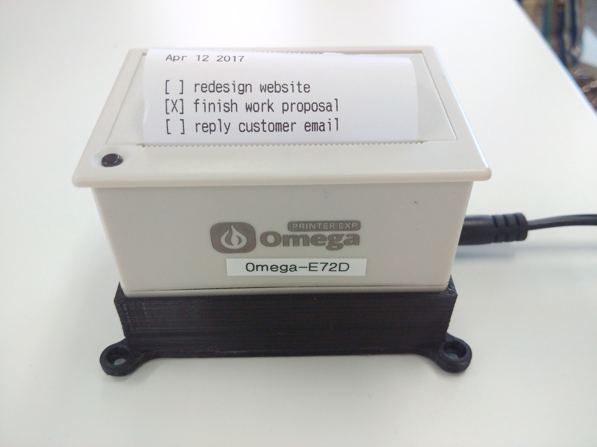
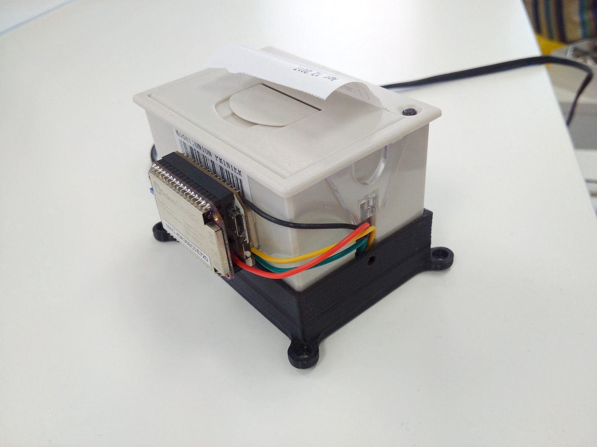
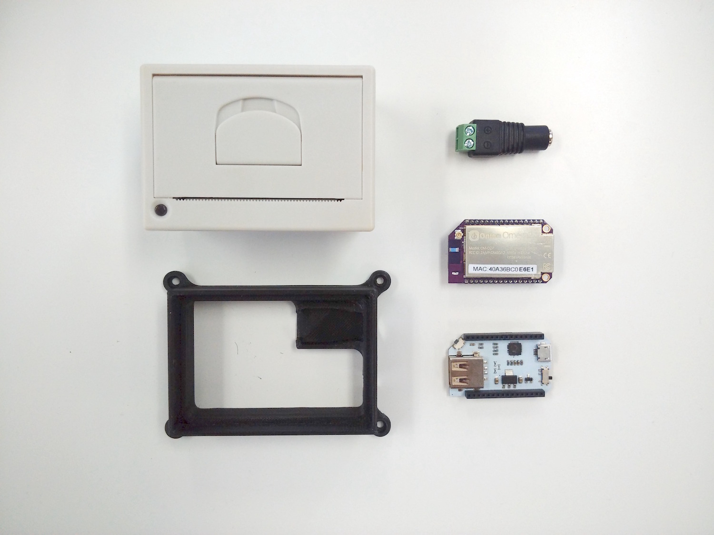
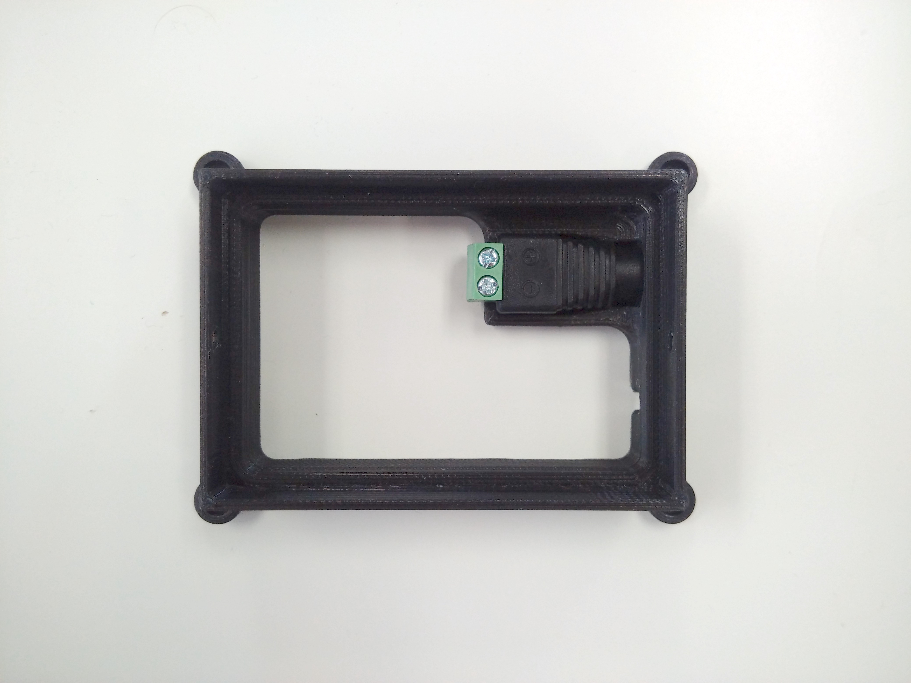
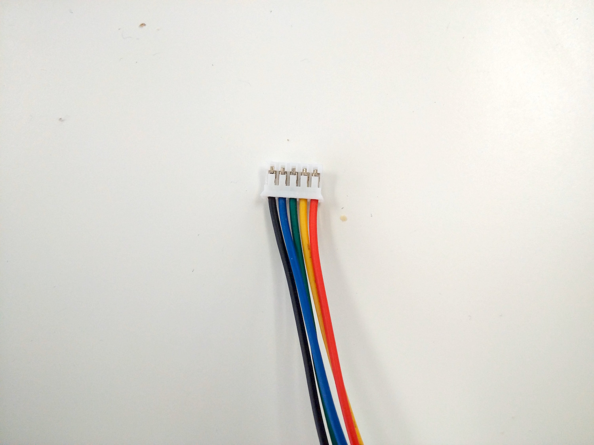
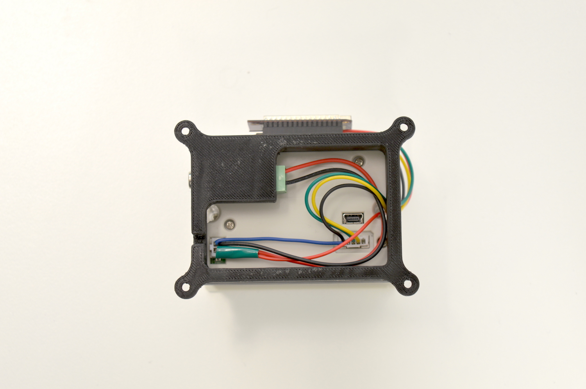
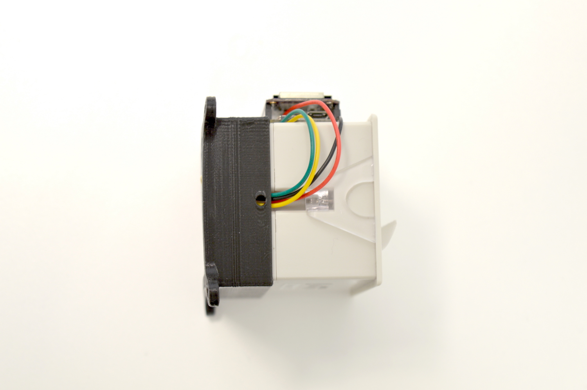
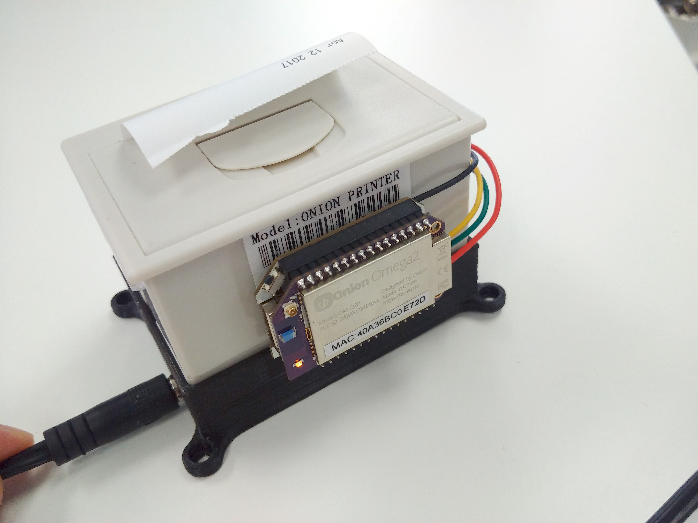

## Thermal Printer - A Compact Version {#thermal-printer-p2}

In this project, we'll build on the [Thermal Printer Project](#thermal-printer-p1). While the Expansion Dock definitely suits this purpose well, we make the same thing in a very compact package using the Mini Dock and a little bit of wire splicing and soldering.





### Overview

**Skill Level:** Advanced

**Time Required:** 1 Hour

We'll need a 3D printed plastic base for this project - if you have it printed out already, this will save you some trouble. Additionally, we'll wire up a DC barrel connector for power and wires for serial communication with the Omega instead of powering it from the Expansion dock.

This tutorial will require you to solder a wire to one of the components on the Mini Dock. Please familiarize yourself with proper soldering technique and safety procedures when working with soldering irons, as there is a risk of injury due to the high heat!

If you are not comfortable soldering, try finding a friend or professional who can quickly solder it for you. Or practice soldering wires together and then work your way up to soldering on actual electronics.

**Warning:** Soldering irons get really hot and can burn skin badly! Be careful and solder only if you know what you're doing and at your own risk, Onion is not responsible for any injury or damage!

### Ingredients

* Onion [Omega2](https://onion.io/store/omega2/) or [Omega2+](https://onion.io/store/omega2p/)
* Onion [Mini Dock](https://onion.io/store/mini-dock/)
* [Thermal Printer](https://www.amazon.com/gp/product/B00XW2K422/ref=as_li_tl?ie=UTF8&tag=onion0e-20&camp=1789&creative=9325&linkCode=as2&creativeASIN=B00XW2K422&linkId=ed19204d85392906ca786c03557458dd)
    * comes with a 2-pin JST power cable and a 5-pin TTL cable
* [DC barrel jack adapter](https://www.amazon.com/gp/product/B00ZGDF7AY/ref=as_li_tl?ie=UTF8&camp=1789&creative=9325&creativeASIN=B00ZGDF7AY&linkCode=as2&tag=onion0e-20&linkId=5d39734cc06c3916099832cb4748a245)
* [5V 2A DC Power Supply](https://www.amazon.com/gp/product/B00GUO5WUI/ref=as_li_tl?ie=UTF8&tag=onion0e-20&camp=1789&creative=9325&linkCode=as2&creativeASIN=B00GUO5WUI&linkId=e8c01614795aeb9d078c1ea0e1940db3)
* [3D printed base](http://www.thingiverse.com/thing:1272778)
* [Male-to-Male Jumper Wires](https://www.amazon.com/gp/product/B01LZF1ZSZ/ref=as_li_tl?ie=UTF8&tag=onion0e-20&camp=1789&creative=9325&linkCode=as2&creativeASIN=B01LZF1ZSZ&linkId=0fa23489eefb433f7768a252eb43dbde)

Tools:

1. [Soldering iron](https://www.amazon.com/gp/product/B01E1ISGH0/ref=as_li_qf_sp_asin_il_tl?ie=UTF8&tag=onion0e-20&camp=1789&creative=9325&linkCode=as2&creativeASIN=B01E1ISGH0&linkId=e645097c29c056fb4dfa5ac65716d83d) + [solder](https://www.amazon.com/gp/product/B01B61TWGY/ref=as_li_qf_sp_asin_il_tl?ie=UTF8&tag=onion0e-20&camp=1789&creative=9325&linkCode=as2&creativeASIN=B01B61TWGY&linkId=72199c3f77442ad73fa91960051b20d2)
1. [Wire Strippers](https://www.amazon.com/gp/product/B0000302WM/ref=as_li_tl?ie=UTF8&tag=onion0e-20&camp=1789&creative=9325&linkCode=as2&creativeASIN=B0000302WM&linkId=0163bdb27332986665ec8254b1904099)
1. [Double-sided tape](https://www.amazon.com/gp/product/B0007P5G8Y/ref=as_li_qf_sp_asin_il_tl?ie=UTF8&tag=onion0e-20&camp=1789&creative=9325&linkCode=as2&creativeASIN=B0007P5G8Y&linkId=b80bdba9100d68495096ae6cf4761d55)




### Step-by-Step

Follow these steps to turn your Omega into a web-based printer!

#### 1. 3D Print the Base

3D print the base to hold our components together. If you do not have a 3D printer available nearby, there are online services available such as [3DHubs](https://www.3dhubs.com/).

#### 2. Install in the Power Jack

Insert the power jack adapter into the printer base. Do this first, since the other pieces will cover up the base later.



#### 3. Trim the Cables

Next we need to cut one end of the 5-pin TTL cable that came with the thermal printer. This is so we can re-route the wires to where they need to go. The other end we'll leave alone, since that goes into the printer.

Cut only **one** of these ends off, leaving bare wire:



#### 4. Assemble the Circuit

We'll be doing the following to connect the Omega to the printer:


1. Plug in the 2-pin JST power cable into the 2-pin port on the bottom of the printer.
1. Route the red and black wires to the barrel jack; make sure the red wire is connected to the **Positive (+)** terminal and the black to the **Negative (-)** terminal.
1. Then plug the non-cut end of the 5-pin TTL cable into the 5-pin port on the printer. Route the wires through the gap in the printer case on the right side of the USB connector.
1. Route the black, green, and yellow TTL wires to the UART pins on the Mini Dock (highlighted in the diagram above).
	* The middle pin on the printer is the printer's serial RX (Receiving) pin, and it needs to be connected to the Omega's UART1 TX (Transmitting) pin
	* The pin second from the right on the printer is the printer's serial TX pin, connect it to the Omega's UART RX pin
	* To insert the wires into the Mini Dock, you can insert the wires into the headers after you strip and twist the ends like so:
		
1. Then solder the red power cable to the 5V pin on the regulator on the Mini Dock as shown above. Take care that you solder to the correct contact or you may damage your board!
	* We do this tricky business because the thermal printer requires 5V to operate and the Mini Dock
1. Insert your printer into the base from the top so that the 5-pin cable is routed through the channel on the side of the printer.
	* The wiring on the underside should like something like this:
		
	* How the 5-pin cable is routed:
		
1. If your wires are all connected, you can then flip the printer right side up.


**Do not plug in the power supply just yet,** as we still need to connect and solder some wires to the Omega.


#### 5. Connect the Omega

Plug the Omega into the Mini Dock. The Omega's pins will push the stripped wires down into the header. Make sure they don't pop out during the process!

Use double-sided tape or putty to affix the Omega to the rear of the printer like so:




Now plug in the 5V power supply into the barrel jack and turn the switch on the Mini Dock to ON.


#### 6. Download the Code

*If you've already downloaded the code in [the first part of the project](#thermal-printer-p1), your printer is ready to go so you can skip this part!*

The code for this project is all done and can be found in Onion's [iot-thermal-printer repo](https://github.com/OnionIoT/iot-thermal-printer) on GitHub.

First, [connect to the Omega's Command line](https://docs.onion.io/omega2-docs/connecting-to-the-omega-terminal.html#connecting-to-the-omega-terminal-ssh) and install `git`:

```
opkg update
opkg install git git-http ca-bundle
```

And then [use `git` to download the project code to your Omega](https://docs.onion.io/omega2-docs/installing-and-using-git.html):

```
cd /root
git clone https://github.com/OnionIoT/iot-thermal-printer.git
```

After cloning the repo, enter the repo directory and copy the contents of the `www` to the `/www` directory on the Omega:

```
cd iot-thermal-printer
cp -r www/ /
```

> By virtue of `uhttpd`, the HTTP server running on the Omega, all of the files in the `/www` directory will be served up as a website.


### Using the Printer

1. Connect your Omega to your WiFi network, or connect your computer to the Omega's WiFi network.
1. In a web browser, navigate to `omega-ABCD.local/printer.html`, where `ABCD` is the last 4 digits on the sticker on the Omega.
	* On some Android and PC devices, the `omega-ABCD.local` address doesn't always work. Follow our [guide on finding your Omega's IP Address](https://docs.onion.io/omega2-docs/finding-omega-ip-address.html) and use the IP address instead of `omega-ABCD.local` when connecting the web interface. It will be something along the lines of `192.168.1.109/printer.html`
1. Type text in the box in the middle of the webpage.
1. Click print to physically print it!


The physical output:


