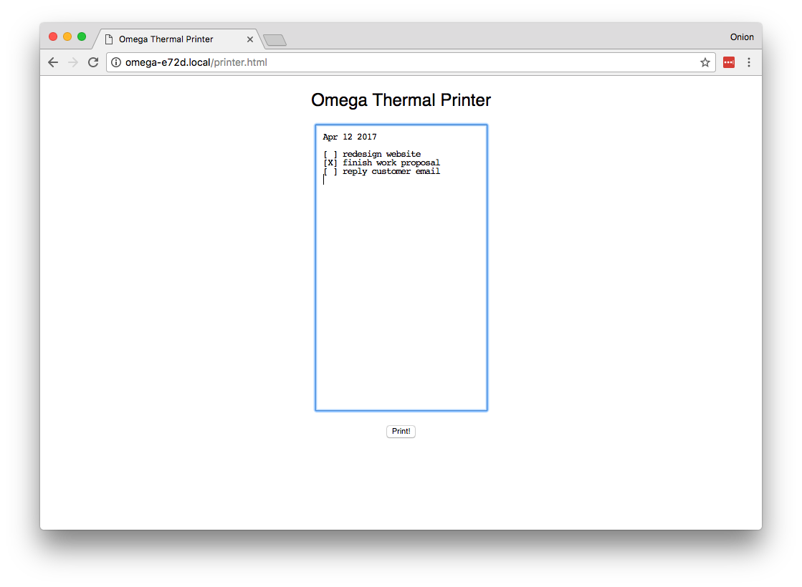
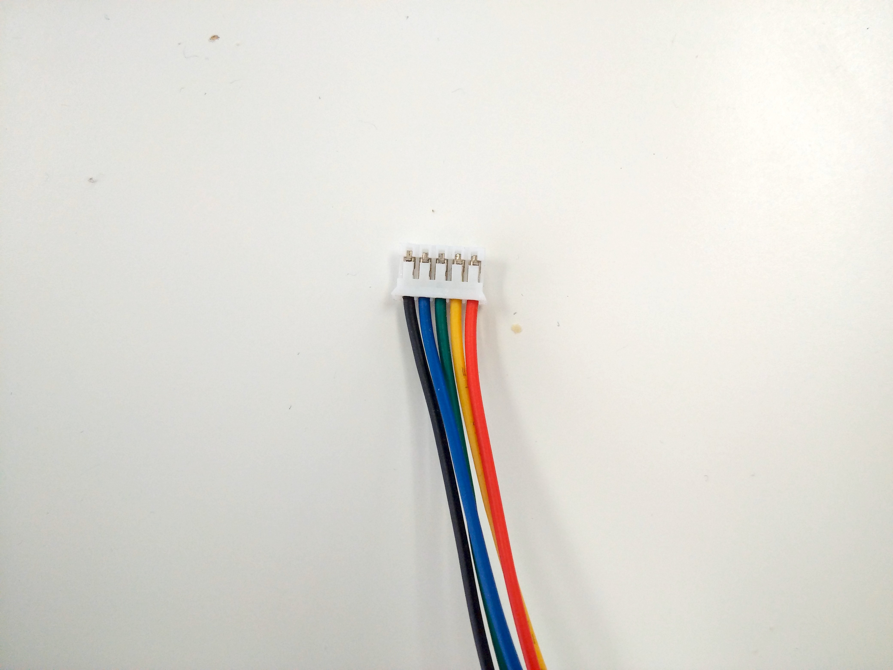
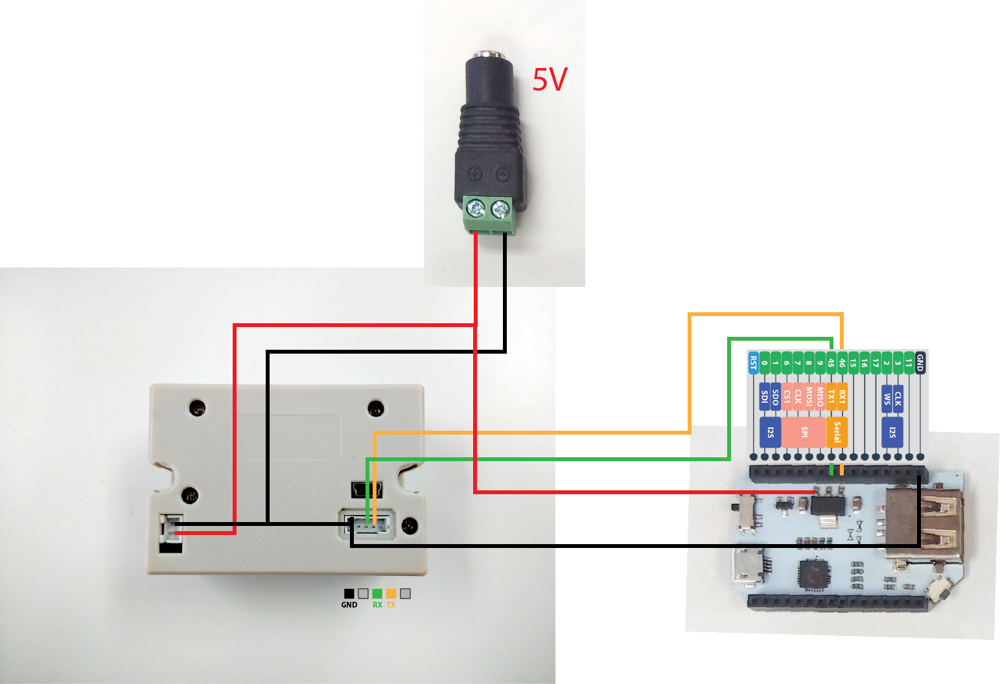
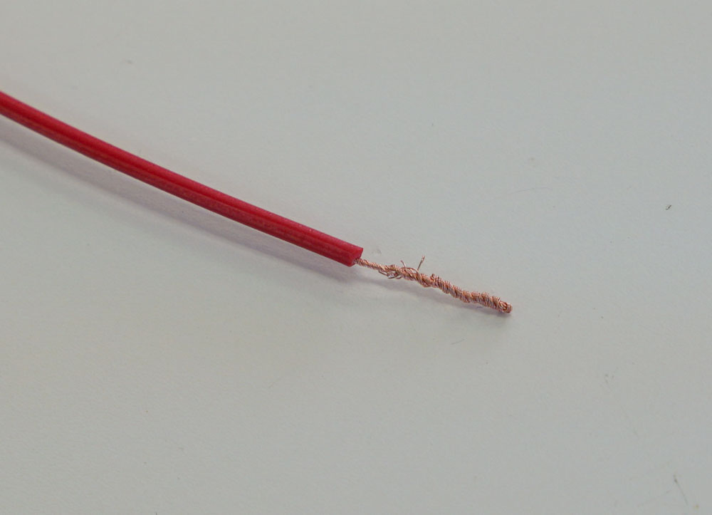
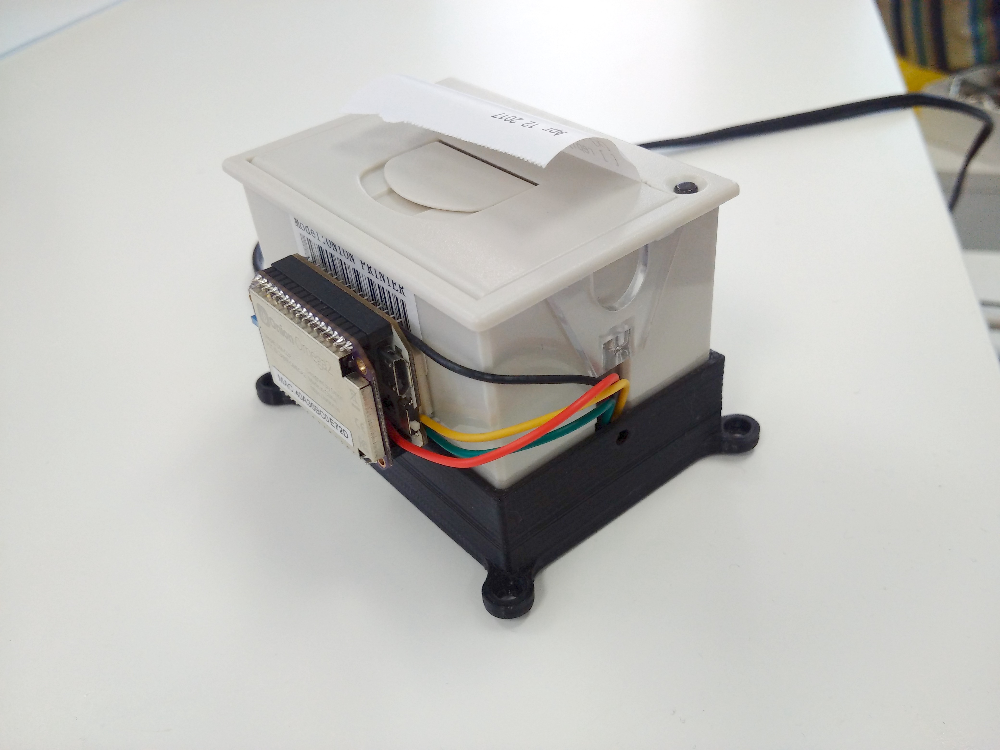

## Thermal Printer

In this project, we'll be using the Omega to control a thermal printer via a web interface. Simply type text in a box, and click Print to print it out in real life!




### Overview

**Skill Level:** Intermediate

**Time Required:** 20 minutes

We'll be 3D printing a plastic base for our printer and wiring. Then we'll wire up a barrel connector for power and wires for serial communication with the Omega.

This tutorial will require you to solder a wire to one of the components on the Mini Dock. Please familiarize yourself with proper soldering technique and safety procedures when working with soldering irons, as there is a risk of injury due to the high heat! 

If you are not comfortable soldering, try finding a friend or professional who can quickly solder it for you.

### Ingredients

1. Omega2 / Omega2+
1. Mini Dock / Expansion Dock
1. Thermal Printer (https://www.adafruit.com/product/2751) 
    * comes with a 2-pin JST power cable and a 5-pin TTL cable that we will be using in this project
1. 2.1 mm power jack adapter (https://www.adafruit.com/product/368)
1. 5V / 2A Power supply (https://www.adafruit.com/product/276)
1. 3D printed base (http://www.thingiverse.com/thing:1272778)
1. Soldering iron + solder


### Step-by-Step

Follow these steps to turn your Omega into a web-based printer!

#### 1. 3D Print the Base

3D print the base to hold our components together. If you do not have a 3D printer available nearby, there are online services available such as [3DHubs](https://www.3dhubs.com/).

#### 2. Plug in the Power Jack

Insert the power jack adapter into the printer base. Do this first, since the other pieces will cover up the base later.


#### 3. Trim the cable

Next we need to cut one end of the 5-pin TTL cable that came with the thermal printer. This is so we can re-route the wires to where they need to go. The other end we'll leave alone, that goes into the printer.

Cut only **one** of these ends off, leaving bare wire:



#### 4. Assemble the Circuit

This is the circuit diagram for our printer:



Plug in the 2-pin JST power cable into the left side of the bottom of the printer above. Route the red and black wires to the barrel jack; make sure the red wire is connected to the "(+)" terminal and the black to the "(-)" terminal. 

Then plug the non-cut end of the 5-pin TTL cable into the printer as shown above. Route the wires through the gap in the printer case on the right side of the USB connector. 

Route the black, green, and yellow TTL wires to the highlighted pins on the Mini Dock above. Then solder the red power cable to the pin on the regulator on the Mini Dock as shown above. Take care that you solder to the correct pin or you may damage your board!

To insert the wires into the Mini Dock, you can strip and twist the ends like so:



The wiring on the underside of the printer should look something like this:


Insert your printer into the base from the top so that the 5-pin cable is visible as shown above. If your wires are all connected, you can then flip the printer back over so the paper can be printed.

**Do not plug in the power supply just yet,** as we still need to connect and solder some wires to the Omega.

#### Assemble the Omega

Plug the Omega into the Mini Dock. The pins should push the wires into the Dock and make contact as the Omega is inserted.

Use double-sided tape or putty to affix the Omega to the rear of the printer like so:




Now plug in the 5V power supply into the barrel jack and turn the switch on the Mini Dock to ON. Then turn on the Omega and connect to its command line.

#### Download the Code


The code for this project is all done and can be found in Onion's [iot-thermal-printer repo](https://github.com/OnionIoT/iot-thermal-printer) on GitHub. Follow the [instructions on installing Git](https://docs.onion.io/omega2-docs/installing-and-using-git.html), navigate to the `/root` directory, and clone the GitHub repo:

```
git clone https://github.com/OnionIoT/iot-thermal-printer.git
```

After cloning the repo, enter the repo directory and run the `install.sh` script:

```
cd iot-thermal-printer
sh install.sh
```

#### Running the Printer

1. Connect your Omega to your WiFi network, or connect your computer to the Omega's WiFi network.
1. In a web browser, navigate to omega-ABCD.local/printer.html, where ABCD is the last 4 digits on the sticker on the Omega.
1. Type in text in the box in the middle of the webpage.
1. Click print to print it!


### Code Highlight

This project uses the `cgi-bin` method to run scripts on the Omega via a web interface. In the following line, we send the data from the text box to the script in the `/cgi-bin` directory using asynchronous JavaScript (AJAX):

```javascript
$.ajax({
    type: "POST",
    url: "/cgi-bin/print.sh",
    data: $('#printContent').val().split('\n').join('\r'), // <-- We need to replace \n with \r
    contentType: 'text/plain'
})
```

The `print.sh` script works like a simple API endpoint that takes data and does something with it; in this case, sending it to the printer via serial:

```sh
#!/bin/sh

echo "Content-type: application/json"
echo ""

if [ "$REQUEST_METHOD" = "POST" ]; then
     read -n $CONTENT_LENGTH line
     echo $line > /dev/ttyS1
     # feed paper
     echo '' > /dev/ttyS1
     #echo '' > /dev/ttyS1
fi

echo '{"success":"ok"}'

exit 0
```

This is just one of many methods to create your own endpoints and services easily and quickly!