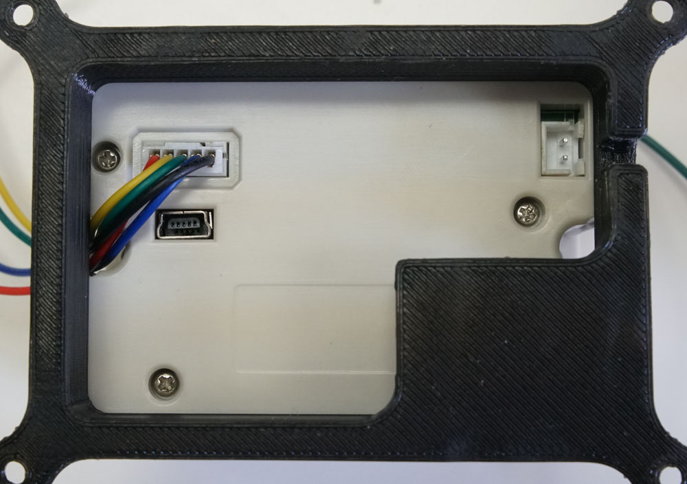

## Thermal Printer

Final result 





### Ingredients

1. Omega2 / Omega2+
1. Mini Dock / Expansion Dock
1. Thermal Printer (https://www.adafruit.com/product/2751)
1. 2.1 mm power jack adapter (https://www.adafruit.com/product/368)
1. 5v / 2A Power supply (https://www.adafruit.com/product/276)
1. 3D print base (http://www.thingiverse.com/thing:1272778)


### Step-by-Step

Here's a quick look at how the components are connected for this to work:


#### 1. Plug in the Power Jack

First let's fit the power jack adapter into the printer base. Do this first, since the other pieces will cover up the base later.


#### 2. Trim the cable

Next we need to cut one end of the cable that come with the thermal printer. This is so we can re-route the wires to where they need to go. The other end we'll leave alone, that goes into the printer.


#### 2. Wire everything else

This is the circuit diagram for our printer:


<!-- // TODO: finish wiring explanation -->


Put everting together


Write up code


/www/cgi-bin/print.sh

```
#!/bin/sh

echo "Content-type: application/json"
echo ""

if [ "$REQUEST_METHOD" = "POST" ]; then
     read -n $CONTENT_LENGTH line
     echo $line > /dev/ttyS1
     # feed paper
     echo '' > /dev/ttyS1
     #echo '' > /dev/ttyS1
fi

echo '{"success":"ok"}'

exit 0
```


/www/printer.html

```
<!DOCTYPE html>
<html>
    <head>
        <meta charset="utf-8" />
        <meta http-equiv="X-UA-Compatible" content="IE=edge" />
        <meta name="description" content="Home page for Onion Corporation" />
        <meta name="author" content="Onion Corporation" />
        <meta name="viewport" content="width=device-width, initial-scale=1, user-scalable=no" />
        <title>Omega Thermal Printer</title>
        <style>
            html, body {
                height: 100%;
                width: 100%;
                margin: 0;
                padding: 0;
                overflow: hidden;
            }

            * {
                -webkit-box-sizing: border-box;
                -moz-box-sizing: border-box;
                box-sizing: border-box;
                font-family: sans-serif;
                -webkit-touch-callout: none;
                -webkit-user-select: none;
                -khtml-user-select: none;
                -moz-user-select: none;
                -ms-user-select: none;
                user-select: none;
            }

            
            h1, h2, h3, h4, h5, h6 {
                font-weight: 400;
            }

            .text-center {
                text-align: center;
            }

            .instruction {
                text-align: center;
                color: #00c;
            }

            textarea {
                   display: block;
                   width: 240px;
                   height: 400px;
                   margin-left: auto;
                   margin-right: auto;
                   resize: none;
                   white-space: pre-wrap;
                   word-wrap: break-word;
                   word-break: break-all;


                   font-family: monospace;
                    font-size: 13px;
                    padding: 10px;
                    letter-spacing: -1px;
                    line-height: 12px;
               }

               #printButton {
                    display: block;
                    margin-left: auto;
                   margin-right: auto;
                   margin-top: 20px;

               }

        </style>
    </head>
    <body>
        <h2 class="text-center">Omega Thermal Printer</h2>

        <div class="wrapper">

            <textarea id="printContent" wrap="hard"></textarea>

            <button id="printButton" class="text-center">Print!</button>

        </div>

        <script src="./jquery.js"></script>

    <script>
            $(function () {
                $('#printButton').on('click', function(e){
                    $.ajax({
                             type: "POST",
                             url: "/cgi-bin/print.sh",
                             data: $('#printContent').val().split('\n').join('\r'), // <-- We need to replace \n with \r
                             contentType: 'text/plain'
                         })
                });
            });
        </script>


    </body>
</html>
```
