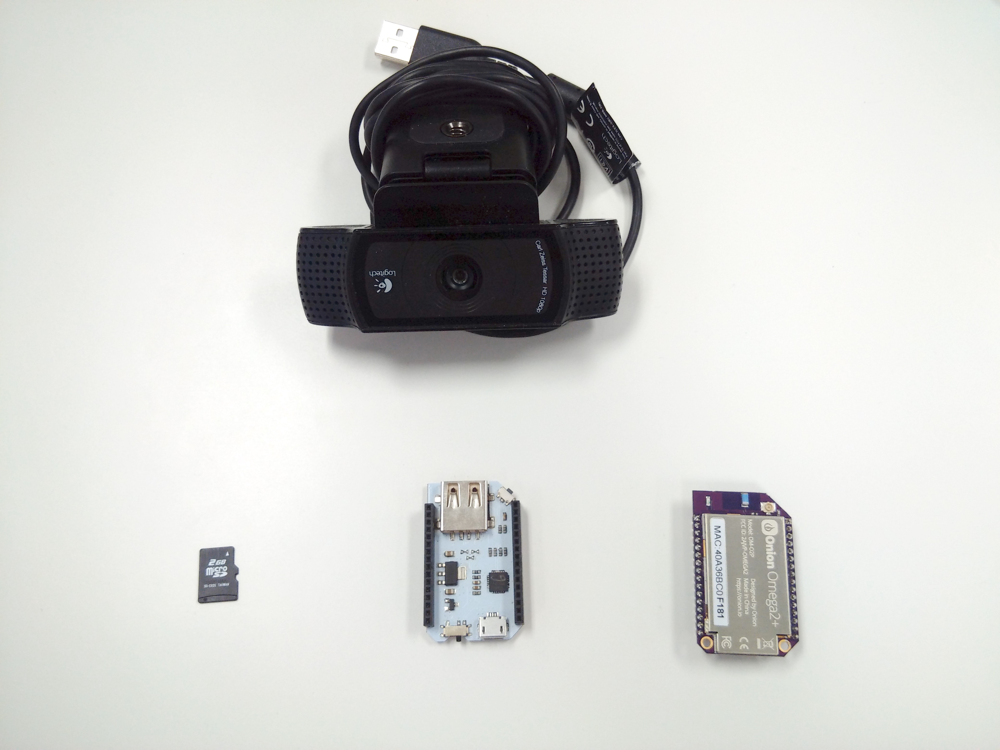
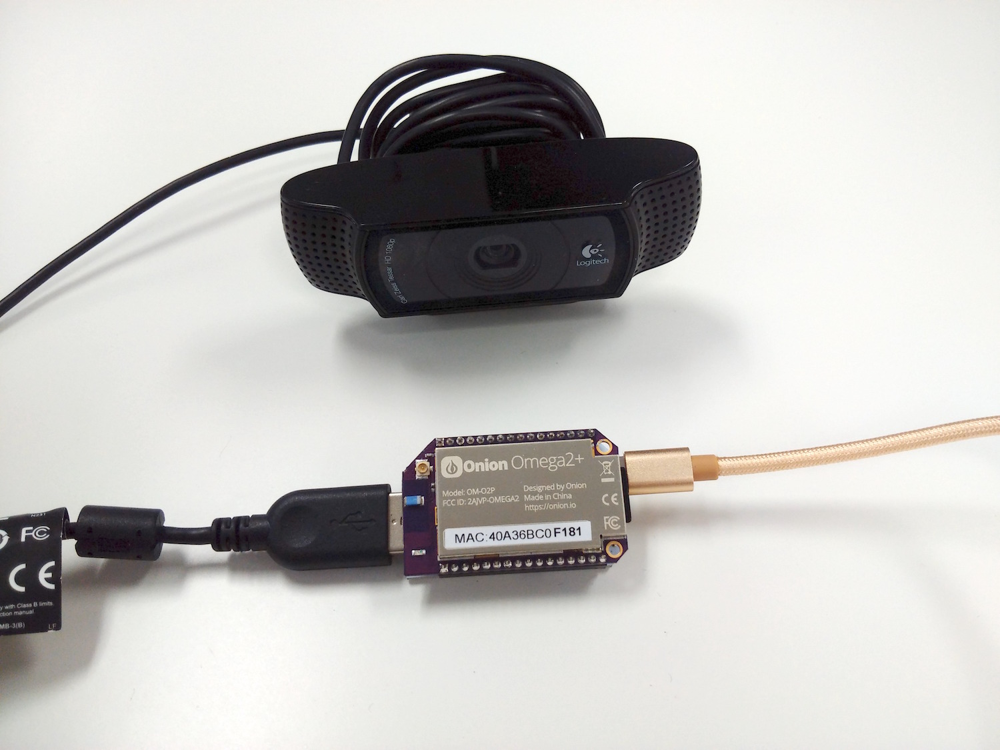
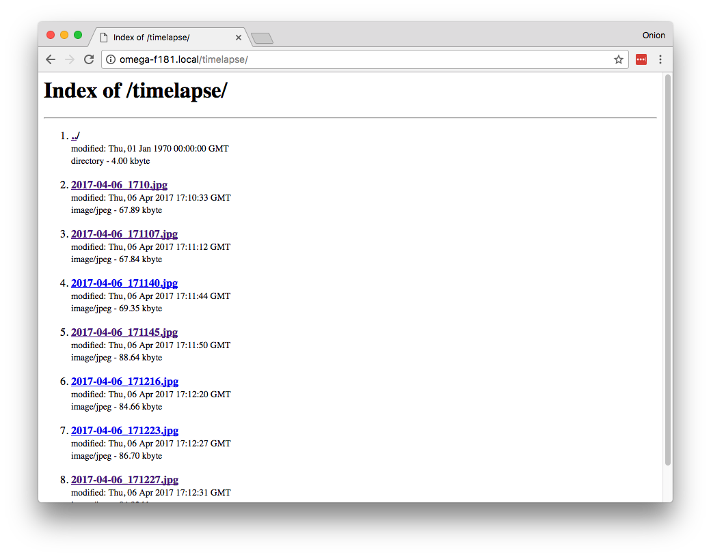

## Time-Lapse Camera

Using a webcam connected to the Omega, we can take photos over time and string them together to make a video of your scene!

// TODO: a link to a youtube video of one of our timelapses


<!-- // include a photo of the final result -->
### Overview

**Skill Level:** Intermediate

**Time Required:** 30 minutes

<!-- // go into some detail here about how we're going to be implementing the project // eg. which programming language we'll be using, APIs // include links to any api or module references -->

In this project, we'll use the `fswebcam` utility and `cron` to capture images from the webcam at timed intervals, then we'll convert it all to a video using `ffmpeg`. To keep the amount of typing to a minimum, we will create shell scripts to do the work for us!

### Ingredients

<!-- // a numbered list of all physical items used to make this project // all items should be linked to a place online where they can be bought // the Onion items should be linked to their corresponding Onion store page -->

1. Onion Omega2+
1. Any Onion Dock that supports Expansions: Expansion Dock, Power Dock, Arduino Dock 2, Mini Dock,
1. Micro SD card
1. [USB Camera](https://www.logitech.com/en-ca/product/hd-pro-webcam-c920)



### Step-by-Step

Follow these instructions create sweet time-lapse videos with a webcam on your Omega2+!

<!-- // each step should be simple -->
#### 1. Get our Hardware ready

You'll have to have an Omega2+ ready to go, complete the [First Time Setup Guide](https://docs.onion.io/omega2-docs/first-time-setup.html) to connect your Omega to WiFi and update to the latest firmware.

Insert the MicroSD card, plug in the USB webcam, connect the Omega to power, and we're golden.



#### 2. Prepare an external storage device

The pictures we'll take with the webcam would fill up the Omega's storage quite quickly. To make sure we have enough space for our pictures, we'll need a MicroSD card to store it all.

```
screen /dev/tty.SLAB_USBtoUART 115200
```


We can use `df -h` to check the storage on the Omega - and make sure we're using the correct device.

``` bash
root@Omega-F181:~# df -h
Filesystem                Size      Used Available Use% Mounted on
/dev/root                 5.5M      5.5M         0 100% /rom
tmpfs                    61.4M     84.0K     61.3M   0% /tmp
/dev/mtdblock6           25.1M    756.0K     24.3M   3% /overlay
overlayfs:/overlay       25.1M    756.0K     24.3M   3% /
tmpfs                   512.0K         0    512.0K   0% /dev
/dev/mmcblk0p4            1.8G    652.5M      1.2G  35% /tmp/run/mountd/mmcblk0p4
```

Here, the last line shows the MicroSD card is successfully mounted under `/tmp/run/mountd/mmcblk0p4`

Now that we're sure where the MicroSD card is, let's create a shortcut to it for easy access:

```
ln -s /tmp/run/mountd/mmcblk0p1 ~/sd
mkdir sd/timelapse
```


#### 3. Webcam software

To get the webcam to take pictures, we'll need the software.

The package we use here isn't in the official Onion repo so we'll have to use LEDE's repo to get it.

Open up the source list like so:

```
vim /etc/opkg/distfeeds.conf
```

And comment/uncomment the lines so they look like this:
```
src/gz reboot_core http://downloads.lede-project.org/snapshots/targets/ramips/mt7688/packages
src/gz reboot_base http://downloads.lede-project.org/snapshots/packages/mipsel_24kc/base
# src/gz reboot_onion http://repo.onion.io/omega2/packages
## src/gz reboot_luci http://downloads.lede-project.org/snapshots/packages/mipsel_24kc/luci
src/gz reboot_packages http://downloads.lede-project.org/snapshots/packages/mipsel_24kc/packages
## src/gz reboot_routing http://downloads.lede-project.org/snapshots/packages/mipsel_24kc/routing
## src/gz reboot_telephony http://downloads.lede-project.org/snapshots/packages/mipsel_24kc/telephony
# src/gz omega2_core http://repo.onion.io/omega2/packages/core
# src/gz omega2_base http://repo.onion.io/omega2/packages/base
# src/gz omega2_packages http://repo.onion.io/omega2/packages/packages
src/gz omega2_onion http://repo.onion.io/omega2/packages/onion
```

>A complete guide on how to do so can be found in our guide on [Using Opkg](https://docs.onion.io/omega2-docs/using-opkg.html#using-opkg-switch-to-lede-repos).

Next, restart the Omega so the changes will take place. Once that's done, we can go ahead and install the `fswebcam` package:

```
opkg update
opkg install fswebcam
```


The `fswebcam` utility lets us take a picture just like this:

```
fswebcam --no-banner -r 1280x720 `date +"%Y-%m-%d_%H%M%S"`.jpg
```


#### 4. Script it to save our fingers


To save us from typing that out every time, we'll write a short script.

Save the code below to `/root/snapshot.sh`:

``` shell
#!/bin/sh

fswebcam --no-banner -r 1280x720 /root/sd/timelapse/`date +"%Y-%m-%d_%H%M"`.jpg
```

Make the file executable with `chmod`:

```
cd /root
chmod +x snapshot.sh
```


#### 4. Automate it

We'll use `cron` to automate the capture image script. `cron` is a utility that will repeatedly execute some command at set times. Here's a quick overview of how cron's syntax works:

```
# * * * * *  command to execute
# ┬ ┬ ┬ ┬ ┬
# │ │ │ │ │
# │ │ │ │ │
# │ │ │ │ └───── day of week (0 - 7) (0 to 6 are Sunday to Saturday, or use names; 7 is Sunday, the same as 0)
# │ │ │ └────────── month (1 - 12)
# │ │ └─────────────── day of month (1 - 31)
# │ └──────────────────── hour (0 - 23)
# └───────────────────────── min (0 - 59)
```

To set up a new task (a cronjob), we'll need to edit cron's configuration file with:

```
crontab -e
```

This opens an editor (by default, `vim`) to edit the file.

To create a cronjob, append the following to the `crontab`:
```
#take snapshot every minute
* * * * * /root/snapshot.sh
```

For our new cronjob to take effect, restart the cron daemon with:

```
/etc/init.d/cron restart
```

Now wait a bit, if new files are created each minute, then we're good to move on!


#### 5. Set up FFmpeg

Once cron starts working and we have some images from the webcam, we need to convert them to video with FFmpeg.

First, grab the package:

```
opkg update
opkg install ffmpeg
```

Next, we'll use a script to rename the photos and create the video. Renaming first makes sending the files to FFmpeg a lot easier.

Copy the code below and save it to `/root/makevideo.sh`.

```
#!/bin/sh

cd /root/sd/timelapse

# rename images to be sequential (according to time)
a=1
for i in `ls -tv *.jpg`; do
  new=$(printf "%d.jpg" "$a") #04 pad to length of 4
  mv -- "$i" "$new"
  let a=a+1
done

# call ffmpeg to create our video
ffmpeg -r 6 -start_number 1 -i %d.jpg -s 1280x720 -q:v 1 `date +"%Y-%m-%d_%H%M%S"`.mp4
```

Here's the options we used for `ffmpeg` and what they do:

| Option | Effect | Accepted format | Our input |
|---------------|:---------------------------------------:|:-------------------------------------------:|-----------|
| -r | Frame rate of the output | integer | 6 |
| -start_number | Number the sequence of files start with | integer | 1 |
| -i | Input files | List of file names | %d.jpg |
| -s | Resolution of the output | Width x Length | 1280x720 |
| -q:v | Quality of video | integer between 1~31 (1 is highest quality) | 1 |


#### 6. Making the video

Almost there!

Let's make the script executable so we don't have to call `sh` every time we want to make the video:
```
chmod +x /root/makevideo.sh
```

To make the video, we directly call the script:

```
/root/makevideo.sh
```

Voila! A time-lapsed video of the scene you pointed your webcam to!

### Code Highlight

<!-- // one or two paragraphs (max) about something cool we did in the code // just give a brief description/overview and provide links to where they can learn more (Onion Docs, online resources, etc) -->

### Bonus points: accessing the images on network

Link the images to the web directory of the Omega, and `uhttpd` will automatically serve them up.

```
ln -s /tmp/run/mountd/mmcblk0p4/timelapse /www/timelapse
```

To get to our images, go to http://<address_of_omega>/timelapse



