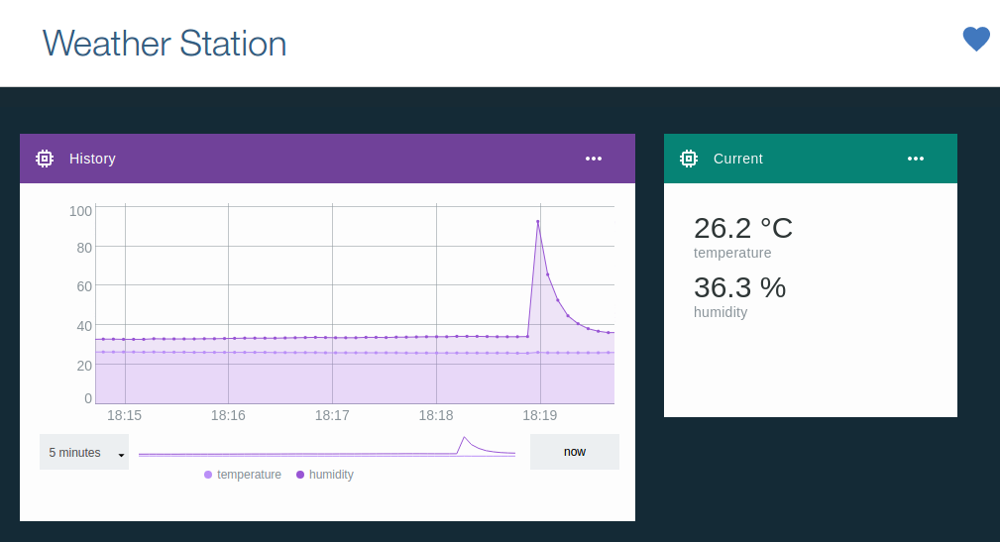
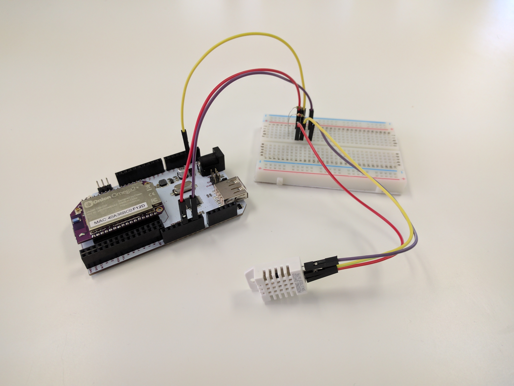
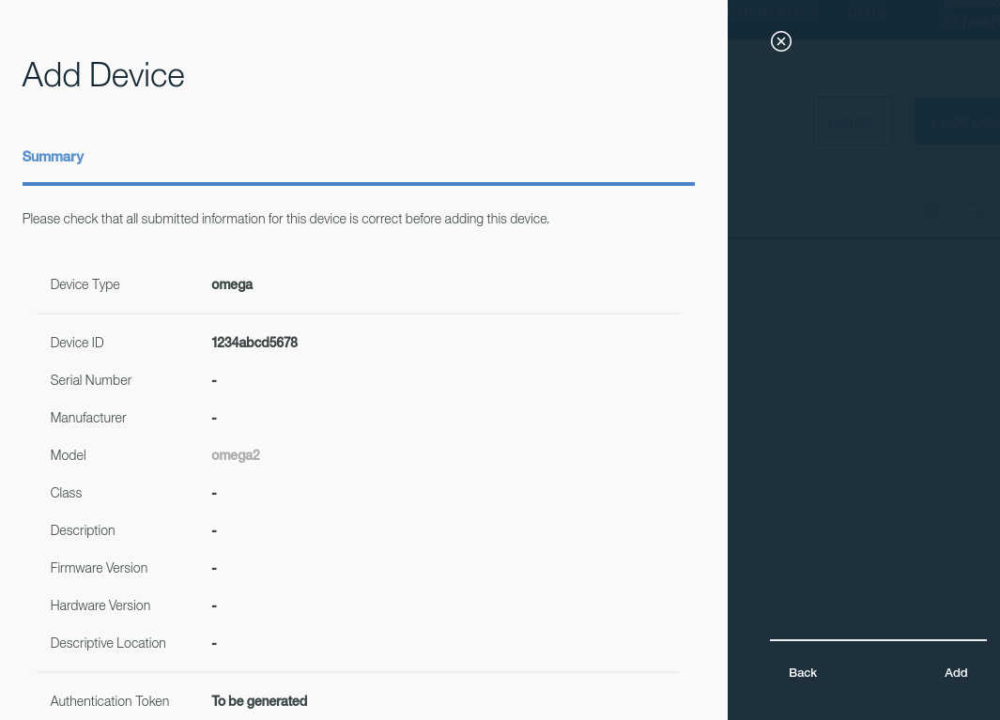
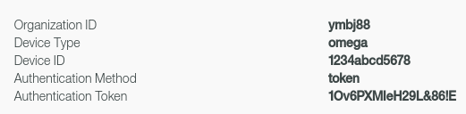

## Weather Station {#weather-station}

This project will allow you to send weather data to IBM's Watson IoT cloud platform, where you can view it on the web!

// TODO: needs to mention what specific weather data is being collected and how we're collecting it

// TODO: link to Watson IoT



// TODO: let's collect data for several hours and display that

### Overview

**Skill Level:** Intermediate

**Time Required:** 40 minutes

We'll be using the [Python pySerial module](https://pythonhosted.org/pyserial/) to periodically send commands to the Arduino Dock, which will then read the temperature and humidity from a sensor. The Omega will then read that data back and send it to IBM Watson, where you can visualize the data in real time! We will then automate the project to run automatically when the Omega is turned on.

The device code can be found in Onion's [`iot-weather-station` repo on GitHub](https://github.com/OnionIoT/iot-weather-station), while the Arduino Dock sketch can be found in the Examples of the [Onion Arduino Library](https://github.com/OnionIoT/Onion-Arduino-Library).


### Ingredients

* Onion Omega2+
    * or Omega2 standard booting from a USB storage device with at least 16 MB of free memory; see [Booting From External Storage](https://docs.onion.io/omega2-docs/boot-from-external-storage.html)
    * For convenience, this tutorial will assume you are using an Omega2+.
* Arduino Dock R2
* Breadboard
* DHT22 temperature + humidity sensor
* 10kΩ resistor
* M-M jumper wires
* (Optional) M-F jumper wires

### Step-by-Step

Follow these instructions to setup the Weather Station project on your very own Omega!


#### 1. Prepare

You'll have to have an Omega2+ ready to go, complete the [First Time Setup Guide](https://docs.onion.io/omega2-docs/first-time-setup.html) to connect your Omega to WiFi and update to the latest firmware.

**Note 1:** The Arduino Dock does not have a USB to serial converter chip, so [all connections to the Omega must be done over SSH](https://docs.onion.io/omega2-docs/connecting-to-the-omega-terminal.html#connecting-to-the-omega-terminal-ssh).

**Note 2:** The Omega's firmware along with this project and its dependencies will require approximately 18 MB of storage space. If you wish to install apps on the Console such as the Editor, we recommend [booting the filesystem from an external SD card or USB drive](https://docs.onion.io/omega2-docs/boot-from-external-storage.html).

After completing the first time setup, follow the steps in the [Arduino Dock guide](https://docs.onion.io/omega2-docs/flash-arduino-dock-wirelessly.html) to prepare it for flashing Arduino sketches.

#### 2. Wire Up the Sensor

We will treat the side of the DHT sensor with the holes as the **front**.

1. Insert the DHT sensor into the breadboard with the front facing the middle gap.
    * The pins will be numbered 1-4 from left to right.
1. Connect Vdd (pin 1) to the Arduino Dock's 5V pin.
1. Connect DATA (pin 2) to the Arduino Dock's digital pin 2.
1. Connect GND (pin 4) to one of the Arduino's GND pins.
    * This is not a typo. Pin 3 is unused on this DHT sensor!
1. Connect the 10kΩ resistor across Vdd and DATA.

Your setup should look something like this:


In the above setup, two 5.1kΩ resistors were used in series to achieve the 10kΩ pullup.

**Optional** - Remove the DHT sensor from the breadboard, and use the M-F jumper wires to connect the pins back to the breadboard. This is so you can easily move the sensor around!



#### 3. Download the Software on the Omega

The code for this project can be found in Onion's [iot-weather-station repo](https://github.com/OnionIoT/iot-weather-station) on GitHub. Follow the [instructions on installing Git](https://docs.onion.io/omega2-docs/installing-and-using-git.html), navigate to the `/root` directory, and clone the GitHub repo:

```
git clone https://github.com/OnionIoT/iot-weather-station.git
```

Now enter the repo directory and run `install.sh` to install the required packages and dependencies:

```
cd iot-weather-station
sh install.sh
```

// TODO: include a '>' section that explains what the install.sh script actually does
// TODO: perhaps give an explanation that this will take some time (give a range) and that they should launch the script and go make a lemonade or something


// TODO: split this next part into its own step

Then get the Omega's MAC address for use with Watson by running the `watsonHelper.py` script:

```
python watsonHelper.py
```

You will see output that looks something like this:

```
root@Omega-F12D:~/iot-weather-station# python watsonHelper.py
====================
Device ID:
(MAC address here)
====================
Loaded Device ID into device.cfg.
Enter this Device ID on the IBM Bluemix website when registering this device on the Watson IoT platform.
Don't forget to add your Organization ID, Device Type, and Authorization Token to the device.cfg file!
```

// TODO: for this type of instruction, it's probably easiest if you screenshot your Omega terminal output and draw a circle around the mac address

Copy or write down the MAC address underneath "Device ID" for later.

#### 4. Flash the Arduino Code

On your computer using the Arduino IDE, install the `Adafruit Unified Sensor` and `DHT sensor library` libraries from the Library Manager by following [this guide](https://www.arduino.cc/en/Guide/Libraries) guide on the Arduino website.

// TODO: let's make the Onion Arduino Library an official arduino library that can be installed like the libraries above. Then we can include screenshot based guides on how to install all 3 libraries using the arduino ide (let's hold on to this till the very end, ie do everything else for the project book and then come back to this)

Then install the Onion Arduino Library by doing the following:

1. In your web browser, download the [Onion Arduino Library ZIP file](https://github.com/OnionIoT/Onion-Arduino-Library/raw/master/Onion-Arduino-Library.zip).
1. Install the ZIP library by following the instructions in the [Arduino Library Installation guide](https://www.arduino.cc/en/Guide/Libraries#toc4).
1. Restart your Arduino IDE to reload the library.

Flash the weather station sketch to the Arduino Dock by doing the following:

1. Click on `File > Examples > Onion > weatherStation` to open the weather station sketch.
1. Flash it to the Arduino Dock by following the instructions in the [Arduino Dock guide](https://docs.onion.io/omega2-docs/flash-arduino-dock-wirelessly.html).

// TODO: see smart-plant-p1, let's try to replicate as much of that flashing the arduino sketch section as we can

#### 5. Setup the Omega on the IBM Watson IoT Platform

We will be using [IBM's guide on registering devices in Watson](https://developer.ibm.com/recipes/tutorials/how-to-register-devices-in-ibm-iot-foundation/) as a reference for this section. Open the link in your web browser and refer to the additional information that we have provided for each step below.

If you're having difficulties in this section, follow these two developer recipes to become familiar with the Watson web interface:

* [Connect an Onion Omega2 to IBM Watson IoT Platform](https://developer.ibm.com/recipes/tutorials/connect-an-onion-omega2-to-ibm-watson-iot-platform/)
* [How to Register Devices in IBM Watson IoT Platform](https://developer.ibm.com/recipes/tutorials/how-to-register-devices-in-ibm-iot-foundation/)

##### Step 1 - Introduction

* You can register for an [IBM Bluemix account here](https://console.ng.bluemix.net/registration/).

##### Step 2 - Create IBM Watson IoT Platform Organization

* You can call the service "Onion IoT", "Watson IoT", or whatever you like.

##### Step 3 - Create Device Type

* Call the device type `omega`.
    * The description can be something like "Onion Omega IoT board".

* In the "Define Template" substep on the Watson website, check off only the "Model" attribute.

* In "Submit Information", enter `omega2` for the Model.
    * New devices by default will have this value for their Model attribute unless you specify something else.
* You can leave Metadata blank.

##### Step 4 - Add Device in IBM Watson IoT Platform

* When adding a device, choose the `omega` device type we just created.
* In the "Device Info" substep, enter the Device ID that we got from the `watsonHelper.py` helper script a few steps back.
* You can leave the Model field blank and it will automatically fill it in with `omega2`.
* You can leave the "Metadata" field blank.
* In "Security", we recommend letting Watson automatically generate an authentication token for you. Click on "Next" without entering anything.
* In the "Summary" substep, review that your information is correct, then click "Add".



// TODO: for the above photo, take a new screenshot that shows the same mac address shown in the step above

You should see a card containing your Organization ID, Device ID, and more. Don't close this card until you've recorded the token somewhere, because there's no way to view the authentication token for this device again! Take a look at the sample card below:



On the Omega, open the `device.cfg` file for editing and replace the placeholders in ALLCAPS with the information in the fields above like so:

| Watson Website       | device.cfg   |
|----------------------|--------------|
| Organization ID      | YOURORG      |
| Device ID            | YOURDEVICEID |
| Authentication Token | YOURTOKEN    |

// TODO: include a screenshot of the device.cfg on your Omega

##### Remaining steps

"Step 5 - Generate API Keys" and onwards are not necessary for this project.

#### 6. Set Up Visualization Boards and Cards on Watson

Follow the steps in [IBM's guide to configuring cards in Watson](https://developer.ibm.com/recipes/tutorials/configuring-the-cards-in-the-new-watson-iot-dashboard/) with the additional information we have provided below:

// TODO: include a screenshot of the blank board

// TODO: find a way to very explicitly communicate that this corresponds to step two in the guide above
##### Step 2 - Overview to Boards & Cards

* You can make your own board to show the collected data from the sensor. In this example, we've called it `Weather Station`.

##### Step 3 - Realtime Data Visualization

* First create a line chart card according to the guide.
* When connecting data sets, set `weather` as the Event.
* Create a data set for temperature following the example below:


* Repeat for humidity by replacing all instances of `temperature` with `humidity`.
* We recommend using an XL line chart size to be able to see enough data over time.
* Set the title to "History"

You can also add a Value card to clearly display the most recent measurement values.

* When adding the card, click on "Value" as the type.
* Use a M size chart to display both temperature and humidity at the same time.
* You can set the title of this card to "Current"


Now you've got visualization set up on Watson!

#### 7. Running the Weather Station Project

On the Omega, navigate to the `iot-weather-station` directory and run the `main.py` file:

```
python main.py
```

You should see messages being published from the command line, and new data points in your Watson dashboard! Try placing the sensor near sources of cold or hot air, or try breathing over it to change the relative humidity and see what happens on the dashboard.


#### 8. Run the Program on Boot

We can automate this project to run when the Omega is turned on, and we can also make it run in the background so you can use the Omega for other things while it's running! To do this, we'll place a script in  `/etc/init.d`.

In the repo folder, make the `weather-station` file executable, copy it to `/etc/init.d`, then enable it to run on boot:

```
chmod +x weather-station
cp weather-station /etc/init.d
/etc/init.d/weather-station enable
```

// TODO: in the repo, move the weather-station script into a directory called init.d, so that it's super explicit what it's for

Reboot the Omega, and you will see the dashboard automatically being populated with data while the command line is available for you to use!

// TODO: add a '>' section that the script we placed in `/etc/init.d` registers our weather station python script with procd, the process management daemon of the system (note: this should be a separate section since we're likely to reuse it in other projects)

### Code Highlight

This project makes use of two main interfaces: the Arduino Dock and the IBM Watson IoT platform.

The Arduino Dock sketch is set to read data from the DHT sensor only when an `r` character is sent over the serial bus.

```c++
if (Serial.available() > 0) {
  // read the input
  int inByte = Serial.read();
  delay(500); // small delay before responding

  // respond only if correct command is received
  if ((char)inByte == 'r') {
    responder();
    delay(delayMS);
  }
}
```

It then sends a response in JSON.

```c++
void responder() {
  // read the weather sensor
  if (getWeather()) {
    String temperature = String(sensorResponse.temperature);
    String humidity = String(sensorResponse.humidity);

    // encode output to JSON
    String response = "{\"temperature\":" + temperature + ", \"humidity\":" + humidity + "}";
    Serial.println(response);
  }
  else {
    // send false
    Serial.println("false");
  }
}
```

JSON was chosen as it is a widely used data serialization format, and JSON parsers exist in most programming languages. You can use this example to create your own Arduino Dock apps that can collect data and send it back to the Omega, which can then run any programming language you like!

The IBM Watson IoT Python library is also useful for sending data to Watson from the Omega. You can reuse the `device.cfg` and `watsonHelper.py` files in your next IoT projects!
