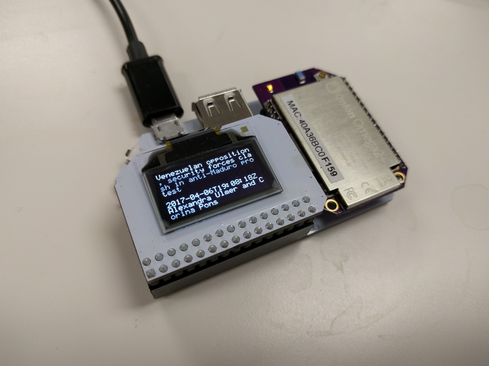
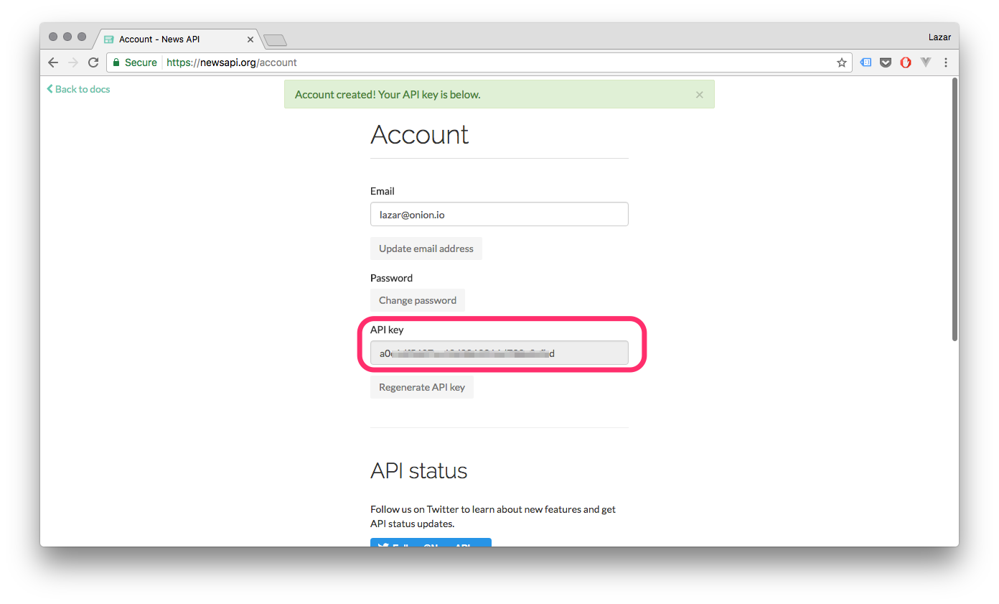
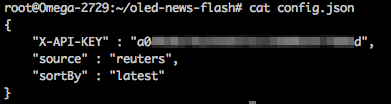
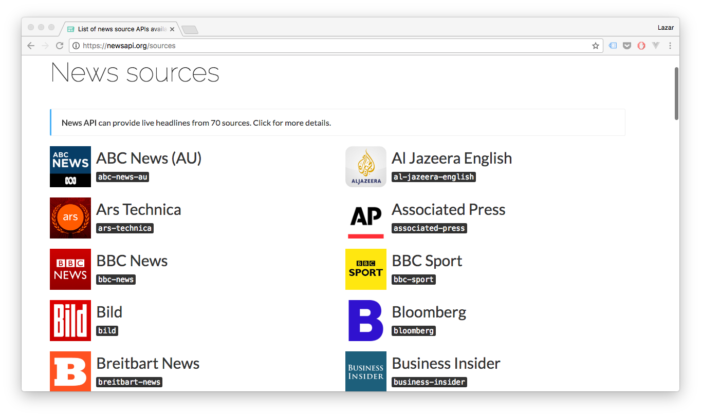
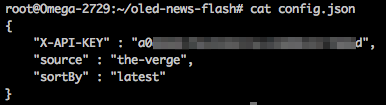

## News Flash Headlines {#news-headlines}

This project will pull a fresh headline from News API and display it to the OLED screen. [News API](https://newsapi.org/) is a news aggregator that returns headlines from a variety of news sources as JSON data.




### Overview

**Skill Level:** Beginner

**Time Required:** 20 minutes

The project will use a Python script to call the News API `/articles` endpoint for headline data.

The complete project code can be found in Onion's [`oled-news-flash` repo on GitHub](https://github.com/OnionIoT/oled-news-flash).


### Ingredients

* Onion [Omega2](https://onion.io/store/omega2/) or [Omega2+](https://onion.io/store/omega2p/)
* Any Onion Dock that supports Expansions: [Expansion Dock](https://onion.io/store/expansion-dock/), [Power Dock](https://onion.io/store/power-dock/), [Arduino Dock 2](https://onion.io/store/arduino-dock-r2/)
* Onion [OLED Expansion](https://onion.io/store/oled-expansion/)


### Step-by-Step

Here's how to get your own headlines screen running on your Omega!

#### 1. Prepare your Ingredients

You'll have to have an Omega2 ready to go, complete the [First Time Setup Guide](https://docs.onion.io/omega2-docs/first-time-setup.html) to connect your Omega to WiFi and update to the latest firmware.

Once that's done, plug in your OLED Expansion:


#### 2. Install Python

[Connect to the Omega's command line](https://docs.onion.io/omega2-docs/connecting-to-the-omega-terminal.html) and install Python and some additional packages we need:

```
opkg update
opkg install python-light python-urllib3 pyOledExp
```

The `python-urllib3` package will allow us to make HTTP requests in Python, while the `pyOledExp` package gives us control of the OLED Expansion.


#### 3. Download the Project Code

All the code from the project can be found in the [`oled-news-flash` repo on GitHub](https://github.com/OnionIoT/oled-news-flash).

This project only has two files, so you can download it directly to your Omega without much hassle.

```
mkdir /root/oled-news-flash
cd /root/oled-news-flash
wget https://raw.githubusercontent.com/OnionIoT/oled-news-flash/master/oledNewsFlash.py
wget https://raw.githubusercontent.com/OnionIoT/oled-news-flash/master/config.json
```

>If you'd like to use git **instead**, [install Git on your Omega](https://docs.onion.io/omega2-docs/installing-and-using-git.html), navigate to the `/root` directory, and clone the GitHub repo:
>
>```
>cd /root
>git clone https://github.com/OnionIoT/oled-news-flash.git
>```

#### 4. Obtain a News API Key

We need an API key in order to access the News API endpoints. The simplest way is to create an account which will give us access to the News API key generator.

1. Register at https://newsapi.org/register and copy your API Key:

	

1. Open up `config.json` and paste the API key generated as the `X-API-KEY` value - replacing `your api key here`:

	


#### 5. Choose Your Source

News API gets headlines from 70 different news sources. We've set the default source to Reuters, but you can change easily change the source of your headlines. Head over to [News API's sources page](https://newsapi.org/sources) and pick your source:



Open up `config.json` and copy the text under any source you wish as the value for `source` - replacing `reuters`.




#### 6. Run it!

On your Omega's command line, run the following:

```
python oledNewsFlash.py
```

And you should see the latest news headline on your OLED screen.


#### 7. And Beyond

Now we can automate this script with `cron` to keep the headlines updated on the OLED screen.

Enter `crontab -e` to add a task to the `cron` daemon, it will open a file in vi, enter in the following:

```
*/15 * * * * python /root/oled-news-flash/oledNewsFlash.py
#
```

> This assumes that your project code is located in `/root/oled-news-flash/` - if it's not, don't forget to change the directory!


Now, we'll restart `cron` to update it with our new task:

```
/etc/init.d/cron restart
```

And **the code will run once every 15 minutes**, updating the OLED screen with the latest headline.

> Check out the Omega documentation for more info on [using `cron`](https://docs.onion.io/omega2-docs/running-a-command-on-a-schedule.html)


### Code Highlight

Many web sites and services provide Application Programming Interfaces (API) to allow others to call on the data they provide without a whole webpage to bog it down.

Calling an API is all about knowing what the API needs, and how to deliver that data.

To contact any API, we need to know at least two major things:

1. URL - the address we need to look up
2. Method - what method the URL accepts, and what do they do

#### Endpoints

For this project, our URL is `https://newsapi.org/v1/articles`. The URL has two bits to it, first is the the actual API's location - `newsapi.org/v1/`. The second is the **endpoint**, kind of like a specific apartment number of the address. Here it's `/articles`.

Together, they're often referred as an **endpoint** of the API.

>News API has a `/sources` endpoint as well which provide different services when called.

#### Methods

Now that we have our endpoint, we need know how to request data from it.

When sending a request, it must be made with a request **method** to let the server know what we need at a broad level from the endpoint.

HTTP supports at least nine different request methods to accommodate different needs. The most common ones are 'GET', 'POST', and 'DELETE'.

Logically, to get data from the `/articles` endpoint, we need to send it a 'GET' request.

#### Parameters, Headers and Bodies

Often, APIs provide personalized data - calendars, emails, and other user-specific data. To implement this kind of interaction, requests are sent with **parameters**, **headers** and possibly a **body** for 'POST' requests.

Parameters are strings that get appended to the request URL with details about our request. This is the most basic way of communicating additional information to the server.

>In this case, the `source` and `sortBy` values are sent to the server through URL parameters. Meaning, the request from the news flash code is to the following URL: `https://newsapi.org/v1/articles?source=reuters&sortBy=latest`

The API key is a way to identify and authenticate a user of the service, allowing APIs to pull up user-specific data. For an API serving general information like News API, an API key is mostly useful in identifying the user's level of access.

Generally, the API key is passed through the HTTP request's header - a list of key-value pairs that is sent with our request. What goes in the header depends on the particular API being used. [The documentation](https://newsapi.org/#documentation) should always specify what kind of things should be put in the header to correctly get information.

>In the news flash code, the headers only contain the `{'X-API-KEY':<API KEY>}` pair.

The body is typically a JSON list of key-value pairs used to store content for 'POST' requests. Again, the specifics of the body depends on what the API needs.
