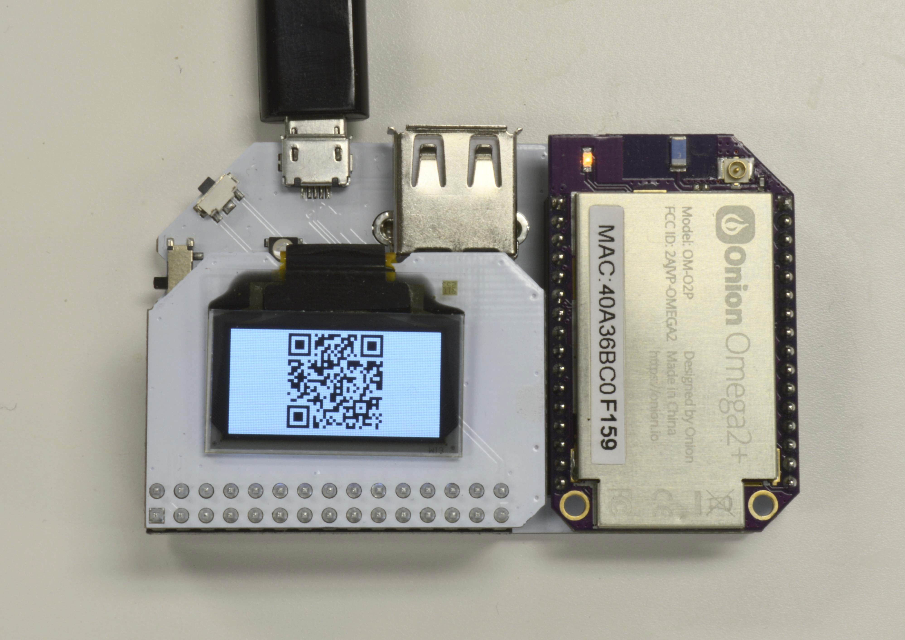

## QR Code Generator {#qr-code-generator}

QR Codes are essentially two dimensional barcodes that can easily be scanned with any camera and a little bit of processing power. The average smartphone will make short work of any QR code it comes across.


In this tutorial, we'll go through how you can use Python to encode text into a QR Code and display it on your OLED Expansion:




### Overview

**Skill Level:** Beginner

**Time Required:** 10 minutes


### Ingredients

1. Onion Omega2 or Omega2+
1. Any Onion Dock that supports Expansions: Expansion Dock, Power Dock, Arduino Dock 2
1. Onion OLED Expansion


### Step-by-Step

Ok, here we go! First we'll install some required packages to make everything run smoothly, and then we'll grab the code for this tutorial from GitHub.

All of the code can be found on this GitHub Repo: https://github.com/OnionIoT/oledQrCodeGenerator


#### 1. Installing Required Packages

We will need to have support for git, Python, and the [Onion OLED Expansion Python Module](https://wiki.onion.io/Documentation/Libraries/OLED-Expansion-Library):

```
opkg update
opkg install git git-http python-light python-codecs pyOledExp
```


#### 2. Downloading the Code

Now we need to download the Python code that actually does all the work:
```
cd /root
git clone https://github.com/OnionIoT/oledQrCodeGenerator.git
```


#### 3. Running the Code

Finally, we get to make some QR codes!
Navigate into the repo directory:
```
cd oledQrCodeGenerator
```

And run the program, the argument to the script is the text that will be encoded in the QR code pattern:
```
root@Omega-18C2:~/oledQrCodeGenerator# python main.py 'Wow, my first QR Code'
> Encoding 21 characters
> Generated QR Code: 31x31 pixels
> Doubled QR Code size: 62x62
> Initializing display
> Setting display mode to inverted
> Writing buffer data to display
```

This will encode the data and display the resulting QR code on the OLED Expansion:


##### Program Details

Behind the scenes, the Python code does the following:

* Encodes the input text into a matrix representing the QR Code
  * The size of the QR code is based on the amount of input text
* Converts the QR code matrix into data that can be displayed on the OLED
* Displays the resulting image on the OLED display
  * Performs display initialization
  * Inverts the display colours
  * Displays the generated image file

An additional feature was added for easier scanning: if the QR code is small (less than half the height of the OLED display), the image will be doubled in size so that each QR code pixel shows up as four pixels on the OLED display.

The default generated QR code will be a Version 3 code with the Low error correction setting and a one-pixel border, creating a code that is 31x31 pixels. If the amount of text to be encoded cannot fit in a Version 3 code, the program will select the next version that will fit the amount of data to be encoded.


#### 4. Using the code as a Python Module (Optional)

The `oledQrCodeGenerator` code can also be imported as a module into your own Python projects!

The `dispQrCode()` function will perform the same actions described above.


**Example Code**

A small example showing how to use this module:
``` python
import oledQrCodeGenerator

print 'Now using the oledQrCodeGenerator'
oledQrCodeGenerator.dispQrCode('Hello!')

print 'All done!'
```

Note that your Python script will have to be in the same directory as `oledQrCodeGenerator` in order for it to work properly.


### Reading QR Codes

It's no fun to just display QR codes and not be able to read them, right?

Don't worry, your smartphone is perfectly capable of reading the code from the OLED:
* On Android, we've used the [QR Code Reader](https://play.google.com/store/apps/details?id=tw.mobileapp.qrcode.banner) and [QR Barcode Scanner](https://play.google.com/store/apps/details?id=appinventor.ai_progetto2003.SCAN&hl=en) apps successfully
* On iOS, we've had success with the [QR Reader App](https://itunes.apple.com/us/app/qr-code-reader-and-scanner/id388175979?mt=8)

For QR codes that encode a lot of text, your phone might take a little while longer to scan the code. Trial and error works best in this scenario: try moving your phone to different distances and angles from the OLED.

Happy hacking!


### Acknowledgements

The code in the `qrcode` directory is a stripped-down version of lincolnloop's `python-qrcode` repo:
https://github.com/lincolnloop/python-qrcode

The rest of the code is home grown by the Onion team :)
