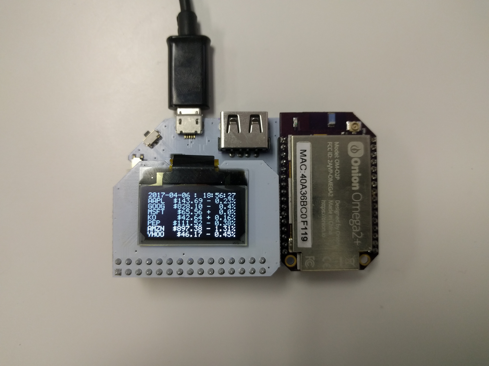
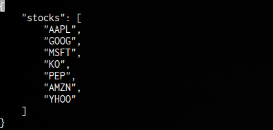

## Stock Ticker {#stock-ticker}

For this project, we'll be obtaining the latest stock data from an online API for a configuratble list of stocks and displaying the data:




**Disclaimer: It's important to note that most stock data APIs provide data that is delayed and does not represent the latest information. Use this project for informational purposes only, it is not meant to offer any investment advice. Onion is not responsible for any investment decisions or their outcomes, please invest responsibly.**


### Overview

**Skill Level:** Beginner

**Time Required:** 10 minutes

This code will be written in Python and we'll be making use of a [Google Finance](https://www.google.com/finance) API to grab stock data. It will print the following data to the OLED:

1. Date and time (UTC)
1. Stock symbol (up to 4 characters)
1. Current trading price (USD)
1. Percentage change since last closing

Specifically, the code uses the `info` endpoint; this is technically [deprecated](https://groups.google.com/forum/#!topic/google-finance-apis/q-DbjbzQDGQ), but still seems to remain active and returns up-to-date finance data.

We also use the [Onion's `pyOledExp` module](https://docs.onion.io/omega2-docs/oled-expansion-python-module.html) to provide control of the OLED Expansion.

The complete project code can be found in Onion's [`oled-stock-ticker` repo on GitHub](https://github.com/OnionIoT/oled-stock-ticker).

### Ingredients

* Onion [Omega2](https://onion.io/store/omega2/) or [Omega2+](https://onion.io/store/omega2p/)

* Any Onion Dock that supports Expansions: [Expansion Dock](https://onion.io/store/expansion-dock/), [Power Dock](https://onion.io/store/power-dock/), [Arduino Dock 2](https://onion.io/store/arduino-dock-r2/)
* Onion [OLED Expansion](https://onion.io/store/oled-expansion/)

### Step-by-Step

Follow these instructions to set this project up on your very own Omega!


#### 1. Prepare

You'll have to have an Omega2 ready to go, complete the [First Time Setup Guide](https://docs.onion.io/omega2-docs/first-time-setup.html) to connect your Omega to WiFi and update to the latest firmware.

Once that's done, plug in your OLED Expansion:


#### 2. Install Python and Git

[Connect to the Omega's command line](https://docs.onion.io/omega2-docs/connecting-to-the-omega-terminal.html) and install Python as well as some of the packages we need:

```
opkg update
opkg install python-light python-urllib3 pyOledExp git git-http ca-bundle
```

The `python-urllib3` package will allow us to make HTTP requests in Python, while the `pyOledExp` package gives us control of the OLED Expansion.

The `git`, `git-http`, and `ca-bundle` packages will allow us to download the project code form GitHub.

#### 3. Download the Project Code

The code for this project is all done and can be found in Onion's [oled-stock-ticker repo](https://github.com/OnionIoT/oled-stock-ticker) on GitHub. We'll use [`git` to download the code to your Omega](https://docs.onion.io/omega2-docs/installing-and-using-git.html): navigate to the `/root` directory, and clone the GitHub repo:

```
cd /root
git clone https://github.com/OnionIoT/oled-stock-ticker.git
```

#### 4. Setup the Ticker

The `config.json` file holds all of the settings for the project. Populate the `stocks` array with the symbols of the stocks you wish to track.



Some notes about the stock symbols:

* The OLED has 8 rows and the 1st will be used for the date and time, so only the first seven will be shown.
* Due to space constraints on the OLED, the stock ticker can properly display only stocks with 4 letters or less.
* The code assumes the stocks are traded in USD.


#### 4. Run the Code

Now run the code: `python main.py`


If you're interested in how the `pyOledExp` code can be used to control the OLED Expansion, take a look at how it's used in [the `oledDriver.py` file in the project code](https://github.com/OnionIoT/oled-stock-ticker/blob/master/oledDriver.py) and also check out the [`pyOledExp` Module documentation](https://docs.onion.io/omega2-docs/oled-expansion-python-module.html).

#### 6. Automate the Program to Run Periodically

The program will grab and display the latest stock info, then promptly exit. We'll use `cron`, a super useful Linux utility, to have the program run periodically.

Enter `crontab -e` to add a task to the `cron` daemon, it will open a file in vi, enter in the following:

```
* * * * * python /root/oled-stock-ticker/main.py
#
```

> This assumes that your project code is located in `/root/oled-stock-ticker`

Now, we'll restart `cron`:

```
/etc/init.d/cron restart
```

And the code will run once every minute, generating *literally* up-to-the-minute stock information on your OLED!

**Again, remember that the stock information is likely delated data and shouldn't be used to inform investment decisions!**

> Check out the Omega documentation for more info on [using `cron`](https://docs.onion.io/omega2-docs/running-a-command-on-a-schedule.html)


### Code Highlight

This code does the following:

1. Load the list of stocks from the configuration file
1. Creates a timestamp of when this script was called
1. Sends a `GET` request with the given stocks to the Google Finance API
1. Cleans up and stores the response into a variable
1. Formats relevant information such as symbol and price for displaying on the OLED
1. Prints the timestamp and stock information to the OLED

### Going Further

You can customize the formatting or which information you want to display on the OLED by changing the `formatGoogleStockInfo()` function in `stocks.py`.

To see all of the available information, query the API for a single stock by running `stocks.py` and the symbol as the first argument:

```
python stocks.py BB

[
    {
        "c": "+0.01",
        "ccol": "chg",
        "e": "TSE",
        "ltt": "4:00PM EDT",
        "cp_fix": "0.09",
        "c_fix": "0.01",
        "l": "10.64",
        "s": "0",
        "lt": "Apr 6, 4:00PM EDT",
        "pcls_fix": "10.63",
        "t": "BB",
        "lt_dts": "2017-04-06T16:00:00Z",
        "l_fix": "10.64",
        "cp": "0.09",
        "id": "674819",
        "l_cur": "CA$10.64"
    }
]
```

Add any information that's relevant to you to the data that's displayed on the OLED screen. Keep in mind that the screen can display 21 characters per line, any additional characters will be automatically relegated to the next line.
