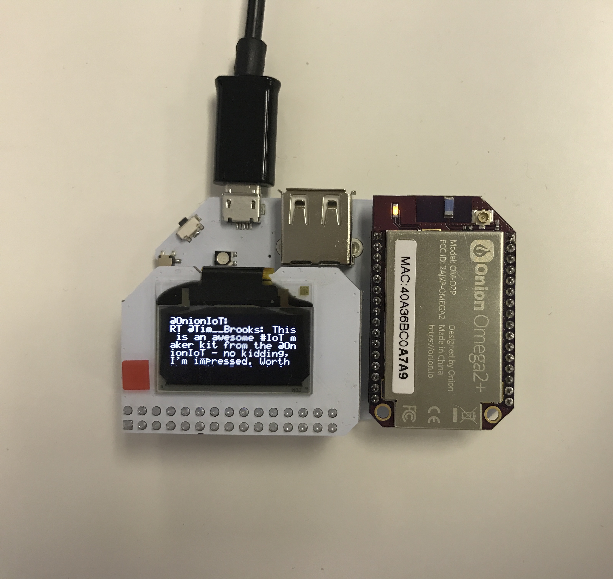
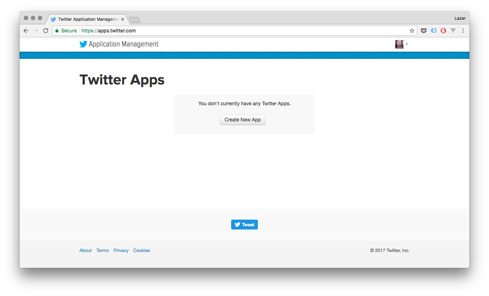
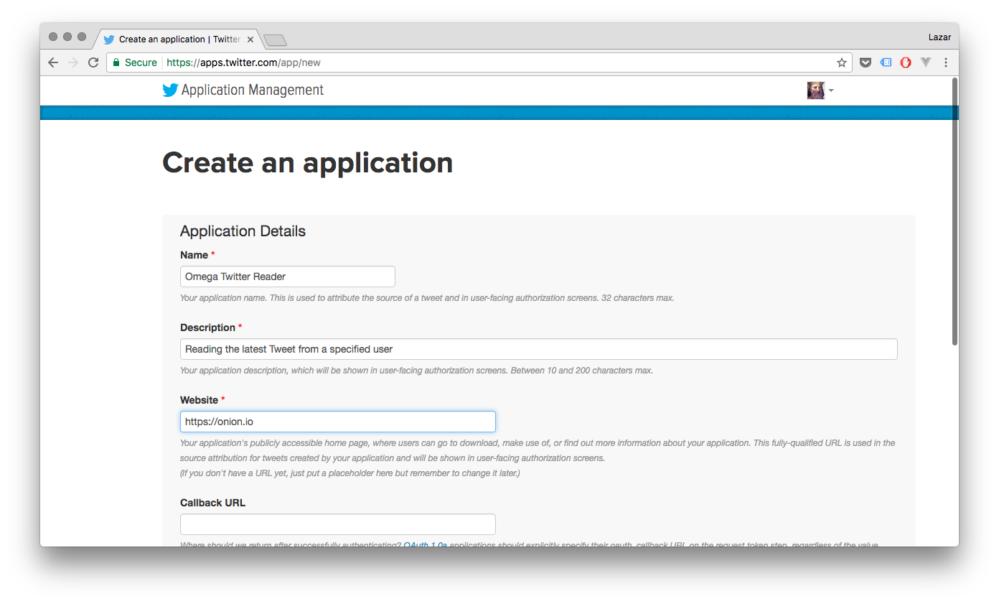
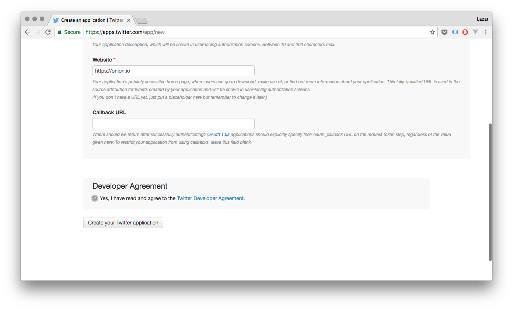
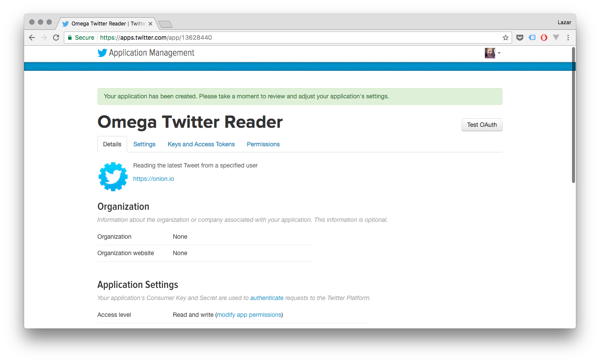
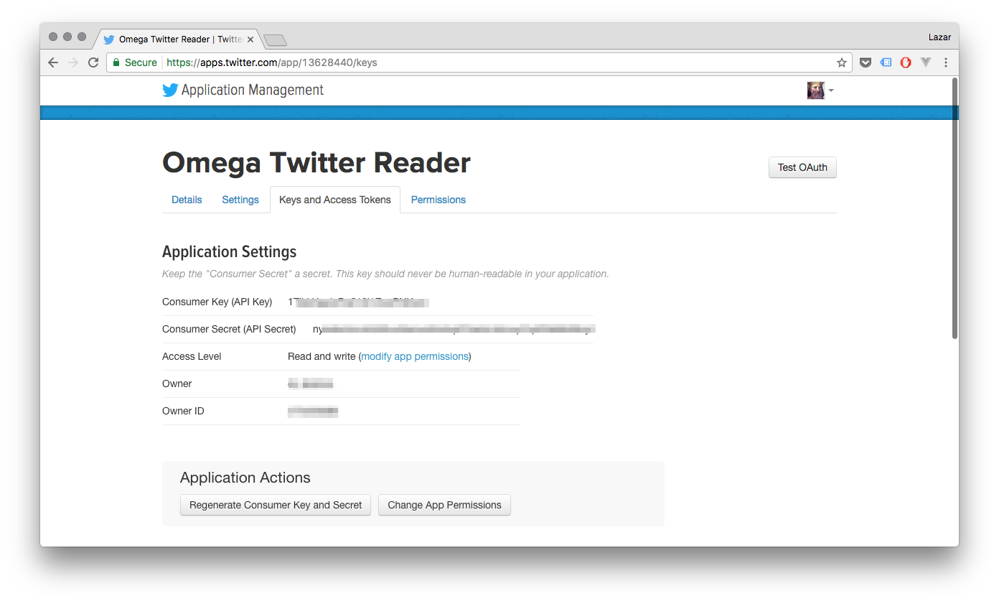
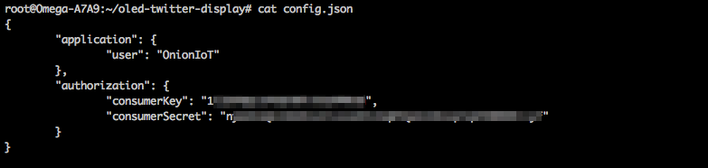

## Displaying the Latest Tweet

For this project, we'll be displaying the latest Tweet of a specified Twitter user on the OLED Expansion:




### Overview

**Skill Level:** Intermediate

**Time Required:** 30 minutes

The code will be written in Python and we'll be making use of [Twitter's REST APIs](https://dev.twitter.com/rest/public) to grab Tweet data. Specifically, the code uses the [`statuses/user_timeline` endpoint](https://dev.twitter.com/rest/reference/get/statuses/user_timeline). Also in use is [Onion's `pyOledExp` module](https://docs.onion.io/omega2-docs/oled-expansion-python-module.html) to provide control of the OLED Expansion.

The complete project code can be found in Onion's [`oled-twitter-display` repo on GitHub](https://github.com/OnionIoT/oled-twitter-display).

### Ingredients

1. Onion Omega2 or Omega2+
1. Any Onion Dock that supports Expansions: Expansion Dock, Power Dock, Arduino Dock 2
1. Onion OLED Expansion


### Step-by-Step

Follow these instructions to set this project up on your very own Omega!

#### 1. Prepare

You'll have to have an Omega2 ready to go, complete the [First Time Setup Guide](https://docs.onion.io/omega2-docs/first-time-setup.html) to connect your Omega to WiFi and update to the latest firmware.

Once that's done, plug in your OLED Expansion:


#### 2. Install Python

Connect to the Omega's Command line and install Python as well as some of the packages we need:

```
opkg update
opkg install python-light python-urllib3 pyOledExp
```

The `python-urllib3` package will allow us to make HTTP requests in Python, while the `pyOledExp` package gives us control of the OLED Expansion.

#### 3. Download the Project Code

The code for this project is all done and can be found in Onion's [oled-twitter-display repo](https://github.com/OnionIoT/oled-twitter-display) on GitHub. Follow the [instructions on installing Git](https://docs.onion.io/omega2-docs/installing-and-using-git.html), navigate to the `/root` directory on the Omega, and clone the GitHub repo:

```
cd /root
git clone https://github.com/OnionIoT/oled-twitter-display.git
```

> If you're in a hurry, we can download the code directly and avoid installing git.<br> Go to your `/root` directory and run:<br>
> `wget https://raw.githubusercontent.com/OnionIoT/oled-twitter-display/master/oledTwitterDisplay.py`<br>
> `wget https://raw.githubusercontent.com/OnionIoT/oled-twitter-display/master/config.json`<br><br>
> We can do this direct download since this GitHub repo is public.

#### 4. Create a Twitter Application

We'll need to create a Twitter Application in order to be able to use Twitter's APIs to grab Tweets. Specifically, our code needs an API Key and API Secret in order to authenticate with Twitter before we can use the APIs:

1. Head over to https://apps.twitter.com and sign in with your Twitter handle

  

1. Fill in the form details for your application. It doesn't really matter what you type in, but a solid name and description goes a long way when you come back to a project after months away from it.

  

1. Read and agree to the Twitter Developer Agreement and hit Create your Twitter application.

  

  > Note that your Twitter account must have an associated mobile phone number before Twitter will allow you to create an application!

1. Your Application is now created!

  

1. Head over to the **Keys and Access Tokens** tab to grab the info we need

  


#### 5. Setup and Run the Code

The `config.json` file holds all of the settings for the project. Populate the `authorization` object with the Consumer Key and Consumer Secret from the Twitter app.


And then populate `application.user` with the Twitter handle whose latest tweet you want to be shown on the OLED Expansion



Now run the code: `python oledTwitterDisplay.py`


If you're interested in how the `pyOledExp` code can be used to control the OLED Expansion, take a look at how it's used in [the project code](https://github.com/OnionIoT/oled-twitter-display/blob/master/oledTwitterDisplay.py) and also check out the [`pyOledExp` Module documentation](https://docs.onion.io/omega2-docs/oled-expansion-python-module.html).


#### 6. Automate the Program to Run Periodically

The program will grab and display the latest Tweet, and then promptly exit. We'll use `cron`, a super useful Linux utility, to have the program run periodically.

Enter `crontab -e` to add a task to the `cron` daemon, it will open a file in vi, enter in the following:

```
*/5 * * * * python /root/oled-twitter-display/oledTwitterDisplay.py
#
```

> This assumes that your project code is located in `/root/oled-twitter-display`

Now, we'll restart `cron`:

```
/etc/init.d/cron restart
```

And the code will run once every 5 minutes, updating the Tweet shown on your OLED.

> Check out the Omega documentation for more info on [using `cron`](https://docs.onion.io/omega2-docs/running-a-command-on-a-schedule.html)


### Code Highlight

All of Twitter's API endpoints require authentication, so that will be the first task of our program. Luckily, Twitter provides [Application-Only Authentication](https://dev.twitter.com/oauth/application-only), which is why we had to create our own Twitter Application in Step 4 above. Application-Only Authentication is great for a few reasons:

* Your program doesn't include your Twitter username and password
* It allows restricting access, so the application can view/modify only certain things
* The API Key and API Secret (also referred to as Consumer Key and Consumer Secret) can be regenerated if compromised

From a high-level, the `twitterApiAuthenticate()` function in the code does an HTTP POST request to `https://api.twitter.com/oauth2/token` with the header containing the base64 encoded Consumer Key and Secret for our application. If the provided Key and Secret are valid, the response will include a Bearer Token. The returned Bearer Token is set to a global variable, and is then used for authorization in the headers of every subsequent request to Twitter's API.

This is a very common authentication practise, see [Twitter's Authentication documentation](https://dev.twitter.com/oauth/application-only) for more details
