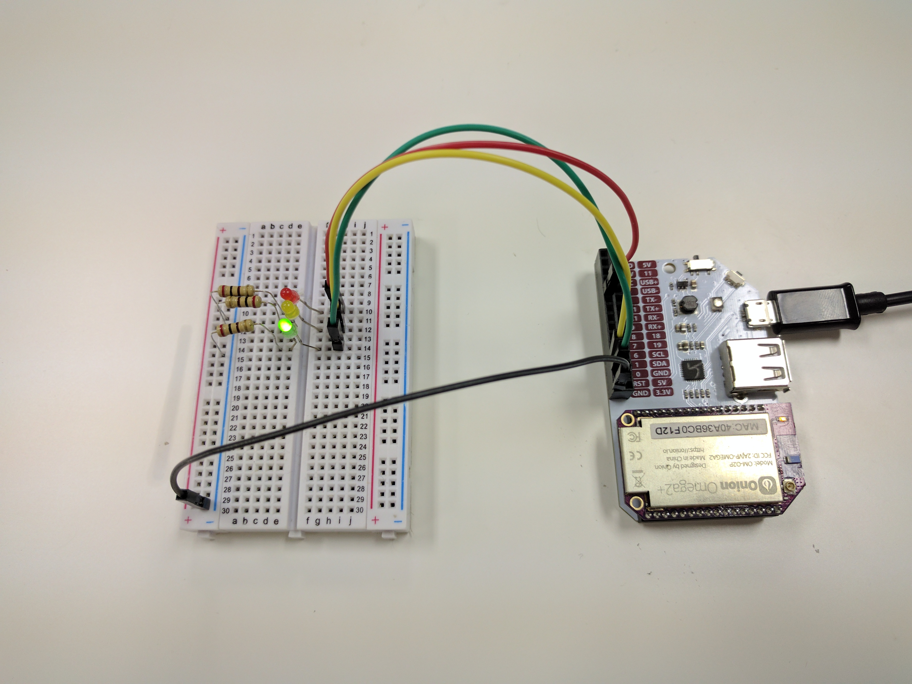
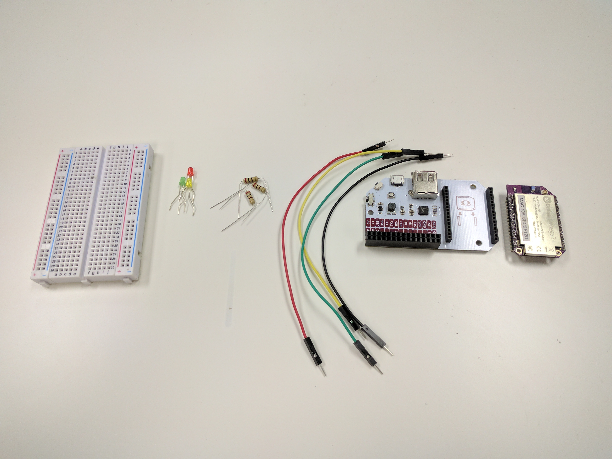
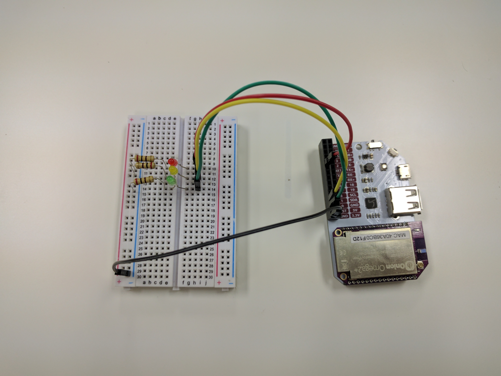

## LED Traffic Light {#led-traffic-light}

For this project, we will be building a working, miniature traffic light using a few LEDs and the Omega. We'll also introduce the basics of controlling the Omega's GPIOs with a Python program.



### Overview

**Skill Level:** Beginner

**Time Required:** 10 minutes

We'll be using the [Onion GPIO Python module](https://docs.onion.io/omega2-docs/gpio-python-module.html). This module is the bread and butter of any project where you will need to control and interface with other circuits!

The complete project code can be found in Onion's [`starter-traffic-light` repo on GitHub](https://github.com/OnionIoT/starter-traffic-light).


### Ingredients

* Onion Omega2 or Omega2+
* Any Onion Dock that exposes the Omega's GPIOs: Expansion Dock, Arduino Dock R2, Power Dock, Breadboard Dock
* 1x Breadboard
* 3x LEDs
    * 1x red
    * 1x yellow/amber
    * 1x green
* 4x Jumper Wires (M-M)
* 3x 200Ω Resisters



### Step-by-Step

Follow these instructions to set this project up on your very own Omega!

#### 1. Prepare the ingredients

You'll have to have an Omega2 ready to go, complete the [First Time Setup Guide](https://docs.onion.io/omega2-docs/first-time-setup.html) to connect your Omega to WiFi and update to the latest firmware.

This project will need the Omega's command-line, so we'll have to either SSH into the Omega's command-line, or connect serially.

To learn more on how to connect to the Omega's command-line you can read our comprehensive [guide to connecting to the Omega](#connecting-to-the-omega-terminal).

#### Wire Up the LEDs

1. Plug in the LEDs across the breadboard, with the cathode on the left side of the gap and the anode on the right.
    * Make sure red is above amber, and amber above green!
1. Connect one end of a 200Ω resistor to the cathode row, and the other end to the negative rail marked `-` on the left side of the board.
1. Connect the `-` rail to one of the GND pins on the Omega.
1. Connect the GPIOs to the LEDs in the following manner:
    * Red to GPIO2
    * Amber to GPIO1
    * Green to GPIO0



#### 1. Install Python

Install Python, the required Python module, and Git by running the following commands:

```
opkg update
opkg install python-light pyOnionGpio git git-http ca-bundle
```

#### 2. Download the Project Code

The code for this project can be found in Onion's [`starter-traffic-light` repo](https://github.com/OnionIoT/starter-traffic-light) on GitHub. Use [`git` to download the code to your Omega](https://docs.onion.io/omega2-docs/installing-and-using-git.html): navigate to the `/root` directory, and clone the GitHub repo:

```
cd /root
git clone https://github.com/OnionIoT/starter-traffic-light.git
```

>Since the project code is only a single file, you can download the code directly to avoid installing and using git:
>```
>mkdir /root/starter-traffic-light
>cd /root/starter-traffic-light
>wget https://raw.githubusercontent.com/OnionIoT/starter-traffic-light/master/main.py
>```

#### 3. Running the Project

Enter the project directory and run the `main.py` file:

```
cd starter-traffic-light
python main.py
```

You should see the lights changing color!


<!-- // TODO: PHOTO: add a photo of the red LED lit up -->

### Code Highlight

We use the Onion GPIO Python module to control the GPIOs. It provides an object with convenient functions such as `setOutputDirection()` and `setValue()` that allow us to control the Omega's GPIOs and abstract a lot of the work under the hood.

For some insight in how the GPIO class works, take a look the `main.py` file:

* First, three `OnionGpio` objects are instantiated, with the GPIO number passed in. Now there are three `OnionGpio` objects, each controlling one of the Omega's GPIOs
* Next, all three GPIOs are set to the output direction with a default value of `0` or `OFF` by calling the `setOutputDirection()` function on each of the `OnionGpio` objects
* Then, the values on the GPIOs can be changed at any time by calling the `setValue()` function on the objects. The `setSignal()` function sets the value of all three GPIOs depending on the color the miniature traffic light is meant to be showing, as dictated by the function argument.

For more details, take a look at the [Onion GPIO Python module documentation](https://docs.onion.io/omega2-docs/gpio-python-module.html).
