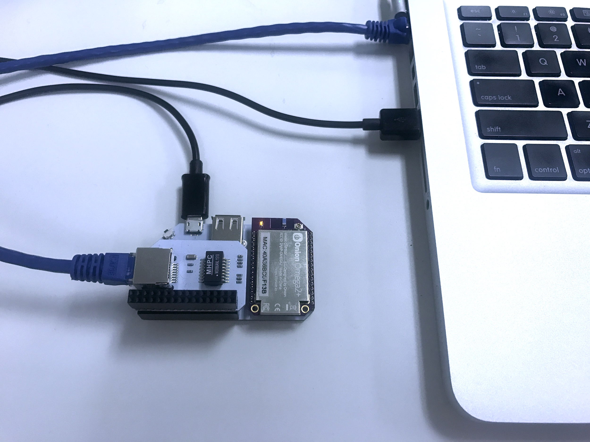
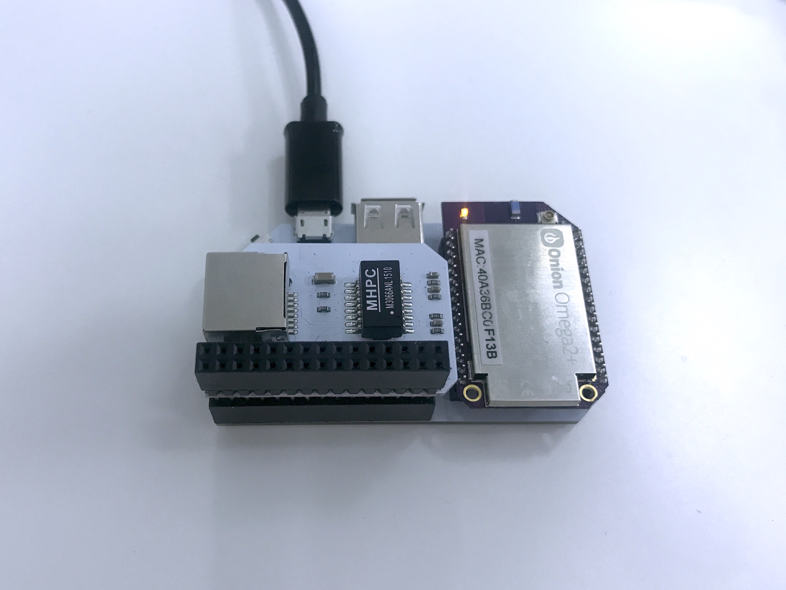

## Omega WiFi Ethernet Bridge {#omega-wifi-ethernet-bridge}


An Ethernet Bridge is a device that shares its WiFi network access through an Ethernet connection, kind of like an ethernet-based WiFi dongle. If the WiFi network is connected to the internet, the internet connection will be shared as well.

The Omega's flexible networking abilities and the Ethernet Expansion allow us to use the Omega as WiFi Ethernet Bridge!



<!-- // TODO: future: photo: illustration of this setup -->

As an example, this type of setup can be used to bring internet access to a desktop computer that does not have a network adapter or to a laptop with a broken wireless interface.


#### Sample Configuration Files

The Onion [`ethernet-bridge-config` Github repository](https://github.com/OnionIoT/ethernet-bridge-config) contains reference configuration files in case you need to troubleshoot your setup.

#### Default Configuration Files

If you ever want to revert your configuration to the original, we have a complete set of default configuration files from a factory-fresh Omega2 [in the `uci-default-configs` repo](https://github.com/OnionIoT/uci-default-configs) on GitHub.


### Overview

**Skill Level:** Intermediate

**Time Required:** 10 minutes

What we're first going to do is set the Omega's `wlan` interface to use `eth0`, the wired ethernet connection. The only thing that's left is to connect the Omega and the target computer with an ethernet cable. We don't even have to adjust the firewall since the `wlan` interface is setup to route packets to all connected interfaces.

#### Sample Configuration Files

The Onion [`range-extender-config` Github repository](https://github.com/OnionIoT/range-extender-config) contains reference configuration files in case you need to troubleshoot your setup.

#### Default Configuration Files

If you ever want to revert your configuration to the original, we have a complete set of default configuration files from a factory-fresh Omega2 [in the `uci-default-configs` repo](https://github.com/OnionIoT/uci-default-configs) on GitHub.

### Ingredients

* Onion [Omega2](https://onion.io/store/omega2/) or [Omega2+](https://onion.io/store/omega2p/
* Any Onion Dock that supports Expansions: [Expansion Dock](https://onion.io/store/expansion-dock/), [Power Dock](https://onion.io/store/power-dock/), [Arduino Dock 2](https://onion.io/store/arduino-dock-r2/)
	* We prefer the Expansion Dock for this project since it enables [access to the command line through serial](https://docs.onion.io/omega2-docs/connecting-to-the-omega-terminal.html#connecting-to-the-omega-terminal-serial) even when there's no network connectivity
* Onion [Ethernet Expansion](https://onion.io/store/ethernet-expansion/)
* An Ethernet cable


### Step-by-Step

Here's how to turn your Omega into an Ethernet WiFi dongle!

#### 1. Prepare the Omega

To begin, you'll need to make sure your Omega is connected to the Internet and has the latest firmware. Follow this [guide](#first-time-setup) if you'd like to learn more on how to set up your Omega.

Once that's done, plug in the Ethernet Expansion:



#### 2. Enable the Omega's Ethernet Connection

Now connect your Omega and the target computer with an ethernet cable:


What we need to do next is change the Omega's networking configuration. Change the following code block located in `/etc/config/network`:

```
config interface 'wlan'
        option type 'bridge'
        option ifname 'eth0.1'
        option proto 'static'
        option ipaddr '192.168.3.1'
        option netmask '255.255.255.0'
        option ip6assign '60'

```

Change `option ifname 'eth0.1'` to `option ifname 'eth0'`


Restart the network service by running the following command:

```
/etc/init.d/network restart
```

> Now the `wlan` network interface is using `eth0`, the physical ethernet interface.


#### 3. Configure your Device to use Ethernet

Now that the Omega is configured, we should be able to get on the internet through an Ethernet cable to the Omega.

Make sure that your connection is set to `Obtain IP address and DNS address Automatically`. It should be set so by default.


##### Windows
To do this on Windows, follow this [guide](http://www.computerhope.com/issues/ch001048.htm).


##### Mac OSX
To do this on Mac OS X, follow this [guide](https://www.cs.cmu.edu/~help/networking/dhcp_info/dhcp_mac.html).


### Enjoy

Now your computer has been given an IP address by the Omega and you can surf away!


