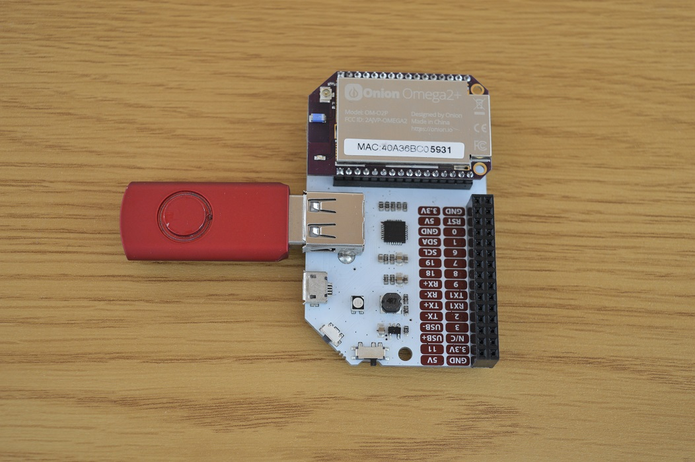

## Mobile Network File Server {#network-file-server}

The Omega's firmware has packages available for a file sharing server program called Samba. By plugging in a USB storage device, you can turn your Omega into a mobile network file server!



<!-- TODO: future: photo: shared network storage -->

### Overview

**Skill Level:** Intermediate

**Time Required:** 20 minutes

This project will walk through how to set up an external storage device, configure a Samba server on the Omega, and how to access it from other operating systems.

#### Sample Configuration files

The Onion [`samba-server-config` GitHub repository](https://github.com/OnionIoT/samba-server-config) contains reference configuration files in case you need to troubleshoot your setup.


### Ingredients

* Onion [Omega2](https://onion.io/store/omega2/) or [Omega2+](https://onion.io/store/omega2p/
* Any [Onion Dock](https://onion.io/product-category/docks/) to power the Omega
    * We like the [Mini Dock](https://onion.io/store/mini-dock/) if you plan to keep it one place.
    * Use the [Power Dock](https://onion.io/store/power-dock/) if you plan to make this a truly portable network storage device.
* A USB storage device or MicroSD card (for Omega2+)

<!-- // TODO: PHOTO of the ingredients -->

### Step-by-Step

Let's turn your Omega into a portable network attached storage, or NAS for short!

#### 1. Setup your Omega

You'll need an Omega2 ready to go, complete the [First Time Setup Guide](https://docs.onion.io/omega2-docs/first-time-setup.html) to connect your Omega to WiFi and update to the latest firmware.

If you need to hook up the Omega to a new network, [connect to the command line](https://docs.onion.io/omega2-docs/connecting-to-the-omega-terminal.html) and use the `wifisetup` utility:

```
root@Omega-0104:/# wifisetup
Onion Omega Wifi Setup

Select from the following:
1) Scan for Wifi networks
2) Type network info
q) Exit

Selection:
```

Follow the instructions to scan for WiFi networks and connect to your router's network.

#### 2. Set up your Storage Device

You can share any directory on your Omega through Samba. For this project, we'll assume you have a USB storage device or microSD. Both of these devices will be automatically mounted at `/tmp/mounts`.

Usually, a USB device is mounted under `/tmp/mounts/USB-A1`, but you can make sure by calling:

```
ls /tmp/mounts
```

The directories listed should all correspond with auto-mounted devices.

Copy down the **full path** to your storage device (`/tmp/mounts/USB-A1` worked for us) - we'll need this to configure Samba.

For a detailed walk-through on how to use storage devices, take a look at the guide to [USB Storage](https://docs.onion.io/omega2-docs/usb-storage.html) and [MicroSD Cards](https://docs.onion.io/omega2-docs/using-a-microsd-card.html) on the Onion Docs.


#### 3. Install the Required Software

We'll need Samba for this, naturally. Samba's name occasionally changes with versioning changes, to check what it is, we can do:

```
opkg update
opkg list | grep samba
opkg install samba##-server
```

At time of writing, Samba is at version 36, so we can install it like so:

```
opkg install samba36-server
```

#### 4. Find the Omega's WiFi card

By default, Samba does not listen to Omega's WiFi for incoming access requests. We'll need to let Samba know which interface it should listen on to get requests for its data.

The Omega communicates with other networks through the `apcli0` interface. Note that down for later!

> If you'd like to see for yourself, use `ifconfig` to list all the interfaces available. Here's an example of that the output will look like:<br>
>```
>root@Omega-E755:~# ifconfig
>apcli0    Link encap:Ethernet  HWaddr AA:AA:AA:AA:AA:AA
>          inet addr:192.168.1.109  Bcast:192.168.1.255  Mask:255.255.255.0
>          inet6 addr: fe80::40a3:6bff:fe00:e755/64 Scope:Link
>          UP BROADCAST RUNNING MULTICAST  MTU:1500  Metric:1
>          RX packets:13787 errors:0 dropped:3 overruns:0 frame:0
>          TX packets:5953 errors:0 dropped:0 overruns:0 carrier:0
>          collisions:0 txqueuelen:1000
>          RX bytes:3197266 (3.0 MiB)  TX bytes:602257 (588.1 KiB)
>
>br-wlan   Link encap:Ethernet  HWaddr AA:AA:AA:AA:AA:AA
>          inet addr:192.168.3.1  Bcast:192.168.3.255  Mask:255.255.255.0
>          inet6 addr: fe80::42a3:6bff:fec0:e757/64 Scope:Link
>          inet6 addr: fd1d:48c4:7633::1/60 Scope:Global
>          UP BROADCAST RUNNING MULTICAST  MTU:1500  Metric:1
>          RX packets:456 errors:0 dropped:0 overruns:0 frame:0
>          TX packets:746 errors:0 dropped:0 overruns:0 carrier:0
>          collisions:0 txqueuelen:1000
>          RX bytes:58973 (57.5 KiB)  TX bytes:88296 (86.2 KiB)
>    ...
>    ...
>```
>
>We see `apcli0` is the interface with the most `RX bytes` and `TX bytes`, meaning it's being doing the most communication. Additionally, it has an IP Address (see the `inet addr`) that corresponds to a LAN - starting with `192.168.1`.

#### 4. Configure Samba

For Samba to start sharing our folders, it needs to know where, how, and who. It gets all these details from configuration files. Specifically, `/etc/config/samba` and `/etc/samba/smb.conf.template`.

First let's open up `/etc/config/samba` with our editor. It should look a little like this:

```
config samba
        option 'name'                   'Lede'
        option 'workgroup'              'WORKGROUP'
        option 'description'            'Lede'
        option 'homes'                  '1'
```

These fields are all customizable options that change how the Samba server behaves.

We recommend changing `name` option to your Omega's `Omega-ABCD` name (where `ABCD` are the bolded numbers on your Omega's cover) for easy recognition. The other options should be left as-is, and the `description` option can be changed to something helpful.

Next, we'll add in a line like this:

```
        option 'interface' 'apcli0'
```

This tells Samba it should listen on the `apcli0` interface, this sets up Samba to accept connections. We just need to let it know the location of our shared folder.

To declare a new shared folder, we'll append a block to the end like this:

```
config 'usbshare'
        option 'name'                   'usb'
        option 'path'                   '/tmp/mounts/USB-A1'
        option 'users'                  'root'
        option 'read_only'              'no'
        option 'guest_ok'               'no'
```

The main configurations that are needed are the `name`, `path`, and `users`:

* The `name` will be the name that appears devices accessing it.
* The `path` is the directory (or file) you want to share.
* Setting `read_only` to `no` will mean that anyone accessing the shared folder can change its contents
* While having `guest_ok` set to `no` means access is only granted after authentication.

>The `/etc/config/samba` file is a Universal Configuration Interface (UCI) file, LEDE uses it to simplify configuration of system services.

Next, we'll have to fiddle with `/etc/samba/smb.conf.template`. Opening it with our editor will greet us with this:

```
[global]
        ...blah
        ...blah
        enable core files = no
        guest ok = yes
        invalid users = root
        load printers = no
        ...blah
```

We'll have to change one thing here since we'll be accessing the shared folder/s as root:

```
        invalid users = #
```

And now Samba is ready to go!

##### More Options

Samba has a ton of configuration features that allow you to micromanage who gets access to what. For a bit more detail on how Samba works, LEDE has an excellent [guide on configuring Samba](https://lede-project.org/docs/user-guide/samba_configuration). For a **lot** more detail on how Samba works, [Using Samba](https://www.samba.org/samba/docs/using_samba/toc.html) is available to explain the nitty-gritty details.


#### 5. Users and passwords

To allow access, we'll have to set up passwords any user we specified - since we only used root, we can call `smbpasswd` like so:

```
smbpasswd -a root
```

This utility will create a `root` Samba account associated with the `root` account of the operating system. You'll be prompted to enter a new password for use with Samba.

#### 6. Applying our changes

Samba needs to be restarted for our configuration to apply. We can do this with:

```
/etc/init.d/samba restart
```

Now we're ready to check out our file share!

#### 7. Access your shared folder

Of course once the server is running, we'll have to actually access it somehow.

##### Windows

On Windows, a Samba share can be found by opening a file explorer and going to 'Network'. The `name` we specified in `/etc/config/samba` should appear as a network location, and the folder we shared listed inside it. You'll be prompted for login details, input `root` and the password you selected in step 5, and voila!

For a more detailed tutorial on connected to a Samba-shared network drive, take a look at [this tutorial](https://help.lafayette.edu/samba/win7nondomain).

<!-- TODO: future: low priority: screenshot guide on how to connect to the samba share -->

##### Linux

Modern Linux distros have Samba clients well integrated in the file explorer, and the process is very similar to windows. Open up file explorer, navigate to the Network root, and find your Omega to access.

>Some desktop environments have it grouped under a 'Samba Shares' folder or the like inside the Network root.

For a more detailed tutorial on connected to a Samba-shared network drive, take a look at [this tutorial]((https://access.redhat.com/documentation/en-US/Red_Hat_Enterprise_Linux/3/html/System_Administration_Guide/s1-samba-connect-share.html)

<!-- TODO: future: low priority: screenshot guide on how to connect to the samba share -->


##### Mac OS X

On OS X, connecting to a Samba share can be done using Finder. Open a Finder window and hit Command+K, in the window that pops up, for Server Address type in `smb://omega-ABCD.local` where `ABCD` is your Omega's unique identifier. Connect as a registered user and select the volume to which you would like to connect.

After that, it will will just be like any other directory on your computer.

For a more detailed tutorial on connected to a Samba-shared network drive, take a look at [this tutorial](http://osxdaily.com/2010/09/20/map-a-network-drive-on-a-mac/)

<!-- TODO: future: low priority: screenshot guide on how to connect to the samba share -->
