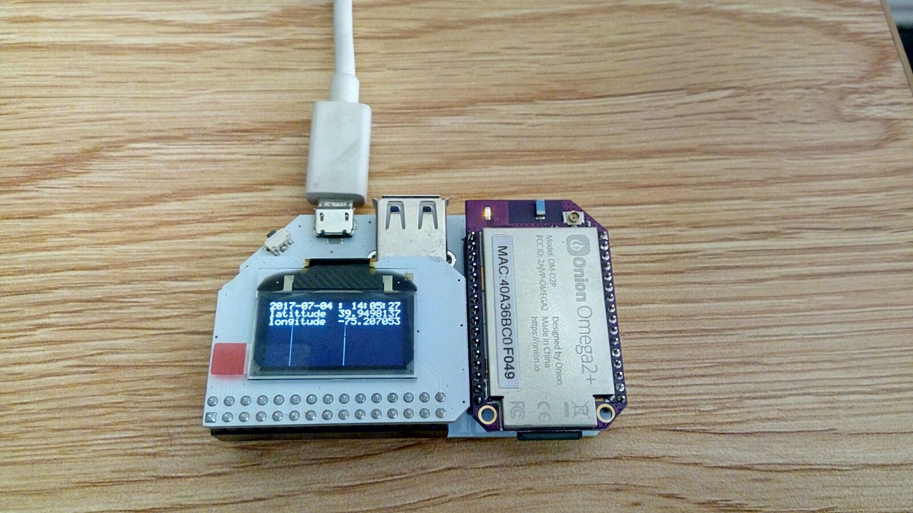
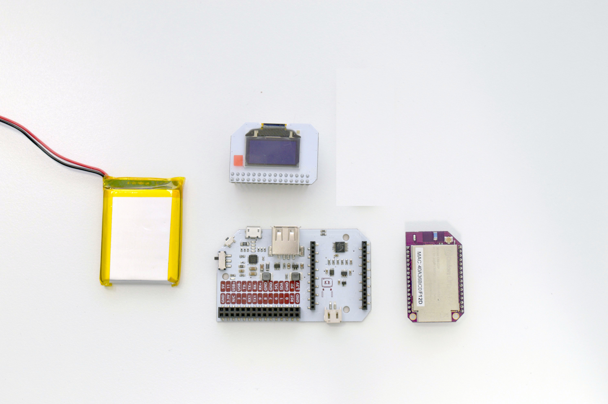
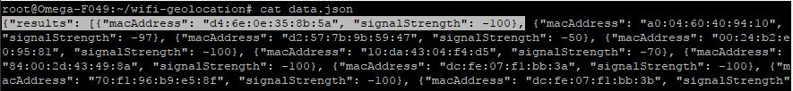

## Mobile WiFi GeoLocation {#wifi-geolocation}

The Omega can scan nearby WiFi networks and report information such as their SSID, encryption type, and signal strength. In this project, we'll be using the Omega to scan local WiFi networks and then based on SSID, mac address, signal strength find the gps location of the Omega using Google Geolocation API and display the gps coordinates(lattitude & longitude) on Oled Expansion. So, you need Omega to be connected to internet too to send that request continuously.




### Overview

**Skill Level:** Intermediate

**Time Required:** 20 minutes

The WiFi Geolocation will:

* Scan for any WiFi networks in range using a `ubus` call
https://onion.io/2bt-scanning-for-wifi-networks/
* Store the scanned WiFi networks mac address, signal strength and channel in a json file 
* Use this saved json file with relevant scanned wifi networks information and request google geolocation api
https://developers.google.com/maps/documentation/geolocation/intro
* Display the GPS coordinates(latitude, longitude) returned by the API on the Oled Expansion

Using the Power Dock, you will be able to use your scanner out in the world without needing a USB power supply.


### Ingredients

* Onion [Omega2](https://onion.io/store/omega2/) or [Omega2+](https://onion.io/store/omega2p/)
* Onion [Power Dock](https://onion.io/store/power-dock/)
	* The [Expansion Dock](https://onion.io/store/expansion-dock/) and [Arduino Dock 2](https://onion.io/store/arduino-dock-r2/) will work as well, they just won't be mobile
* Onion [OLED Expansion](https://onion.io/store/oled-expansion/)
* A [3.7V LiPo battery](https://www.amazon.com/gp/product/B01MYY9J78/ref=as_li_qf_sp_asin_il_tl?ie=UTF8&tag=onion0e-20&camp=1789&creative=9325&linkCode=as2&creativeASIN=B01MYY9J78&linkId=c74126e601f388e237102887a744e778)
	* We found 1200 mAh to be good for several hours of use



### Step-by-Step

Here's how to turn your Omega into a WiFi Geolocator!

#### 1. Prepare

You'll need to have an Omega2 ready to go, complete the [First Time Setup Guide](https://docs.onion.io/omega2-docs/first-time-setup.html) to connect your Omega to WiFi and update to the latest firmware.

#### 2. Setup the Hardware

Connect your Omega to the Power Dock, then plug in the OLED Expansion into the Expansion Header. 

<!--# 2 -->

#### 3. Install Packages

[Connect to the Omega's command line](https://docs.onion.io/omega2-docs/connecting-to-the-omega-terminal.html#connecting-to-the-omega-terminal-ssh) and install Python as well as some of the packages we need:

```
opkg update
opkg install python-light pyOledExp git git-http ca-bundle curl
```

The `pyOledExp` package gives us control of the OLED Expansion. The `git`, `git-http`, and `ca-bundle` packages will allows us to download the project code form GitHub. The 'curl' package allows us to request Google api with the json file from the command line , if needed. 

#### 4. Download and Install the Project Software

The code for this project is all done and can be found in Onion's [`wifi-geolocation` repo](https://github.com/OnionIoT/wifi-geolocation) on GitHub. Use [`git` to download the code to your Omega](https://docs.onion.io/omega2-docs/installing-and-using-git.html): navigate to the `/root` directory, and clone the GitHub repo:

```
cd /root
git clone https://github.com/OnionIoT/wifi-geolocation.git
```

#### 5. Generating Google API Key

The code requires a API key to be able to make requests to the google geolocation API. You need to generate a key to able to use the code further.
You can learn from here how to [get a key](https://developers.google.com/maps/documentation/geolocation/get-api-key) to use for the API.

Once, you have a API key, you can edit helpers.py file in the code and paste your API key for API_KEY and save the file.

#### 6. Running the Project on Boot

Next we'll setup the Omega to automatically run the scanner when it turns on. Edit the `/etc/rc.local` file and add the following line above `exit 0`:

```sh
python /root/wifi-geolocation/main.py &
```

This way, when you flip the power switch, the Omega will run the code in the background after it completes the initialization process.

#### 7. Using the WiFi Geolocator

Here's the fun part! Press the reset button and the Omega will run the program.

If the Omega is within the range of WiFi networks, it will be able to discover the networks and save the mac address, signal strength and channel for each wifi network onto a json data file. 
The program will then further request google API and get a response with latitude and longitude for the mac addresses.


The saved data.json file can be used make request from the command line using curl: 

```sh
curl -d @data.json -H "Content-Type: application/json" -i "https://www.googleapis.com/geolocation/v1/geolocate?key=YOUR_API_KEY"
```

##### Unable to GeoLocate

If the Omega is not connected to any wifi network or cannot scan any wifi network, you'll see corresponding error message on the OLED. The program will try again in a few seconds.

The different error messages can be : 
* notFound : No Wifi network was scanned , so geolocation could not be done.
* dailyLimitExceeded : Daily limit with the usage of the Google API has been exceeded.
* keyInvalid : You need to provide a valid API Key for the Google maps geolocation API.
* userRateLimitExceeded : You have exceeded the requests per second per user limit configured in your Google API console.
* parseError : The request body is not a valid JSON.

##### Saved Data

Assuming the project code was downloaded to the `/root` directory, the collected wifi data will be saved to: `/root/wifi-hotspot-scanner/data.json`. It is json format file and can be opened by any text editor. It stores data about the surrounding networks for every single scan:



This data can be used to geolocate by using command line then.

### Code Highlight

The `ubus` system utility is a key part of the firmware on which the Omega is based. It allows you to call services and functions on the Omega as if you were sending data to a web API. The basic syntax goes like this:

```
ubus call (service) (function) '{(JSON parameters)}'
```

The WiFi scanning functions is available as `ubus` functions so that it can be called by any program.

You can see how they work in the `ubusHelper.py` module:

```python
# basics of running a command
# returns a dict as ubus functions return json objects
def runCommand(command):
    output, err = shellHelper.runCommand(command)
    responseDict = json.loads(output)
    
    all_data = responseDict["results"]
    new_json={}
    new_json_list=[]
    for data in all_data:
    	new_data = {}
    	new_data["macAddress"] = data["bssid"]
    	new_data["signalStrength"] = int(data["signalStrength"])/2-100
    	new_json_list.append(new_data)
    new_json["results"] = new_json_list
    with open('data.json', 'w') as outfile:
    	json.dump(new_json, outfile)
    return responseDict

# often used commands
# add more if you need
def call(args):
    command = ["ubus", "call"]
    command.extend(args)
    return runCommand(command)
```

and the `helpers.py` module:

```python
# scan wifi networks in range
# returns a list of wifi dictionaries
def scanWifi():
    device = json.dumps({"device": "ra0"})
    args = ["onion", "wifi-scan", device]
    return ubus.call(args)["results"]

# returns a dictionary with gps info
def getGps():
    http = urllib3.PoolManager()
    url = "https://www.googleapis.com/geolocation/v1/geolocate?key="+API_KEY
    payload = open("data.json")
    headers = {'content-Type': 'application/json', 'Accept-Charset': 'UTF-8'}
    r = http.request(
    	'POST',
    	url,
    	headers=headers,
    	body=payload
    )
    return r.data.decode('utf-8')
```

In essence, the `scanWifi()` function above runs the following command:

```
ubus call onion wifi-scan '{"device":"ra0"}'
```

And the `getGps()` function runs this command:

```
curl -d @data.json -H "Content-Type: application/json" -i "https://www.googleapis.com/geolocation/v1/geolocate?key=YOUR_API_KEY"
```

Try running these two commands on your Omega's command line by hand and take note of the output.
