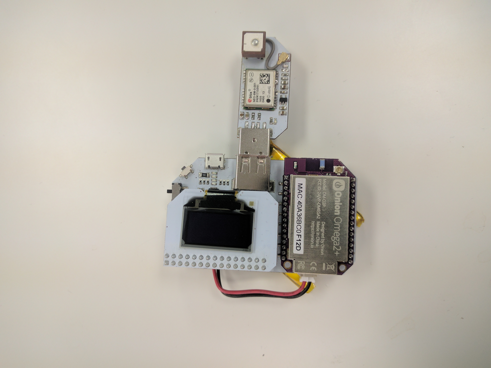
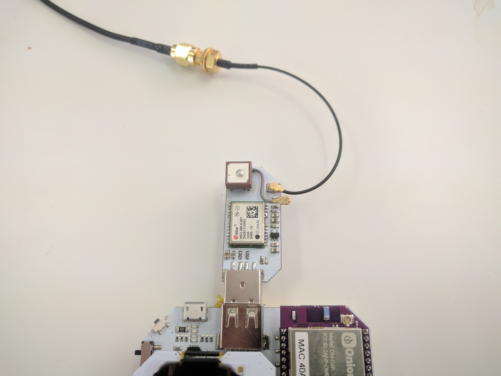

## Mobile WiFi Network Scanner {#wifi-network-scanner}

The Omega can scan nearby WiFi networks and report information such as their SSID, encryption type, and signal strength. In this project, we'll be using the Omega to scan local WiFi networks, record the GPS coordinates where they're found, display the networks with the strongest signal on the OLED Expansion, and save the rest of the data to a spreadsheet file.


### Overview

**Skill Level:** Intermediate

**Time Required:** 10 minutes

The WiFi scanner will:

* Scan for any WiFi networks in range using a `ubus` call
* Retrieve location data form the GPS Expansion, again using the `ubus`
* Sort the scanned networks by signal strength and display the six networks with the strongest signal on the OLED Expansion

It will then save the following data for each network into a comma separated value (CSV) file that can be imported into a spreadsheet program:

* Date scanned // TODO: and time presumably?
* Latitude and longitude
* SSID
* BSSID
* Encryption type
* Signal strength

Using the Power Dock, you will be able to use your scanner out in the world without needing a USB power supply.


### Ingredients

* Onion Omega2 or Omega2+
* Onion Power Dock
	* The Expansion Dock and Arduino Dock will work as well, they just won't be mobile
* Onion OLED Expansion
* Onion GPS Expansion
* External GPS Antenna (optional)
* A 3.7V LiPo battery
	* We found 1500 mAh to be good for several hours of use

// TODO: PHOTO: of all of the ingredients

### Step-by-Step

Here's how to turn your Omega into a WiFi scanner!

#### 1. Prepare

You'll need to have an Omega2 ready to go, complete the [First Time Setup Guide](https://docs.onion.io/omega2-docs/first-time-setup.html) to connect your Omega to WiFi and update to the latest firmware.

#### 2. Setup the Hardware

Connect your Omega to the Power Dock, then plug in the OLED Expansion into the Expansion Header. Then plug in the GPS Expansion into the USB host port as shown below.



The GPS Expansion's antenna is connected via a Hirose U.FL connector. If you have your own antenna with the appropriate connector that you would like to use, you can gently unplug the included antenna (the large square piece with a wire) and replace it with your own.



<!--# 2 -->

#### 3. Install Packages

[Connect to the Omega's command line](https://docs.onion.io/omega2-docs/connecting-to-the-omega-terminal.html#connecting-to-the-omega-terminal-ssh) and install Python as well as some of the packages we need:

```
opkg update
opkg install python-light pyOledExp ogpsgit git-http ca-bundle
```

The `pyOledExp` package gives us control of the OLED Expansion, while the `ogps` package will provide a `ubus` service that lets us easily get data from the GPS Expansion. The `git`, `git-http`, and `ca-bundle` packages will allows us to download the project code form GitHub.

After installing `ogps`, check that the `ubus` `gps` service is listed by running `ubus list`:


If you don't see `gps` listed, you'll need to restart your `rpcd` service in order to refresh the list:

```
/etc/init.d/rpcd restart
```

If this doesn't work, try reinstalling the `ogps` package by running the following commands:

```
opkg remove ogps
opkg update
opkg install ogps
```

#### 4. Download and Install the Project Software

The code for this project is all done and can be found in Onion's [`wifi-hotspot-scanner` repo](https://github.com/OnionIoT/wifi-hotspot-scanner) on GitHub. Use [`git` to download the code to your Omega](https://docs.onion.io/omega2-docs/installing-and-using-git.html): navigate to the `/root` directory, and clone the GitHub repo:

```
cd /root
git clone https://github.com/OnionIoT/wifi-hotspot-scanner.git
```

#### 5. Running the Project on Boot

Next we'll setup the Omega to automatically run the scanner when it turns on. Edit the `/etc/rc.local` file and add the following line above `exit 0`:

```sh
python /root/wifi-hotspot-scanner/main.py &
```

This way, when you flip the power switch, the Omega will run the code in the background after it completes the initialization process.

#### 6. Using the WiFi Scanner

Here's the fun part! Press the reset button and the Omega will run the program.

If the GPS Expansion is able to lock onto a satellite signal, you'll see the time, the GPS coordinates, and the 6 WiFi networks with the strongest signal available nearby.


The Omega will then save data about all of the discovered networks to a file called `wifiData.csv`. You can then import this into a spreadsheet or navigation program for mapping later!

// TODO: photo; need a close-up that clearly shows the expected output on the OLED

##### Unable to Lock Signal

If the GPS Expansion cannot lock onto a satellite, you'll see an error message on the OLED. The program will try again in a few seconds.

##### Saved Data

// TODO: a small section on the csv output, show a screenshot of some examples of the scan

### Code Highlight

The `ubus` system utility is a key part of the firmware on which the Omega is based. It allows you to call services and functions on the Omega as if you were sending data to a web API. The basic syntax goes like this:

```
ubus call (service) (function) '{(JSON parameters)}'
```

The WiFi and GPS scanning functions are available as `ubus` functions so that they can be called by any program.

You can see how they work in the `ubusHelper.py` module:

```python
# basics of running a command
# returns a dict as ubus functions return json objects
def runCommand(command):
    output, err = shellHelper.runCommand(command)
    responseDict = json.loads(output)
    return responseDict

# often used commands
# add more if you need
def call(args):
    command = ["ubus", "call"]
    command.extend(args)
    return runCommand(command)
```

and the `helpers.py` module:

```python
# scan wifi networks in range
# returns a list of wifi dictionaries
def scanWifi():
    device = json.dumps({"device": "ra0"})
    args = ["onion", "wifi-scan", device]
    return ubus.call(args)["results"]

# read the GPS expansion
# returns a dictionary with gps info
def readGps():
    args =["gps", "info"]
    response = ubus.call(args)

    # check if the GPS is locked
    if "signal" in response and response["signal"] == False:
        return False
    # else return the data
    return response
```

In essence, the `scanWifi()` function above runs the following command:

```
ubus call onion wifi-scan '{"device":"ra0"}'
```

And the `readGps()` function runs this command:

```
ubus call gps info
```

Try running these two commands on your Omega's command line by hand and take note of the output.
