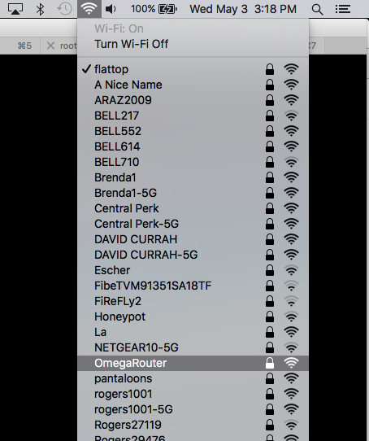
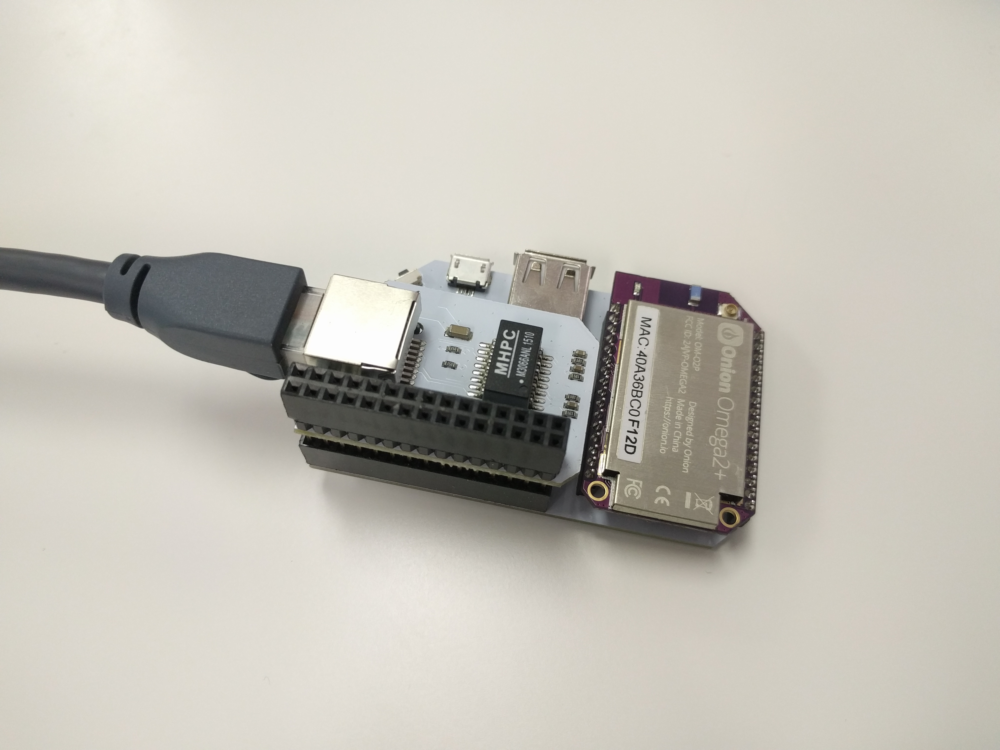

## Omega WiFi Router {#omega-wifi-router}

A router is a device that connects multiple devices on a wired or wireless network. They are very widely used with modems to allow multiple devices to connect to the Internet through the single connection provided by the modem.


We're going to use the Omega as a wireless router that:
* Accepts an Ethernet connection
* Broadcasts a WiFi network Access Point (AP)
* Shares network access from the Ethernet network to the WiFi AP network

The Ethernet Expansion is required to give your Omega access to an Ethernet port. By using the Ethernet Expansion, we can turn our Omega into a low-cost yet effective router.



// TODO: retake screenshot when there's only a single omega present

### Overview

**Skill Level:** Intermediate

**Time Required:** 10 minutes

What we are going to do is to first enable the Omega's Ethernet connection, stop the Omega from connecting to other, existing WiFi networks, then enable routing network traffic from the Omega's AP to the Internet through the Ethernet connection.


### Ingredients

* Onion Omega2 or Omega2+
* Any Onion Dock that supports Expansions: Expansion Dock, Power Dock, Arduino Dock 2
	* We prefer the Expansion Dock for this project since it enables [access to the command line through serial](https://docs.onion.io/omega2-docs/connecting-to-the-omega-terminal.html#connecting-to-the-omega-terminal-serial) even when there's no network connectivity
* Onion Ethernet Expansion

### Step-by-Step

Here's how to turn your Omega into a wireless router!

#### 1. Prepare

First let's get the Omega ready to go. if you haven't already, complete the [First Time Setup Guide](https://docs.onion.io/omega2-docs/first-time-setup.html) to connect your Omega to WiFi and update to the latest firmware.

#### 2. Setup the Hardware

Connect your Ethernet Expansion to the Expansion dock, and plug in the Ethernet cable, as shown below:




#### 3. Setup the Omega

The next step is to stop the Omega from connecting to other, existing WiFi networks, as it will be using the Ethernet Expansion to access the Internet instead.

>We're going to be restarting the WiFi on the Omega a few times, breaking any SSH connections in the process. To avoid this, you can try using a serial connection with your Omega. For more information, please refer to this [guide on connecting to your Omega.](#connecting-to-the-omega-terminal)

On the Omega's command line, enter the following commands:

```
uci set wireless.@wifi-iface[0].ApCliEnable=0
uci commit wireless
```

Restart the WiFi network to apply your saved changes:

```
wifi
```


#### 4. Changing the WiFi AP Configuration

Set the SSID and password of the router's WiFi network with the following commands, substituting `OmegaRouter` and `RouterPassword` with values of your choice:

```
uci set wireless.@wifi-iface[0].ssid=OmegaRouter
uci set wireless.@wifi-iface[0].key=RouterPassword
uci commit
```

##### Changing the Encryption Type

If you wish to keep the default encryption type, WPA2 (`psk2`), which we strongly recommend, you can skip this step.

However, if you do wish to change the encryption type, find the type you want in the [UCI wireless encryption list](https://wiki.openwrt.org/doc/uci/wireless/encryption), then substitute it into `YourEncryptionType` and run:

```
uci set wireless.@wifi-iface[0].encryption=YourEncryptionType
uci commit
```

Please keep in mind that 1st generation WPA is [not secure](http://www.pcworld.com/article/153396/wifi_hacked.html) and that WEP keys have be be a certain length in order to work properly.

##### Restarting the WiFi {#projects-omega-as-a-router-restarting-the-wifi}

Run the following command to restart the WiFi network and apply your settings:

```
wifi
```

#### 5. Enable Ethernet Connectivty

Enable the Ethernet interface, `eth0`, by running:

```
uci set network.wan.ifname='eth0'
uci set network.wan.hostname='OnionOmega'
uci commit
```

Then restart the network service:

```
/etc/init.d/network restart
```

This will allow the Omega to connect to the Internet via the Ethernet port.

#### 6. Enabling Packet Routing

Now we need to enable sharing of network access between the ethernet network and the WiFi AP. Open the `/etc/config/firewall` file using `vi` and find the block that looks like the following:

```
config zone
        option name 'wan'
        option output 'ACCEPT'
        option forward 'REJECT'
        option masq '1'
        option mtu_fix '1'
        option network 'wwan'
        option input 'ACCEPT'
```

and do the following:

* Change `option forward 'REJECT'` to `option forward 'ACCEPT'`
* Change `option network 'wwan'` to `list network 'wwan'`
* Add `list network 'wan'` after the `list network 'wwan'` line

The block should now look like this:

```
config zone
        option name 'wan'
        option output 'ACCEPT'
        option forward 'ACCEPT'
        option masq '1'
        option mtu_fix '1'   
        list network 'wwan'  
        list network 'wan'   
        option input 'ACCEPT'
```

Now restart the firewall by running:

```
/etc/init.d/firewall restart
```

#### 7. Using the Omega Router

And we're ready! To use the Omega Router, you simply need to connect your computer or your smartphone/tablet to the WiFi network that you configured in Step 4, and your devices should be able to access the Internet via the Omega.


#### 8. Sample Configuration Files

The Onion [`omega-as-router` Github repository](https://github.com/OnionIoT/omega-as-router) contains reference configuration files in case you need to troubleshoot your setup.

Follow the [instructions on installing Git](https://docs.onion.io/omega2-docs/installing-and-using-git.html), navigate to the `/root` directory, and clone the GitHub repo:

```
git clone https://github.com/OnionIoT/omega-as-router.git
```

Please note that there are some placeholders such as `RouterPassword` and `somewifissid`. Make sure to copy only the relevant parts!
